+---------------------------------------------------+---------------------------------------------+
|                                                   | 学校代码： 10246                            |
+===================================================+===========================+=================+
|                                                   | 学 号：19262010012                          |
+---------------------------------------------------+---------------------------+-----------------+
|                                                                               |                 |
+-------------------------------------------------------------------------------+-----------------+

{width="3.0208333333333335in"
height="1.125in"}

  -----------------------------------------------------------------------
  硕 士 学 位 论 文
  -----------------------------------------------------------------------

  -----------------------------------------------------------------------

**（专业学位）**

+-----------------------------------------------------------------------+
| **基于CNN与SENet的Transformer**                                       |
|                                                                       |
| **短文本分类方法研究**                                                |
+=======================================================================+

+-----------------------------------------------------------------------+
| **Research on short text classification based on**                    |
|                                                                       |
| **Transformer of CNN and SENet**                                      |
+=======================================================================+

院 系： 软件学院

专业学位类别（领域）： 软件工程

姓 名： 刘浩

指 导 教 师： 赵进

完 成 日 期： 年 月 日

# 目录

[目录 [I](#目录)](#目录)

[摘要 [III](#摘要)](#摘要)

[Abstract [V](#abstract)](#abstract)

[第一章 绪言 [1](#绪言)](#绪言)

[1.1 研究背景及意义 [1](#研究工作的背景和意义)](#研究工作的背景和意义)

[1.2 研究现状 [1](#研究现状)](#研究现状)

[1.3 本文的主要工作和贡献
[5](#本文的主要工作和贡献)](#本文的主要工作和贡献)

[1.4 本文组织结构 [5](#_Toc86486356)](#_Toc86486356)

[第二章 相关工作与研究发展
[7](#相关工作与研究进展)](#相关工作与研究进展)

[2.1 基于SENet的特征提取器
[7](#基于senet的特征提取器)](#基于senet的特征提取器)

[2.2 注意力机制 [10](#注意力机制)](#注意力机制)

[2.3 Transformer模型 [15](#transformer模型)](#transformer模型)

[2.4 常见的文本分类方法 [20](#_Toc88584555)](#_Toc88584555)

[2.5 相关文本分类比较与总结
[39](#相关文本分类比较与总结)](#相关文本分类比较与总结)

[2.6 本章小结 [40](#本章小结)](#本章小结)

[第三章 短文本分类模型设计
[41](#短文本分类模型设计)](#短文本分类模型设计)

[3.1 分类模型CS-Transformer介绍
[42](#分类模型cs-transformer设计)](#分类模型cs-transformer设计)

[3.2 卷积在文本中应用 [44](#卷积在文本中应用)](#卷积在文本中应用)

[3.3 文本分类中SENet应用
[47](#文本分类中senet应用)](#文本分类中senet应用)

[3.4 基于卷积与SENet的多头自注意力机制
[48](#基于卷积与senet的多头自注意力机制)](#基于卷积与senet的多头自注意力机制)

[3.5 本章小结 [50](#本章小结-1)](#本章小结-1)

[第四章 实验与结果分析 [51](#实验与结果分析)](#实验与结果分析)

[4.1 实验数据集 [51](#实验数据集)](#实验数据集)

[4.2 评价指标 [55](#评价指标)](#评价指标)

[4.3 实验参数设置 [56](#实验参数设置)](#实验参数设置)

[4.4 基于改进的Transformer学习策略
[57](#改进的transformer学习策略)](#改进的transformer学习策略)

[4.5 实验结果分析与对比 [59](#实验结果分析与对比)](#实验结果分析与对比)

[4.5.1 基准模型 [59](#基准模型)](#基准模型)

[4.5.2 实验结果与分析 [61](#实验结果与分析)](#实验结果与分析)

[4.5.3 模型CS-Transformer的性能分析
[66](#模型cs-transformer的性能分析)](#模型cs-transformer的性能分析)

[4.5.4 模型执行时间和大小对比评估
[68](#模型执行时间和大小对比评估)](#模型执行时间和大小对比评估)

[4.5.5 分类模型CS-Transformer训练评估
[69](#分类模型cs-transformer训练评估)](#分类模型cs-transformer训练评估)

[4.5.6 超参数Encoder的数量对实验结果的影响
[72](#超参数encoder的数量对实验结果的影响)](#超参数encoder的数量对实验结果的影响)

[4.5.7 超参数Batch的大小对实验结果的影响
[73](#超参数batch的大小对实验结果的影响)](#超参数batch的大小对实验结果的影响)

[4.5.8 卷积核的大小对实验结果的影响
[75](#卷积核的大小对实验结果的影响)](#卷积核的大小对实验结果的影响)

[4.5.9 不同多输入的方法对模型的影响
[76](#不同多输入的方法对模型的影响)](#不同多输入的方法对模型的影响)

[4.6 消融实验 [77](#消融实验)](#消融实验)

[4.7 本章小结 [78](#本章小结-2)](#本章小结-2)

[第五章 基于CS-Transformer模型自动回复邮件系统
[80](#基于cs-transformer模型自动回复邮件系统)](#基于cs-transformer模型自动回复邮件系统)

[5.1 自动回复邮件系统架构
[80](#自动回复邮件系统架构)](#自动回复邮件系统架构)

[5.1.1 技术介绍 [80](#技术介绍)](#技术介绍)

[5.1.2 系统架构 [82](#系统架构)](#系统架构)

[5.2 系统功能设计 [83](#系统功能设计)](#系统功能设计)

[5.2.1 自动回复邮件系统 [83](#自动回复邮件系统)](#自动回复邮件系统)

[5.2.2 文本分类模型系统 [83](#文本分类模型系统)](#文本分类模型系统)

[5.3 系统实现与分析 [84](#系统实现与分析)](#系统实现与分析)

[5.3.1 自动回复邮件系统 [84](#自动回复邮件系统-1)](#自动回复邮件系统-1)

[5.3.2 文本分类模型系统 [87](#文本分类模型系统-1)](#文本分类模型系统-1)

[5.4 系统性能 [91](#系统性能)](#系统性能)

[5.5 系统安全 [91](#_Toc88584592)](#_Toc88584592)

[5.6 本章小结 [92](#本章小结-3)](#本章小结-3)

[第六章 总结 [93](#第六章-总结)](#第六章-总结)

[6.1 工作总结 [93](#工作总结)](#工作总结)

[6.2 未来展望 [94](#未来展望)](#未来展望)

[参考文献 [96](#参考文献)](#参考文献)

[致谢 [104](#致谢)](#致谢)

# 摘要

互联网和移动互联网技术的飞速发展，使得文本数据出现了爆炸式增长，尤其是技术支持人员每天面对海量的用户邮件，需要花费大量的时间和精力。如何高效的自动的给用户邮件按优先级分类并且自动回复第一份附有根据邮件优先级申请的表单号的确认邮件的应用是当前急需解决的问题。在这个自动化的过程中，一种准确率高和某些类别要求回归率高的文本分类的方法尤为重要。而文本分类又是自然语言处理中业界研究的热点。

随着近年来Transformer模型，BERT模型，GPT模型，XLNet模型以及BERT的各种优化改进的模型出现，为邮件这种比较随意的文本进行分类提供了可行的解决方案。随着自注意力机制的引入，为全局信息的获取提供很大的保证。但是英语中尤其是邮件这类比较随意的文体，词的意思更多的影响还是局部信息。本文在标准
Transformer
Encoder的模型的基础上，引入CNN和SENet对Transformer模型的多头自注意力机制部分和特征提取进行改进，使得改进后的Transformer
Encoder模型更好的提取具有不同粒度的多输入中的信息，而且提升了对局部信息的获取进而提高了准确率。

本文针对以上问题，提出了一种基于CNN与SENet的多输入Transformer网络模型在短文本分类，主要研究和贡献包括以下几点：

（1）在Transformer模型中引入CNN。由于标准的Transformer模型摒弃了卷积神经网络
CNN，仅采用自注意力机制和全连接来做特征抽取，虽然拥有很强的全局信息获取能力，但是相邻的两个词之间往往有强相关性。所以针对原有Transformer模型中局部信息的获取不足问题。本文通过把CNN加入Transformer模型中，利用不同大小的卷积核提取局部信息，进而提升了局部信息的获取能力。

（2）在Transformer模型中引入SENet（Squeeze-and-Excitation
Networks），具体来说，就是利用不同大小的卷积核提取局部信息形成不同的特征通道，然后就是通过学习的方式来自动获取到每个特征通道的重要程度，然后依照这个重要程度去提升有用的特征并抑制对当前任务用处不大的特征。

（3）结合CNN与SENet对多头注意力（Multi-head
Attention）进行改进。把原有的全连接网络都替换掉。这样即利用了CNN局部提取信息的能力与SENet自动学习特征通道能力，又不影响原有的多头自注意力提取全局信息。

（4）实现了一个基于改进的Transformer模型的自动回复邮件系统，以改进的Transformer模型为文本分类模型，用于对收到的用户新邮件的内容进行优先级预测。然后根据邮件优先级，发件人，邮件内容和技术维护人员的信息自动在Service
Now申请请求表单，从而根据申请到的表单号自动的回复邮件。邮件优先级预测选用多类样本进行系统效果校验，实验表明，对有户邮件的优先级预测效果更好。

最后，本文为验证改进的Transformer模型的有效性，设计实现了与常用文本分类的对比实验，实验结果表明模型在英文文本分类分类数据集IMDB,SST2和我公司的用户邮件数据集取得预期的效果。

**关键词**：文本分类 深度学习 CNN SENet Transformer模型 注意力机制

# Abstract

With the development of Internet technology, text information has
increased exponentially, especially when technical production support
face a large number of user emails every day, it takes a lot of time and
effort. How to efficiently and automatically classify users\' emails by
priority and automatically reply to the application of the first
confirmation email with the form number applied according to the email
priority is a problem that needs to be solved urgently. In this
automated process, a method of text classification with high accuracy
and high regression rates for certain categories is particularly
important. Text classification is an important technology in the field
of natural language processing.

In recent years, with the appearance of Transformer model, BERT model,
GPT model, XLNet model and various optimized and improved models of
BERT, it has provided a feasible solution for the classification of
relatively random text such as mail. With the introduction of the
self-attention mechanism, a great guarantee is provided for the
acquisition of global information. However, in English, especially in
more casual styles such as emails, the meaning of words has more
influence on local information. Based on the model of the standard
Transformer Encoder, this paper introduces CNN and SENet to improve the
multi-head self-attention mechanism and feature extraction of the
Transformer model, so that the improved Transformer Encoder model can
better extract multiple inputs with different granularities.
Information, and improve the acquisition of local information and
improve the accuracy rate.

In this article, I propose a multi-input Transformer network model based
on CNN and SENet for short text classification. The main contributions
include the following:

1\) Propose an improved Transformer model. Specifically, the standard
Transformer model abandons the convolutional neural network CNN and only
uses the self-attention mechanism for feature extraction. Although it
provides a lot of global information, the extraction of local
information is very weak. If it completely relies on the multi-head
self-attention mechanism It is not enough to obtain partial information.
In this paper, by adding CNN to the Transformer model, convolution
kernels of different sizes are used to extract local information. In
turn, the ability to obtain partial information is improved.

2\) Introduce SENet (Squeeze-and-Excitation Networks) into the
Transformer model. Specifically, it uses different sizes of convolution
kernels to extract local information to form different feature channels,
and then automatically obtains each of them through learning. The
importance of the feature channel, and then according to this importance
to enhance the useful features and suppress the less useful features for
the current task.

3\) Improve Multi-head Attention, combine CNN and SEnet, and replace the
original fully connected network. In this way, the ability of CNN to
extract information locally and the ability of SENet to automatically
learn feature channels are used without affecting the original
multi-head self-attention to extract global information.

4\) Implemented an automatic reply mail system based on the improved
Transformer model, using the improved Transformer model as a text
classification model to predict the priority of the content of new mail
received from users. Then, according to the email priority, sender,
email content, and technical maintenance personnel\'s information, the
Service Now application request form is automatically applied, and the
email is automatically responded to according to the applied form
number. Mail priority prediction uses multiple types of samples for
system effect verification. Experiments show that the effect of priority
prediction on household mail is better.

Finally, through a series of experiments, this paper verifies that the
improved model in this paper achieves better results in the English text
sentiment classification data set IMDB, SST2 and our company's household
email data set.

**Keywords:** text classification, deep learning, CNN SENet Transformer
model, attention mechanism

# 绪言

## 1.1 研究工作的背景和意义

随着互联网与信息技术的飞速发展，电子邮件已经成为人们生活和工作中不可缺少的交流媒介，在现阶段人们的工作和生活中发挥着很大的作用。电子邮件在带来方便和便利的同时，也给产品技术支持人员带来巨大压力。产品技术支持人员每天面对海量的用户请求与问题邮件，需要花费大量的时间和精力去管理邮件以及按用户邮件的紧急程度申请相应的表单号。利用申请到的表单号回复用户的确认邮件。为了在客户的心里建立起企业的形象，让人们记住的是企业的形象，进一步记住所用产品的品牌，最后达成服务与品牌的完美结合。快速的准确的回复客户的确认邮件尤为重要。但通常技术人员需要花费较长时间来回复客服的确认邮件，更严重的有可能许多客户邮件没有发确认邮件。因为他们不仅要阅读每一份邮件还有腾出更多时间用于解决问题。随着企业的业务的新业务不断扩大。这一现象越来越来明显。技术支持人员已经对激增的客户的新邮件应接不暇，更别说解决客户的问题。而且随着技术支持人员不断更替，新来的员工不具备企业的业务知识，又要接受培训才能更好给客户邮件分类进而不能马上投入到工作中去，为了解决这一问题，一种根据深度机器学习为新的客户邮件得出邮件优先级，并且根据邮件优先级，发件人，邮件内容和技术维护人员的信息自动在Service
Now申请请求表单，从而根据申请到的表单号自动的回复邮件第一份关键确认邮件的应用已迫在眉睫。近年来，虽然邮件这一比较随意的文本分类任务已出现很多新的方法。但是想要得到一种能够准确率高的和某些类别要求回归率高的邮件优先级分类的方法仍然是有一定的挑战的。

## 1.2 研究现状

自2010年以后，在自然语言处理(Natural Language Processing,
NLP)中嵌入(Embedding)这个词语就变的流行起来。计算机不是什么都懂，为了能让计算机读的懂人类的语言，要对文本进行编码。编码一般有两种编码方法，方法一是独热编码（One-hot），它是最简单的也是出现最早一种方法，它的原理就是把每个词表示成一个固定维度的向量，维度大小是词表大小，向量中单词所在位置为1，其它位置为0，但One-hot表示存在一些问题：高维性、稀疏性。两个词语义上无法正确表示。我们更希望语义相近的词距离比较近，语义不想近的词距离比较远。为了解决这些问题，Word
Embedding出现了，Word
Embedding的一个基本思路就是，把一个词映射到语义空间的一个点，把这个点映射到低维的稠密空间，这样的映射使得语义上比较相似的词，在语义空间的距离也比较近，如果两个词的关系不是很接近，那么在语义空间中向量也会比较远。

2013年Tomas
Mikolov等人提出word2vec^\[4\]^。Word2Vec就是产生这种低维稠密表示的方法之一。它是基于神经网络预测的语言模型，与传统基于统计的语言模型相比，有一层隐藏层的神经网络且无激活函数，输入层是输入单词的
One-hot 编码，经过神经网络之后，输出层是对某一个单词的的预测。Word
Embedding就是输入层与隐藏层之间的权重矩阵，产生这种矩阵包括两种方法：Skip-grams(SG)和Continuous
Bag of Words(CBOW)，这两种方法很类似，其中
SG由中心词预测上下文词；而SG则和CBOW正好相反，CBOW和英语完形填空几乎是一样的,由上下文词预测中心词。2014年，Jeffrey
Pennington, Richard Socher, Christopher D.
Manning三人提出了GloVe算法^\[64\]^。其中，GloVe是Global
Vector的缩写。在传统上，实现word
embedding（词嵌入）主要有两种方法，Matrix Factorization
Methods（矩阵分解方法）和Shallow Window-Based
Methods（基于浅窗口的方法），二者分别有优缺点，而GloVe结合了两者之间的优点。从论文中的实验，可以看到GloVe方法好于word2vec等方法。但是不管是word2vec还是GloVe它们存在一词多义的问题，比如用它们来对Bank这个单词进行编码，所以是区分不开这个词表示的是"银行"还是"河岸"的意思，因为它们都是静态编码，在用语言模型训练的时候，尽管上下文环境中出现的单词不同，但是不论什么上下文的句子经过Word2Vec，都是预测相同的单词Bank，但是同一个词只能占据同一行的参数空间，从而导致多种不同的语境信息被编码到同一词的词嵌入空间里去。所以词嵌入无法解决一词多义的情况。

2018年, Peters等人提出了ELMO (Embedding from Language Models)
被提出来用来解决一词多义的问题^\[5\]^。它是一种同一个词在不同的上下文中有不同的表示(contextualized
word embedding)。ELMO是可以根据当前上下文对Word Embedding
进行动态调整，它的本质思想是：先用语言模型学好一个单词的 Word
Embedding，在实际使用 Word
Embedding的时候，单词已经具备了特定的上下文，这个时候可以根据上下文单词的语义去调整单词的Word
Embedding 表示，这样经过调整后的 Word Embedding
更能表达在这个上下文中的具体含义，自然也就解决了多义词的问题。该模型通过给定的任务,使用在大规模数据上预先训练的双向长短期(Bi-LSTM)网络的所有固定隐藏层记忆学习任务特定的加权表示来构建上下文优化的词嵌入,有效解决了多义词问题,在问答、情感分析以及文本蕴含等６项
NLP 任务上的效果均有提升。但是 ELMO
的特征抽取器选择使用了长短期记忆网络(Long Short-Term Memory, LSTM)而不是
Transformer。

Transformer是谷歌在2017年做机器翻译任务中提出的，是一种基于transformer的encoder-decoder架构,编码器和解码器均由6个编码
block
组成,其编码器和解码器中的自注意力机制（self-attention）结构在计算当前词的时候同时利用上下文的词,有效的提取了词之间长距离依赖关系，并且每个token表示的计算过程都是独立进行的,这样它不仅可以并行计算所有token特征向量也具有抽取长距离依赖关系和并行计算的能力,在多项翻译任务上提升了BLUE得分^\[6\]^。它抛弃了深度学习任务里面使用的CNN和RNN，单纯的使用了全连接和自注意力机制去建模字与字间的语义关系。目前非常流行的BERT就是基于Transformer
构建的，它被广泛应用于NLP领域，例如机器翻译，问答系统，文本摘要和语音识别等方向。

2018年，Radford 等提出了GPT(generative
pre-training),该模型在无标注数据上使用transformer替代
LSTM(相对而言LSTM无法捕捉更长的语义信息)学习语言模型,根据上文的意思去预测下一个词(只利用了单侧信息),然后通过下游的有监督任务，利用fine-tune方法微调模型中的参数或着只训练输出层的参数,其在文本生成类任务上效果较好^\[7\]^。

2018年，Devlin等提出了BERT，其通过在预训练过程中调节所有层的上下文来学习深度双向表示^\[8\]^。它是一种基于多层双向transformer编码在大规模数据上以无监督任务Masked
LM和Next Sentence Prediction
为目标预先训练的深层语言表示模型，可以用于微调。通过特定于不同任务的层,
它适用于单词和句子级的广泛任务，在阅读理解和文本分类等，BERT让NLP技术向前走了一大步。它是真正意义上的解决了长句子的依赖，突破了RNN
模型不能并行计算的限制并且利用自注意力机制产生更具可解释性的模型。

2019年，CMU和google
brain联手推出了BERT的改进版XLNet^\[49\]^。在这之前也有很多公司对BERT进行了优化，包括百度、清华的知识图谱融合，微软在预训练阶段的多任务学习等等，但是这些优化并没有把BERT致命缺点进行改进。但是BERT因为采用了Mask的训练方式，忽略了被Mask掉词之间的依赖关系；同时因为BERT是基于自编码的，所以和基于自回归的模型相比较的，在面对生成任务的时候有缺陷；而且因为BERT是基于transformer的，所以在序列长度方面有限制。所以作者就希望可以融合自编码和自回归的优点，然后设计出来一个模型。XLNet作为BERT的升级模型，主要在以下三个方面进行了优化1）采用AR模型替代AE模型，解决mask带来的负面影响2）双流注意力机制3）引入transformer-xl。

2020年，微软提出新预训练语言模型DeBERTa（Decoding enhanced BERT with
disentangled
attention）^\[21\]^。它被证明比RoBERTa和BERT作为PLM更有效，并且经过微调后，在一系列NLP任务中取得了更好的效果。DeBERTa对BERT模型做了两个修改。1.每个单词都是用两个向量表示的，这两个向量分别对其内容和位置进行编码，并且单词之间的注意力权重是根据单词的位置和内容来计算的内容和相对位置。这是因为观察到一对词的注意力权重不仅取决于它们的内容，而且取决于它们的相对位置。2.
DeBERTa在预训练时增强了BERT的输出层。在模型预训练过程中，将BERT的输出Softmax层替换为一个增强的掩码解码器（EMD）来预测被屏蔽的令牌。这是为了缓解训练前和微调之间的不匹配。在微调时，我使用一个任务特定的解码器，他将BERT输出作为输入并生成任务标签。然而，在预训练时，它不使用任何特定任务的解码器，而只是通过Softmax归一化BERT输出（logits）。因此，他将掩码语言模型（MLM）视为任何微调任务，并添加一个任务特定解码器，该解码器被实现为两层Transformer解码器和Softmax输出层，用于预训练。

但是这些基于transformer或BERT的模型仍然存在以下三个方面的问题：

（1）标准 Transformer 模型由于摒弃了卷积神经网络
CNN，仅采用自注意力机制来做特征抽取，虽然获取全局信息提供很多，但是局部信息的提取却很弱.尤其是英语比如money
implication, client impact, short window, raise exception，service
unavailability. 还有词组，习语（cut off/back/up/down, work on/off, under
the weather, as soon as possible. Nip it in the bud）等等。

（2）针对多输入的文本分类，每种输入它信息量密度不同。如果携带信息的密度不同，不能同等对待。迫切需要针对邮件这种短文本分类任务，对transformer模型进行量身定制。

（3）多头自注意力机制中，不管是层之间的连接还是词向量空间转换都是采用全连接。这样忽视了局部信息对词向量影响大于其它全局信息的事实。

因此，如何增强文本中局部信息的获取，进而产生高准确率是有待解决的问题。本文对文本分类任务展开研究，针对Transformer模型对局部信息捕捉能力不足的缺点，提出有效的改进方案。

## 1.3 本文的主要工作和贡献

为了解决上面Transformer模型中的不足，本文通过对近年来主流的文本分类模型进行研究，实验对比，最终提出了一种基于CNN与SENet的多Transformer网络模型在短文本分类方法。在标准
Transformer
Encoder的模型的基础上，引入CNN和SENet对Transformer模型的多头自注意力机制部分和特征提取进行改进，使得改进后的Transformer
Encoder模型更好的提取具有不同粒度的多输入中的信息，而且提升了模型对局部信息的获取能力进而提高了准确率。

本文的主要贡献包括以下几点：

[]{#_Toc86486356
.anchor}（1）在Transformer模型中引入CNN。由于标准的Transformer模型摒弃了卷积神经网络
CNN，仅采用自注意力机制和全连接来做特征抽取，虽然拥有很强的全局信息获取能力，但是相邻的两个词之间往往有强相关性。所以针对原有Transformer模型中局部信息的获取不足问题。本文通过把CNN加入Transformer模型中，利用不同大小的卷积核提取局部信息，进而提升了局部信息的获取能力。

（2）在Transformer模型中引入SENet（Squeeze-and-Excitation
Networks），具体来说，就是利用不同大小的卷积核提取局部信息形成不同的特征通道，然后就是通过学习的方式来自动获取到每个特征通道的重要程度，然后依照这个重要程度去提升有用的特征并抑制对当前任务用处不大的特征。

（3）结合CNN与SENet对多头注意力（Multi-head
Attention）进行改进。把原有的全连接网络都替换掉。这样即利用了CNN局部提取信息的能力与SENet自动学习特征通道能力，又不影响原有的多头自注意力提取全局信息。

（4）实现了一个基于改进的Transformer模型的自动回复邮件系统，以改进的Transformer模型为文本分类模型，用于对收到的用户新邮件的内容进行优先级预测。然后根据邮件优先级，发件人，邮件内容和技术维护人员的信息自动在Service
Now申请请求表单，从而根据申请到的表单号自动的回复邮件。邮件优先级预测选用多类样本进行系统效果校验，实验表明，对有户邮件的优先级预测效果更好。

## 1.4 本文组织结构

第一章节，绪论部分。首先围绕着选题介绍了研究工作的背景及意义，然后研究梳理了相关研究的国内外现状，得出本研究主要的问题，最后阐述了了本文的主要的研究内容和贡献点。

第二章节，相关工作和研究发展。具体介绍了本文研究所涉及的理论和技术知识，包括卷积神经网络，SENet,注意力机制，Transformer。最后详细研究了现在主流的文本分类方法和它们的研究发展状况，通过相关文本分类对比得出的优缺点。

第三章节，短文本分类模型设计。针对Transformer中不足，首先介绍基于CNN和SENet的Transformer即CS-Transformer，然后依次阐述了卷积神经网络和SENet引入的必要性。

第四章节，实验结果与分析。通过设计CS-
Transformer与主流的文本分类模型对比实验和其它多组实验，验证文本提出的CS-Transformer模型的有效性。然后通过对所涉及到超参数进行数据调试已经可视化得出一组最优的适合本模型的超参数，最后对CS-Transformer模型进行消融实验，验证CNN与SENet有效性。

第五章节，基于CS-Transformer模型的自动回复邮件系统，整个系统包括两部分，第一部分是客户端的自动回复邮件系统，第二部分是基于CS-Transformer模型的文本系统。本节分别对它们的系统架构，系统功能设计，系统实现与分析，系统性能和系统安全进行阐述。

第六章节，总结与展望。首先对本文的工作进行总结和概括，然后针对文本分类中依然可能的改进的地方和本文工作中的所存在的缺陷，提出了接下来研究的方向。

# 相关工作与研究进展

## 2.1 基于SENet的特征提取器

**2.1.1 Squeeze and excitation 模块**

随着SENet网络（Squeeze-and-excitation
networks）在2017年赢得了最后一届ImageNet
2017竞赛分类任务的冠军，众多研究者纷纷开始对它的研究。虽然ImageNet竞赛是一项基于视觉对象识别和目标检测的许多任务，但是SENet在计算机视觉领域的成功已经充分验证它的效果，它是否可以成功运用到自然语言处理的文本分类中并且拥有不错的效果是此研究的重点。注意力机制首先机器翻译领域出现之后广泛运用在计算机视觉领域，以此提高分类网络的性能。在计算机视觉领域中，注意力机制一般分为空间域注意力，通道域注意力和混合域注意力。SENet是由Jie
Hu等人提出的，它是一种通道域注意力(Channel
Attention)实现方法^\[57\]^。卷积神经网络的每一个通道对应的是学习到的某个特征，获取的特征不是都是有用的信息，通道域注意力是可以通过模型自动学习的方式获去每个通道的重要程度并且利用通道的重要程度进一步提升有用的特征和抑制无关的特征。通道的重要程度一般用Sigmoid函数实现。用SENet方法实现的通道域注意力是分为两个操作，压缩操作（Squeeze）和激发操作（Excitation）。压缩操作使用全局池化将特征图沿着空间维度进行特征压缩,将二维的通道特征压缩为一个数，这个数代表这个通道在空间上的全部信息，然后将所有数形成一个一维特征输入到全连接层，最后是激发操作，将全连接层得到的结果作为权重在原特征图上进行加权计算。SE模块的结构示意图如图2-1所示。2019年，Xi等人提出了SKNet(Selective
kernel
networks)，SKNet是SENet的升级版本^\[18\]^。SKNet除了考虑到通道间的关系，还考虑到了卷积核的重要性，即不同的图像能够得到具有不同重要性的卷积核，是网络可以获的不同感受野的信息。

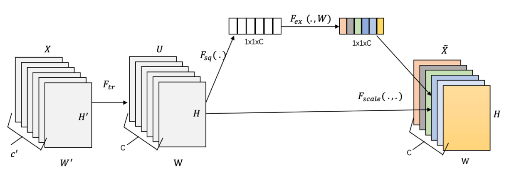{width="5.542168635170603in"
height="1.9436953193350832in"}

图2-1 SE-block示意图^\[57\]^

现在大多网络模型是从空间维度上提升网络的性能。SENet网络是从特征通道之间的关系上来提升网络的学习能力。这个网络主要的是想通过特征重标定的策略建模学习特征通道之间的相互依赖关系。通过学习的方式来获得到每个特征通道的重要度，根据这个重要度去提升通道上有用的特征信息，抑制用处不大的特征信息。公式2-1表示一般的卷积过程。

$$\begin{array}{r}
u_{c} = v_{c}*X = \sum_{s = 1}^{C'}v_{c}^{s}*X^{s}\ \#(2 - 1)
\end{array}$$

其中$v_{c} = \lbrack v_{c}^{1},v_{c}^{1},\ldots,v_{c}^{C'}\rbrack$
卷积核集，\*表示卷积，$X = \lbrack x^{1},x^{2},\ldots,x^{C'}\rbrack\ \ $，$X^{s}$表示第s个特征通道输入，$c$是第几个通道，$U = \lbrack u_{1},\ u_{2},\ \ldots,\ u_{C}\ \rbrack,\ \ u_{c} \in \mathbb{R}^{H \times W},\ X \in \mathbb{R}^{H' \times W' \times C'},U \in \mathbb{R}^{H \times W \times C}\ $。

首先是特征压缩操作（Squeeze），对每个二维的空间维度来进行特征压缩，将每个二维通道变成一个实数，在某种程度上这个实数代表它对应的二维通道，并且所有实数成的一维数组的维度和输入的特征通道数相匹配。它表征着在特征通道的全局分布。压缩操作是由全局平均池化或全局最大池化实现的，这一步的结果表示该层C个feature
map的数值分布情况，或者叫全局信息。公式2-2表示在卷积结果的基础上做全局平局池化。

$$\begin{array}{r}
z_{c} = F_{sq}\left( u_{c} \right) = \frac{1}{H \times W}\sum_{i = 1}^{H}{\sum_{j = 1}^{W}{u_{c}(i,j)\ }}\#(2 - 2)
\end{array}$$

激发操作(Excitation)，通过参数w来为每个特征通道生成权重，其中参数w被学习用来显式地建模特征通道间的相关性，激发的过程是一个类似于循环神经网络中门的机制。激发操作是通过两个全连接层或卷积去建模通道间的相关性，并输出和输入特征同样数目的权重，首先将特征维度降低到输入的
1/16，降低多少是一个超参，可以根据自己模型最终的效果指定，然后运用ReLU激活后再通过一个全连接层后回到原来的维度。这样做的好处有两个：一是具有更多的非线性，可以更好地拟合通道间复杂的相关性；二是减少了参数量和计算量。然后通过一个Sigmoid函数获得0到1之间归一化的权重。公式2-3就是运用每个通道上全局池化的结果经过经过两个全连接得到的通道上的权重特征分布。

$$\begin{array}{r}
s = F_{ex}(z,\ W) = \sigma\left( g(z,W) \right) = \sigma\left( W_{2}\delta\left( W_{1}z \right) \right)\ \#(2 - 3)
\end{array}$$

其中$\delta$表示ReLU激活函数，$\sigma$表示sigmoid激活函数，
$W_{1} \in \mathbb{R}^{\frac{C}{r} \times C},W_{2} \in \mathbb{R}^{C \times \frac{C}{r}}\ $。

r是一个缩放参数，在论文中取的是16，$W_{1}z$就是一个全连接层操作，

最后是一个重标定（Reweight）的操作，将激发操作输出的权重当作是经过学习选择后的每个特征通道的重要性，然后通过乘法把通道加权到先前的特征上，这样就在通道维度上完成了对原始特征的重标定。

$$\begin{array}{r}
{\widetilde{x}}_{c} = F_{scale}\left( u_{c},s_{c} \right) = s_{c}u_{c}\#(2 - 4)
\end{array}$$

其中${\widetilde{x}}_{c} = \lbrack{\widetilde{x}}_{1},{\widetilde{x}}_{2},\ldots,{\widetilde{x}}_{C}\ \rbrack$,
$F_{scale}\left( u_{c},s_{c} \right)$表示通道上特征权重大小$s_{c}$与feature
map $u_{c} \in \mathbb{R}^{H \times W}$的乘积。

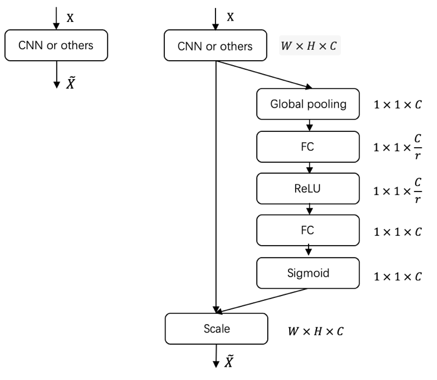{width="3.2071434820647418in"
height="2.7909011373578303in"}

图2-2 左边是CNN 层或其它，右边是SENet融合到CNN层^\[57\]^。

**2.1.2全局平均池化**

通常在分类任务中，深度网络模型最后一层是全连接层，全连接层的参数相比于其它层是相当多因为参数量是输入和输出的乘积。如果整个网络的大部分参数都来自于全连接层中的参数，很容易发生过拟合现象尽管可以加drop层。最后一层全连接层的主要作用得到全局的信息和去除特征的空间相关性，进而为最后的分类做准备。2013年，正对以上问题Lin等人提出了NIN(Network
in
network),它的其中一个创新点是采用全局平均池化降低网络复杂度，避免过拟合，在之后的很多经典论文中都有用到，具有开创性意义^\[58\]^。论文中提到全局平均池化能达到与全连接相同效果，而且不需要更新参数，从而参数量可以很大程度上减少。在计算机视觉中，全局平均池化是指将每一张特征图中的所有的像素点都进行平均池化，这样每张特征图得到一个特征点，再将这些特征点组成一个特征向量进行分类，同样的，对于自然语言处理也是一样的，把每个词或词组对应的向量上做平局池化。通过采用这种全局均值池化的方式使得深度神经网络结构变的简单很多。如图2-3
所示，就是全局平均池化的结构示意图。

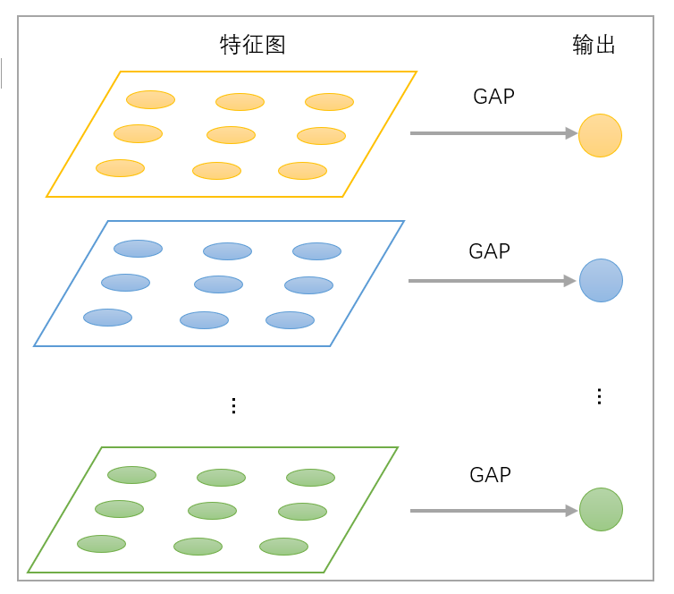{width="3.9530511811023623in"
height="3.4814063867016625in"}

图2-3 全局平均池化图^\[58\]^

## 2.2 注意力机制

**2.2.1 背景简介**

注意力机制（Attention
Mechanism）是一种模仿人类视觉注意力的模型，受启发于并来源于人类视觉。人类在观察事物时，人类的观察感知系统不会一开始就关注整个场景的所有细节，而是将注意力有选择性地集中在所要关注的某个部分上，抑制不需要关注的部分，并对不同注视点的信息进行分析，对场景建立感知，从而指导眼球运动^\[101\]^。注意力机制通过将计算资源集中在场景的某些部分使得需要处理的像素变得更少，这样也大大降低了任务的复杂性。注意力机制能够获知感兴趣的目标位置，从而将重点关注于该部分，而忽略或抑制视觉环境的无关特征。注意力机制已在计算机视觉领域有广泛的应用且得到了良好的效果。近年来，注意力机制开始逐步被运用到自然语言处理(NLP)任务中，而且获得了比经典深度学习网络更好的效果。

2014年，Mnih等人首次提出了视觉上注意力机制的循环神经网络模型（Recurrent
models of visual
attention），与循环神经网络结合构建模型来进行图像分类，发现注意力机制能够识别图像中较为重要的部分，进而提高图像识别准确率，并且模型具有高并发计算能力^\[72\]^。2015年，Bahdanau等人首次将注意力机制引入自然语言处理领域(natural
language
processing，NLP)并应用于对齐任务和机器翻译,与传统神经网络模型相比在准确率上有很大幅度的提升^\[80\]^。随后同年，Luong等人在Bahdanau的论文中的注意力机制基础上提出了两种注意力机制即全局注意力模型（Global
attention model）和局部注意力模型（Local attention
model），进一步提升了seq2seq这种自然语言处理任务的效果^\[67\]^。这两种注意力机制主要区别是全局注意力模型会利用query中每个token的向量值，而局部注意力模型仅仅利用其中某一部分token的向量值。2016年，Yin等人提出ABCNN（attention
based
CNN）首次在卷积神经网络模型上增添了注意力机制对句子进行建模。在答案选择数据集（Answer
Selection,
AS）上取得了比较不错的分类效果^\[81\]^。2017年，谷歌机器翻译团队提出了自注意力机制（Self-Attention）来学习文本表示，与普通的神经网络模型相比，准确率更高^\[6\]^。

**2.2.2 常用的注意力机制**

LSTM或GRU只能在一定程度上改进 RNN
中的长距离依赖问题，并且对信息的"记忆"能力并不强，当需要记住的"信息"越来越多时，模型就需要被设置的更复杂，而计算能力有限是限制模型变复杂重要原因。因此，为了解决这些问题，注意力机制横空出世，不仅能够从大量信息中选择一些关键的重要的信息，来提高神经网络的效率。而且能做高效的并行运算。

Attention 注意力机制可有效缓解神经网络模型的复杂度。Attention
函数的计算是一个"寻址"的过程，即通过一个查询向量（Q,query）到一系列\<Key,Value\>数据对来映射输出值，如下图
2-4：

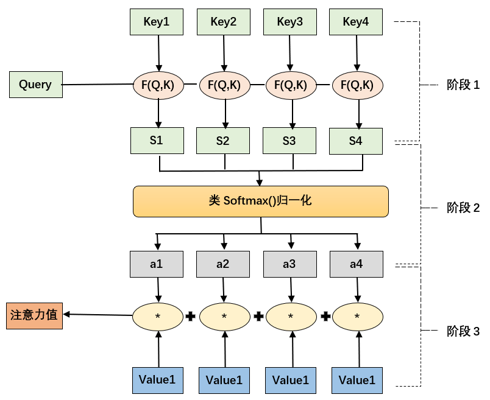{width="5.156694006999125in"
height="4.2136373578302715in"}

表2-4 常见注意力计算流程图

计算 Attention 时主要分为三个阶段。第一阶段：是将查询向量 Q 和每个输入的
K 进行相似度或相关性计算，得到注意力得分$S_{i}$:

$$\begin{array}{r}
S_{i} = f(Q,K)\ \#\ (2 - 5)
\end{array}$$

$S_{i}$
为注意力打分机制，在注意力机制中，常用的注意力计算函数f()分为以下4种：

点积模型

$$\begin{array}{r}
f_{1}\left( Q,{K\ }_{i} \right) = Q^{T}K_{i}\#(2 - 6)
\end{array}$$

双线性模型

$$\begin{array}{r}
f_{2}\left( Q,{K\ }_{i} \right) = Q^{T}W_{a}K_{i}\#(2 - 7)
\end{array}$$

缩放点积模型

$$\begin{array}{r}
\ f_{3}\left( Q,{K\ }_{i} \right) = \frac{Q^{T}K_{i}}{\sqrt{d}}\#(2 - 8)
\end{array}$$

加性模型

$$\begin{array}{r}
f_{4}\left( Q,{K\ }_{i} \right) = v_{a}^{T}\tanh(W_{a}Q\  + \ U_{a}K_{i})\#(2 - 9)
\end{array}$$

第二阶段：使用归一化指数函数（SoftMax 函数）对第一阶段的得出的权重系
数进行尺度缩放，即将其结果归一化为概率分布
$a_{i}$，并且将重要元素的权重突出显示（分子：将神经元的当前输出映射到（0，+∞）；分母：所有输出结果值的总和），
公式如下：

$$\begin{array}{r}
a_{i} = softmax\left( S_{i} \right) = \frac{\exp\left( S_{i} \right)}{\sum_{}^{}{\exp\left( S_{i} \right)}}\#(2 - 10)
\end{array}$$

第三阶段：将第二阶段得出的权重与 value 值加权求和，得到最终需要的

Attention 数值：

$$\begin{array}{r}
Attention(Q,K,V) = \sum_{}^{}a_{i}{Value}_{i}\#(2 - 11)
\end{array}$$

**2.2.3 自注意力机制Self-Attention**

为了更好的可以处理变长的信息序列，可以利用注意力机制来"动态"地生成不同连接的权重（与全连接网络相比，因为全连接网络是一种非常直接的建模远距离依赖的模型，但是无法处理变长的输入序列。不同的输入长度，其连接权重的大小也是不同的。）。自注意力机制是注意力机制的进化变体，更擅长发现句子中的句法特征或者词之间相关联的语义特征。与
Attention 机制不同，Self-Attention
为了充分考虑一句话中词语之间的联系，句子中的每个词都要与所有词进行注意力计算。因此，它最大的特点是可以捕捉词语序列内部的联系。Self-Attention
函数思想可以简化为以下图 2-8：

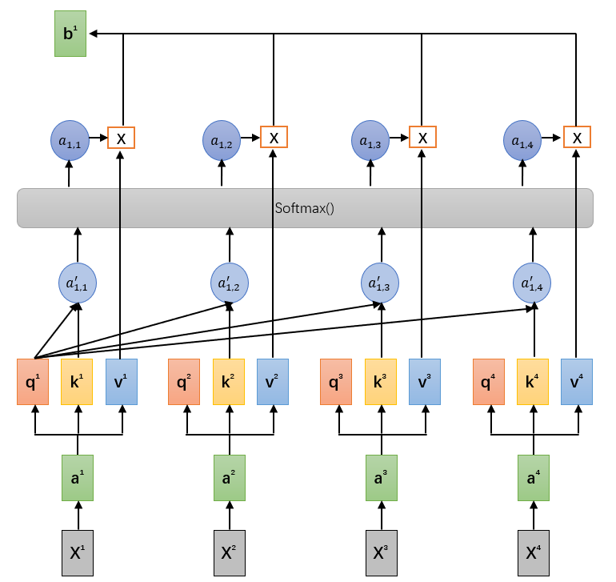{width="5.768055555555556in"
height="5.445833333333334in"}

图2-5 自注意力机制简化原理图

输入Xi,先经过一个嵌入层（Embedding），变成 ai向量， 然后进入
Self-Attention 层中。

$$\begin{array}{r}
a^{i} = WX^{i}\#(2 - 12)
\end{array}$$

在 Self-Attention
层中，ai都与三个不同的矩阵相乘，获得三个不同的向量，分别是 q、k、v。q 是
query，用于匹配值。k 是 key，是被 q 匹配的值；v 是
value，是需要被抽取的特征

$$q^{i} = W^{q}a^{i}$$

$$\begin{array}{r}
k^{i} = W^{k}a^{i}\#(2 - 13)
\end{array}$$

$$v^{i} = W^{v}a^{i}$$

接下来对每一个 q 和每一个 k 做 Attention 计算。如上图所示，$q^{1}$ 和
$k^{1}$ 做Attention，得到$a_{1,1}$,下标用（1,1）表示。如图只是展示了
$q^{1}$的运算作为示例，实际上还有 $q^{2},q^{3},q^{4}$ 在做同步运算

$$\begin{array}{r}
a_{1,i} = \frac{q^{1}k^{i}}{\sqrt{d}}\#(2 - 14)
\end{array}$$

把得到的$a_{1,i}$经过归一化计算得到$a_{1,i}'$,让$a_{1,i}'$分别相乘累加得到$b_{1}$，输出的第一
个向量就是$b_{1}$。实际上产生$b_{1}$就已经使用了整个句子的信息，还有
$b_{2}$等向量也在并行计算产生。

在 Self-Attention 中，q、k、v 则相当于Attention 机制中的
Q、K、V，是该模型的输入值分别乘以
$W^{Q},W^{K},W^{V}$三个矩阵而得。其中，为了梯度的稳定，需要除以$\sqrt{d}$调节因子，并使用$K^{T}$进行点积相似度的计算。所以，Self-Attention
的计算公式为:

$$\begin{array}{r}
Attention(Q,K,V) = softmax\left( QK^{T}/\sqrt{d_{k}} \right)V\#(2 - 15)
\end{array}$$

## 2.3 Transformer模型

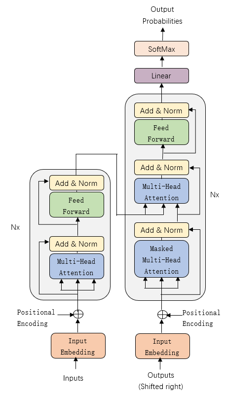{width="3.2759787839020125in"
height="5.715080927384077in"}

图 2-6 Transformer的模型结构^\[6\]^

基于RNNs的Seq2Seq模型自从被提出就受到了广泛的认同，并且不断优化，在很多任务上表现出不错的效果。尽管如此，受限于循环神经网络本身的架构特征，基于RNNs
的 Seq2Seq
模型依然很难处理长依赖问题，其序列的特性也限制了模型的并行化计算。Vaswani
等人于2017年在《Attention is all you
need》中提出Transformer模型，其结构如图2-8所示，旨在解决 Seq2Seq
任务，同时解决长期依赖问题^\[6\]^。作者在文中指出，其提出的
Transformer模型在机器翻译任务上，超过循环神经网络模型和卷积神经网络模型，并且在训练过程中需要更少的计算资源。

Transformer模型也是由一个Encoder组和一个Decoder组组成。一个Encoder或Decoder组由多个Encoder模块或Decoder模块堆叠而成。每个模块都是由多头注意力（Multi-Head
Attention）和全连接前向网络层（Fully Connected Feed-Forward
layer）组成。由于摒弃了RNNs，这就需要利用另外一种方法来记住模型输入序列的位置信息。Transformer
模型中使用位置编码（positional
embedding）为输入序列的每一位元素添加一个相对位置信息，这些位置信息随后会被加入到词向量中，作为每一个词语的表示向量。Multi-Head
Attention 通过多个不同的线性变换对输入进行映射，

首先两层transformer_block对词向量(token coding)与词的位置向量(position
encoding)加权后的文本表征向量
进行特征的分层表示,以达到句子特征融合的目的.词向量可以选用在大型语料库中预训练获得的包含更多的先验知识的静态词向量,
也可以随机初始化再由当前任务训练生成更好地捕获与当前任务相关联的特征信息的动态向量表征。

**2.3.1 位置嵌入和词嵌入**

由于单纯的Attention并没有考虑序列中词语的顺序信息, 也就是说, 若将𝑄, 𝐾和𝑉
中的词语顺序打乱, Attention仍然能训练出相同的结果. 因此,
为了像RNN或CNN那样学习到序列的顺序信息, 需要加入位置编码 (Positional
Encoding). 在之前的大多数Position Embedding中,
都是根据任务来训练位置向量, 在Google的模型中,
直接构造了一个固定的位置编码公式:

$$\left\{ \begin{array}{r}
{PE}_{(pos,2i)} = sin(pos/10000^{2i/d_{m}}) \\
{PE}_{(pos,2i + 1)} = cos(pos/10000^{2i/d_{m}})
\end{array} \right.\ \ \ \ \ \ \ \ \ \ \ \ \ \ \ (2 - 16)\ $$

其中𝑝𝑜𝑠为词语在序列中的位置, 𝑖是词向量维度信息.
之所以选择正弦和余弦函数作为Position
Encoding函数是因为相加的正余弦函数展开之后带有线性变换特征,
这为学习序列的相对位置信息提供了可能性，而在NLP任务中,
相对位置信息是非常重要的.

通常情况下, Position Embedding与Word Embedding完成之后可以相加或
者相连接, 再作为模型的输入,
两种方法效果相当。本文采用位置编码与词向量相加的结果作为输入。

**2.3.2 缩放点积自注意力**

点积自注意力(Scaled Dot-Product
Attention)模块的计算过程如图２-7所示，式(2-17)－式(2-21)是其公式化的表示。

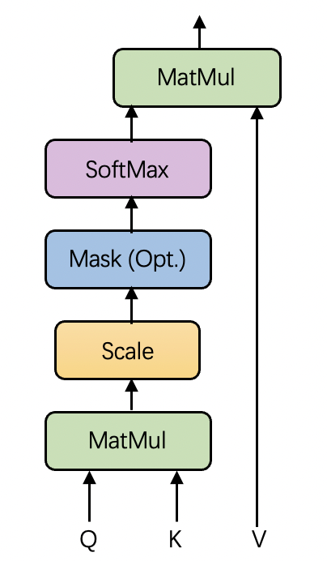{width="1.65in"
height="2.82623687664042in"}

图 2-7 缩放点积注意力^\[6\]^

针对本文模型，输入为维度$d_{k}$＝36的query，key和维度$d_{v}$＝30的value向量,其由词向量a产生。将query分别和每个key进行内积运算，并对结果除以$\sqrt{d_{k}}$缩放后输入SoftMax函数，得到权重后乘以value，获得自注意力层的输出b。

$$\begin{array}{r}
q^{i} = w^{q}a^{i}\ \#(2 - 17)
\end{array}$$

$$\begin{array}{r}
k^{i} = w^{k}a^{i}\#(2 - 18)
\end{array}$$

$$\begin{array}{r}
v^{i} = w^{v}a^{i}\#(2 - 19)
\end{array}$$

$$\begin{array}{r}
a_{i,j} = q^{i} \bullet k^{j}\text{/}\sqrt{d_{k}}\#(2 - 20)
\end{array}$$

$$\begin{array}{r}
b^{i} = \sum_{j}^{}{softmax\left( a_{i,j} \right)v^{i}}\#(2 - 21)
\end{array}$$

在实际计算中，会将多个query打包为矩阵后进行并行计算。key和value也被打包为矩阵
K 和矩阵V，计算过程为式(2-20)；

$$\begin{array}{r}
Attention(Q,K,V) = softmax\left( QK^{T}/\sqrt{d_{k}} \right)V\#(2 - 22)
\end{array}$$

**2.3.3 多头注意力机制**

多头注意力能够让模型从不同的表征子空间去共同学习不同位置的表达信息。类似于在CNN中的多个filter学习图片不同的表达信息,
如图2-11所示, 先将Q，K，V经过不同的h个线性投影后,
再进行缩放点积注意力的计算，可以学习到不同的语义信息。

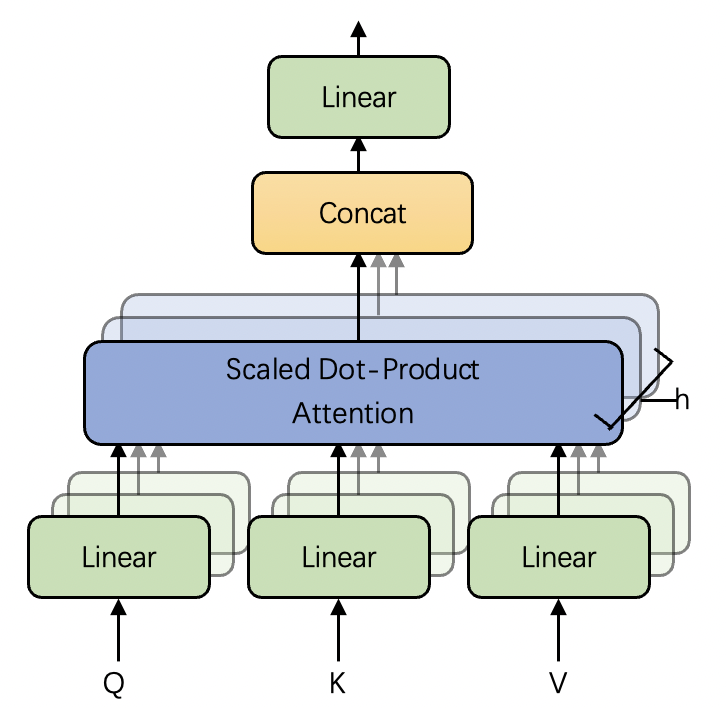{width="2.8404232283464568in"
height="2.77in"}

图 2-8 若干平行运行的多头注意力^\[6\]^

每个多头模块的计算过程由式(2-21)表示,式(2-22)表示将多个自注意力头的结果进行拼接后转换为特定维度的输出向量。

$$\begin{array}{r}
MultiHead(Q,K,V) = Concat\left( {head}_{2},\ldots,{head}_{h} \right)W^{O}\#(2 - 23)
\end{array}$$

$$\begin{array}{r}
{head}_{i} = Attention\left( QW_{i}^{Q},KW_{i}^{K},VW_{i}^{V} \right)\#(2 - 24)
\end{array}$$

其中Q，K，V 分别代表查询矩阵、键矩阵和值矩阵；
$W_{i}^{Q}，W_{i}^{K}，W_{i}^{V}$ 分别表Q，K，V进行变换的矩阵,
$W_{i}^{Q} \in \mathbb{\ R}^{d_{model} \times d_{k}},\ \ W_{i}^{K} \in \mathbb{\ R}^{d_{model} \times d_{k}},W_{i}^{V} \in \mathbb{\ R}^{d_{model} \times d_{v}},W^{O} \in \mathbb{\ R}^{hd_{v} \times d_{model}},\ $h代表自注意力数。在Google的论文^\[6\]^中取的是${h\  = \ 8,d}_{m} = 512,\ d_{k}\  = d_{v}\  = \ d_{m}/h = 64$，本文中取${h\  = \ 8,d}_{m} = 128,\ d_{k}\  = d_{v}\  = \ d_{m}/h = 64$。MultiHead(Q,K,V)代表由多头信息拼接变换后的多头注意模块的输出，其长距离特征捕获的能力受Multi-Head数量的影响，数量越多，特征捕获效果越好.由于其内部是一系列的矩阵乘法操作，所以并行化能力优CNN和RNN
结构。

**2.3.4 Feed-Forward Networks**

前馈神经网络(Feed Forward)前的残差模块(Residual
Block)对多头自注意力层的输出与编码器的输入进行求和后再进行Dropout(dropout率为0.1)操作来减少冗余信息。归化模块(Layer
Normal)利用单个样本数据上的均值和标准差来不断调整神经网络的中间输出，从而使整个神经网络在各层的中间输出的数值更稳定,同时具有正则化的效果。Layer
Normal层计算的公式化表示如下：

$$\begin{array}{r}
m = \frac{1}{D}\sum_{1}^{D}x_{i}\#(2 - 25)
\end{array}$$

$$\begin{array}{r}
\sigma = \sqrt{\frac{1}{D}\sum_{1}^{D}\left( X_{i} - m \right)^{2}}\#(2 - 26)
\end{array}$$

$$\begin{array}{r}
LN(x) = a \times \frac{(x - m)}{\sqrt{a^{2} + \varepsilon}} + \beta\#(2 - 27)
\end{array}$$

其中$x_{i}$代表经自注意力层的输出与编码器的输入融合后的向量的第i维；m表示输入x的均值，代表输入x的标准差;
α和β是可训练参数,ε是为防止除数为０而设的小数。

经残差模块与归一化模块处理后的结果传递到前馈
(feed-forward)神经网络中，其计算过程由式(2-28)表示.每个位置的单词对应的前馈神经网络都完全一样。

$$\begin{array}{r}
FFN(x) = \max\left( 0,xW_{1} + b_{1} \right)W_{2} + b_{2}\#(2 - 28)
\end{array}$$

这里是两层网络，第一层采用ReLU激活函数来达到非线性变化的目的;后一层是线性函数，其中
$W_{1}\ ,W_{2}$
为权值,$\ b_{1},b_{2}$为偏置。之后再次经过残差模块和归一化模块，一个transformer_block
计算完毕,我的模型通过堆叠两个 transformer_block
来获得分层,动态的语义特征向量使得后续模块的处理更加高效。

## 2.4 常见的文本分类方法

常见的文本分类方法有很多。本节我会从传统机器学习，卷积神经网络，循环神经网络以及其变体，双向循环神经网络，Transformer模型以及其变体这五大常用的方法进行比较和总结。

\(1\) 传统机器学习的分类方法

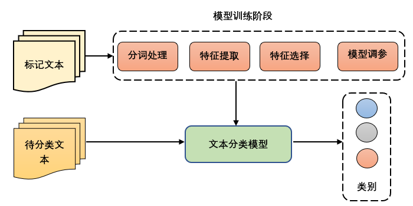{width="5.149850174978128in"
height="2.574925634295713in"}

图2-9基于传统机器学习的文本分类模型

传统的机器学习的特征提取有两种：第一种是人工特征抽取，就是特征工程。

由于特征工程的巨大工作量还要具备专业的知识，所以人工特征的方法越来越难以满足需求。第二种是基于统计学的方法提取特征比如One-hot编码，词袋模型，TF-IDF等。广泛使用的是TF-IDF(term
frequency--inverse document
frequency)方法。用来表示在所有文档中某一个词对某一个文档的相对重要性。其中TF指词频，是某个词在文档出现的次数。IDF
是逆文档频：IDF=$logT/(1 + T_{i\ })$ ，其中 T
为文档总数，$T_{i\ }$是包含某词i的文档总数，则TF-IDF =
TF×IDF对某个词，如果在某文档j中出现较多次，即TF较大；而包含该词的文档数却较少，即IDF也较大，则说明这个词对文档j相对更加重要，本文所有的传统的机器特征提取都使用TF-IDF表示文本与单词之间的关系。

常见的传统的机器学习的分类模型很多，比如逻辑回归、支持向量机、随机森林、贝叶斯等。2010年，安波等人利用逻辑回归模型实现了垃圾邮件过滤，提出了字节级n元文法获取邮件特征，有效的解决了垃圾邮件特征获取的问题^\[84\]^。2019年，宋晓婉针对多类问题上存在的分类精度不高和分类速度较慢等缺点对支持向量机有所改进，提出了一种基于类分离度量值的二叉树构造算法，并将其应用到大学生综合素质测评多分类问题中^\[85\]^。2020年，王样等人了有效提取极短文本中的关键特征信息，提出了一种基于支持向量机的极短文本分类模型^\[85\]^。2019年，刘勇等人针对传统随机森林分类使用了平均多数投票规则不能区分强弱分类器等缺点对其进行改进。实验结果表明有良好的性能^\[87\]^。2020年，吴皋等人针对传统朴素贝叶斯算法属于浅层学习,其特征独立性假设易引起分类效果欠佳的问题,提出一种深度集成朴素贝叶斯模型;该模型受深度森林中集成思想的启发^\[88\]^。传统的机器学习文本分类方法的优点是速度快并且在少量数据集上可以取代很好的效果，但其缺点同样明显，即数据样本需人工标注，词与词是没有联系，很独立而且词频来衡量文章中的一个词的重要性不够全面。

（2）卷积神经网络

卷机神经网络相关的文本分类中有很多研究和文献，卷积神经网络（Convolutional
Neural Networks，CNNs）的概念是Le Cun
等人于1995年提出^\[10\]^。2008年，Collobert，Ronan
等人将卷积神经网络首次运用到了自然语言处理任务中^\[100\]^。2014年，Kim采用CNN卷积网络对文本分类^\[9\]^，如图2-11所示，利用不同大小的1维卷积核对词向量做卷积和池化，最后全连接和SoftMax输出。并且取得了很大突破。随后2015年，Ye
Zhang等人对其做了大量的参数实验，给出了很多把TextCNN应用到文本分类的具体建议^\[89\]^。2020年，万齐斌等人针对无法将注意力集中在重要的词的问题，提出了一种基于BiLSTM-Attention-CNN混合神经网络的文本分类方法^\[90\]^。在BiLSTM层之后加入注意力机制(Attention)提取输出信息的注意力分值;注意力层之后,连接k-max池化层,提取前k个重要的词,增强模型特征的表达能力。实验结果表明准确率提高了1～2个百分点。2021年，滕金保等人将长短期记忆网络LSTM和卷积神经网络CNN组合为混合模型用于解决无法体现每个词语在文本中重要程度的问题^\[91\]^。

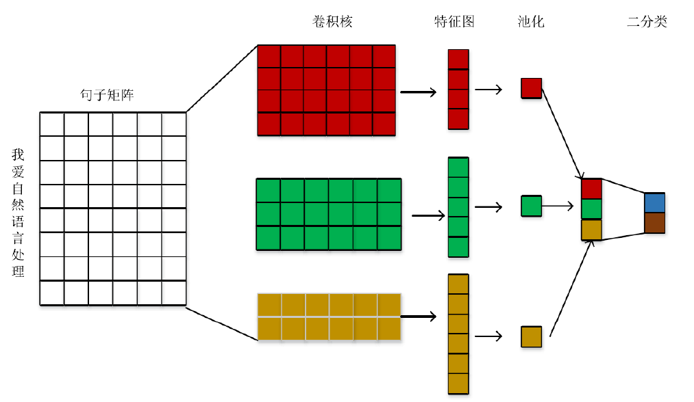{width="5.768055555555556in"
height="3.3471795713035872in"}

图 2-11 卷积过程^\[9\]^

卷积神经网络的文本分类方法缺点是没有注意力的学习，很难获取全局信息。优点是速度快和可以并行运行，而且可以更好的获取局部的信息。因此，如何利用好它的优势部分和规避它的缺点是本文要解决的问题。

> （3）循环神经网络

1990 年 Jeffrey L Elman 提出循环神经网络（Recurrent Neural
Network，RNN）是一种用于处理时序性数据的神经网络。图 2-12
所示，它能够处理序列变化的数据和其它的神经网络相比。RNN就能够很好地解决这类问题，例如某些字的意思会因为上文的内容不同而拥有不同的意思。但是RNN也有很多缺点，比如存在长句子依赖问题和因序列过长导致的梯度爆炸问题，这些缺点是由于RNN的向下传播信息的时候需要将每个状态都包含所有上个状态的输出而造成的结果，而且，在梯度下降反向传播的过程中要进行链式求导，序列越长造成乘积越多，最终导致后面的神经元无法学习到任何信息。

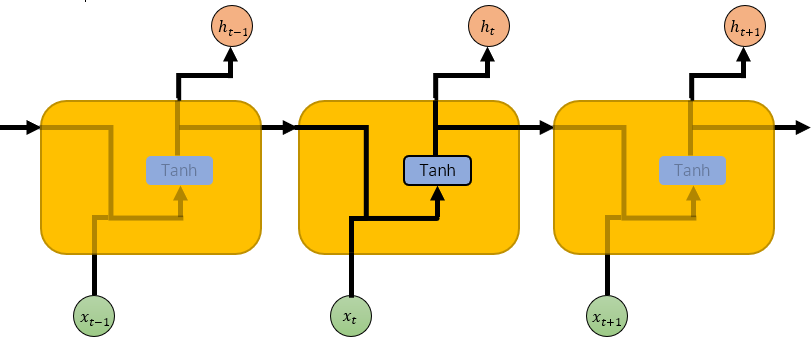{width="4.66049978127734in"
height="1.9745133420822398in"}

图2-12 RNN结构图

针对RNN在模型训练过程中存在的梯度消失和梯度爆炸和长句子依赖等问题，1997年，Hochreiter等人首次提出并实现使用长短期记忆网络(LSTM，Long
Short-Term
Memory)^\[82\]^。引入了"门"机制来控制信息的传递过程，使得模型可以有选择的保留一些需要记住的信息同时又可以根据上一时刻的状态和当前时
刻的输入进行调整，从而规避了RNN中存在的问题。LSTM模块中包含三个"门"机制，将整个模型分为四个单元(如图
2-13)。其中，遗忘门(蓝色)主要是对上一节点的输入选择性丢弃一些信息，输入门(红色)是选择在神经元中保留哪些新信息，输出门(紫色)决定当前状态的输出值。

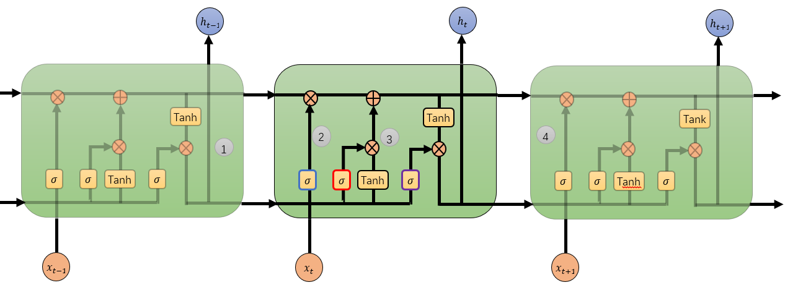{width="5.387601706036746in"
height="1.961486220472441in"}

图2-13 LSTM结构图^82\]^

GRU(Gated Recurrent unit)
是chung等人在2014年提出的门控机制循环神经网络^\[83\]^。具体结构如图2-15所示。和长短期记忆网络相比，GRU模型只有两个门，分别是更新门(蓝色)和重置门（红色），所以具有更简单的结构和预算也相对少。GRU模型比标准的
LSTM 模型要简单而且效果也不错，也是非常流行的变体。

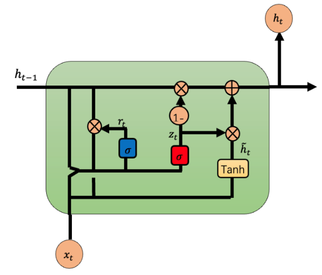{width="2.906593394575678in"
height="2.4789402887139107in"}

图2-15 GRU结构图^\[83\]^

不管是LSTM还是GRU，它们都是只能根据上文内容预测下一个字，但是很多字的意思是受下文的影响的。这种自回归模型不能像BERT或CNN这些网络具有并行的执行能力和速度慢。因为它们是时序模型，当前内存单元内的信息取决于前一时刻的输出和当前的输入，所以它们难以并行训练。虽然一定程度上解决了长距离依赖的问题，但是没有完全解决。仍然有梯度消失的问题。

（4）双向循环神经网络

为了使循环神经网络模型得到下文的状态信息，1997年，Schuster,
Mike等人提出了BRNN（Bidirectional recurrent neural
networks）^\[92\]^。这样BRNN就即可以依据之前时刻的时序信息也可以依据之后时刻的时序信息来预测下一时刻的输出。比如预测一句话中缺失的单词不仅需要根据前文来判断，还需要考虑它后面的内容，真正做到基于上下文判断。2013年，Graves等人提出了双向长短期记忆网络BiLSTM(Bidirectional
LSTM)^\[93\]^。之后相继出现了BiGRU。双向LSTM或GRU的文本分类模型如图2-11所示，和单向相比，最大的不同是它得到了后文的特征，然后前文和后文的特征做拼接最后经过全局平均池化和SoftMax函数输出分类结果。2019年，关立刚针对基于深度学习技术的文本分类算法中卷积神经网络(CNN)无法获取文本全局特征和双向循环神经网络(BiLSTM)无法聚焦文本局部特征的问题，将CNN与BiLSTM进行结合提出了基于注意力和残差连接的BiLSTM\--CNN文本分类^\[94\]^。2020年，王婷伟针对基于深度学习技术的文本分类算法中卷积神经网络(CNN)无法获取文本全局特征、双向循环神经网络(BiLSTM)无法聚焦文本局部特征的问题提出基于基于注意力和残差连接的BiLSTM-CNN文本分类^\[95\]^。

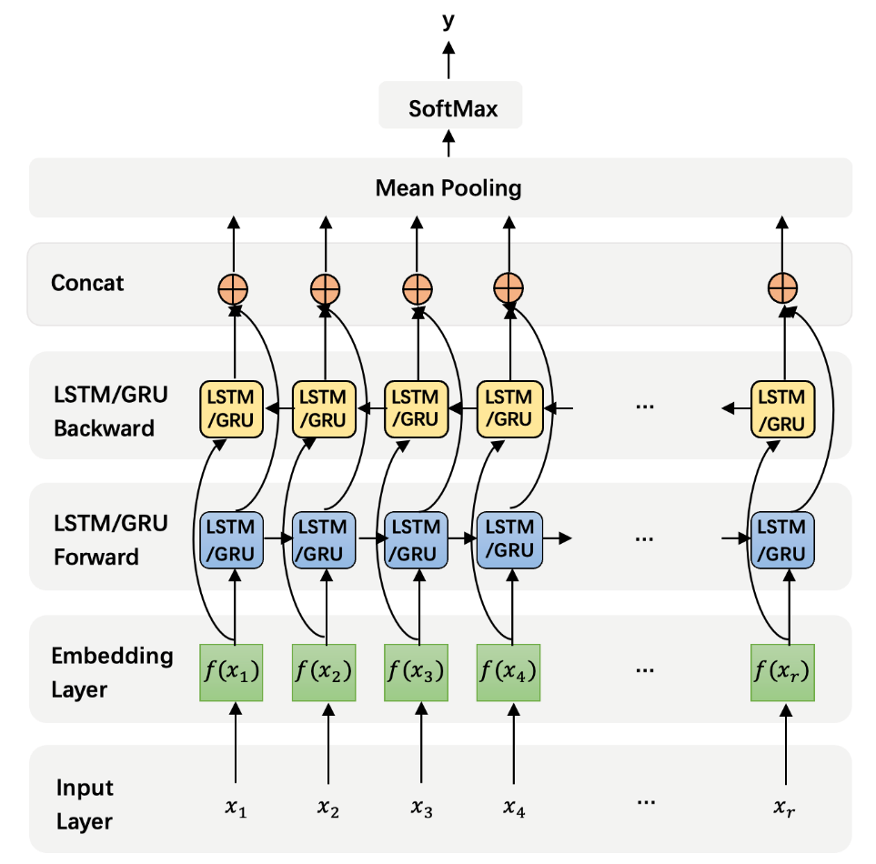{width="4.357142388451444in"
height="4.298915135608049in"}

图2-17 双向LSTM/GRU文本分类模型图

2018年，Matthew，Peters等人提出了ELMo（Deep Contextualized Word
Representations）,它是一种使用了预训练技术的新型单词向量化的设计采用了双向LSTM语言模型^\[5\]^。在之前2013年的word2vec及2014年的GloVe的工作中，每个词对应一个vector，对于多义词无能为力。ELMo提出了一个较好的解决方案。不同于以往的一个词对应一个向量，是固定的。在ELMo世界里，预训练好的模型不再只是向量对应关系，而是一个训练好的模型。使用时，将一句话或一段话输入模型，模型会根据上线文来推断每个词对应的词向量。这样做之后明显的好处之一就是对于多义词，可以结合前后语境对多义词进行理解。比如apple，可以根据前后文语境理解为公司或水果。

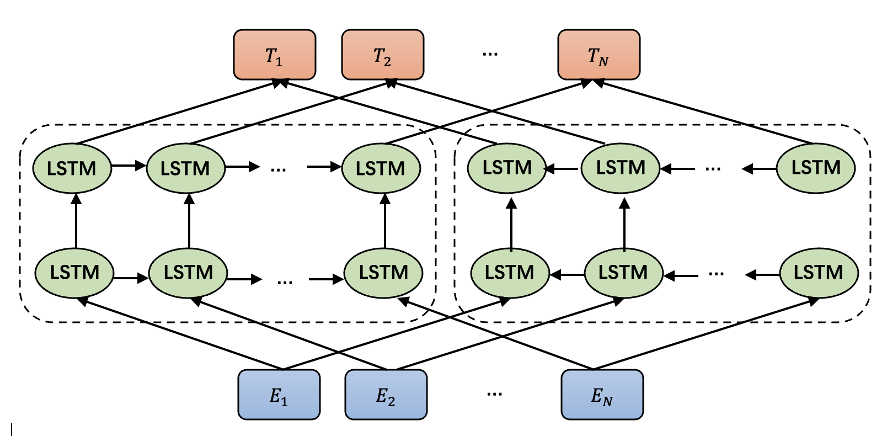{width="5.653846237970254in"
height="2.7779133858267717in"}

图2-18 ELMo结构图^\[8\]^

ELMo的是一个双向的LSTM语言模型，利用语言模型作为训练任务来获得一个上下文相关的预训练表示，由一个前向和一个后向语言模型构成，目标函数就是取这两个方向语言模型的最大似然。ELMo的结构图如图2-18。相对于LSTM，有两个改进，第一个是使用了多层LSTM，第二个是增加了后向语言模型（backward
LM）。

2021年，赵亚欧等人针对循环神经网络模型无法直接提取句子的双向语义特征,以及传统的词嵌入方法无法有效表示一词多义的问题,提出了基于ELMo和Transformer的混合模型用于情感分类^\[96\]^。2021年，杨书新等人针对传统的Word2Vec、GloVe等词嵌入技术会产生语义单一的问题，提出了一种融合情感词典与上下文语言模型ELMo的文本情感分析模型SLP-ELMo^\[97\]^。

ELMo虽然解决了一次多义的问题和根据上下文预测一下个单词的问题，但是由于它的双向语言模型是采用拼接的方式得到的，所以它也会有许多问题，问题一，特征选择和融合与BERT相比较弱；问题二，当数据数量较大和质量较高时，该模型的良好效果不显著；问题三，双向LSTM对语言模型建模不如注意力模型，训练速度较慢；问题四，利用LSTM或GRU实现的双向而不是Transformer,没有完全解决长句子依赖的问题。ELMo不能堆叠过深，一般两至三层等问题。

（5）Transformer模型以及相关的变体

2017年，Vaswani等人提出了在《Attention is all you
need》中提出Transformer模型，为了解决受限于循环神经网络本身的架构特征，基于RNNs
的 Seq2Seq
模型依然很难处理长依赖问题，其序列的特性也限制了模型的并行化计算等问题^\[6\]^。其结构如图2-6所示，旨在解决
Seq2Seq 任务，同时解决长期依赖问题。作者在文中指出，其提出的
Transformer模型在机器翻译任务上，超过循环神经网络模型和卷积神经网络模型，并且在训练过程中需要更少的计算资源。

{width="2.4678444881889763in"
height="4.30525699912511in"}

图 2-6 Transformer的模型结构^\[6\]^

2018年，Radford 等提出了GPT(generative
pre-training),是指的生成式的预训练模型^\[7\]^。GPT 使用 Transformer 的
Decoder 结构，并对 Transformer Decoder 进行了一些改动，原本的 Decoder
包含了两个 Multi-Head Attention 结构，GPT 只保留了 Mask Multi-Head
Attention，如下图2-15所示。GPT的思想跟Elmo,
BERT和XLNET基本保持一致，同样包括两阶段的训练，包括两阶段的训练，第一阶段是预训练，即在大型未标注的语料上进行预训练，第二阶段是fine-tuning，即将预训练的模型迁移到具体的NLP任务，进行模型微调。下图2-15是GPT模型结构图。

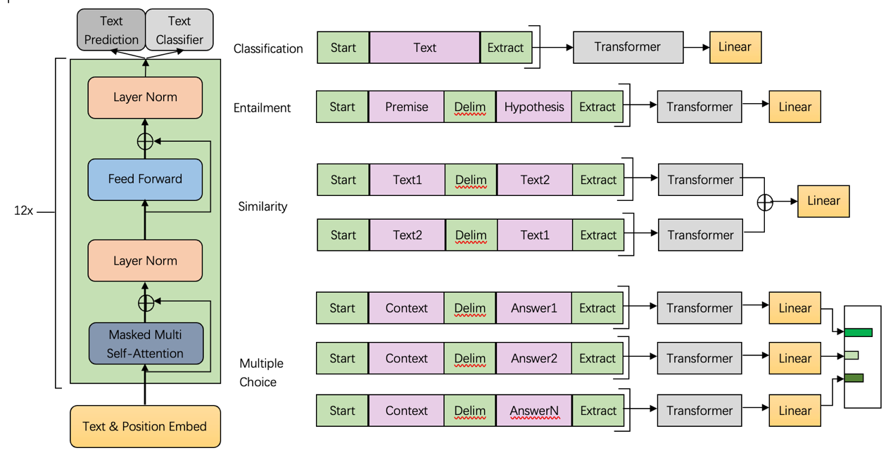{width="5.768055555555556in"
height="2.9444444444444446in"}

图 2-22
左边是Transformer的结构图用于训练的。右边是具体的NLP任务，把有结构的输入向量化并且输入到预训练模型中，最后在模型加上全连接和SoftMax层输出。

GPT 预训练时利用上文预测下一个单词，ELMO和BERT
（下一篇将介绍）是根据上下文预测单词，因此在很多 NLP 任务上，GPT
的效果都比 BERT 要差。但是 GPT
更加适合用于文本生成的任务，因为文本生成通常都是基于当前已有的信息，生成下一个单词。它的优点是：1）RNN所捕捉到的信息较少，而Transformer可以捕捉到更长范围的信息。2）计算速度比循环神经网络更快，易于并行化。3）实验结果显示Transformer的效果比ELMo和LSTM网络更好。它的缺点是：1）对于某些类型的任务需要对输入数据的结构作调整。2）对比BERT，没有采取双向形式，削弱了模型威力。

2019年，Devlin等人利用Transformer模型的encoder层,提出了BERT模型全称为Bidirectional
Encoder Representation from
Transformers，是一个预训练的语言表征模型^\[8\]^。BERT强调了不再像以往一样采用传统的单向语言模型或者把两个单向语言模型进行浅层拼接的方法进行预训练。在预训练时候采用两阶段训练的方式，第一个阶段叫做Masked
language
model（MLM），随机的抽取15%的token作为即将参与mask的对象。在这些被选中的token中，数据生成器并不不是把他们全部变成\[MASK\]，而是有下列3个选择:

1）在80%的概率下，用\[MASK\]标记替换该token,比如my dog is hairy -\> my
dog is \[MASK\]

2） 在10%的概率下,用⼀个随机的单词替换该token,比如my dog is hairy -\> my
dog is apple

3）在10%的概率下, 保持该token不变, 比如my dog is hairy -\> my dog is
hairy

BERT在训练的过程中,并不知道它将要预测哪些单词? 哪些单词是原始的样?
哪些单词被遮掩成了\[MASK\]？哪些单词被替换成了其他单词？这样可以让模型快速学习该token的分布式上下文的语义，尽最大努力学习原始语言说话的样子。

第二个阶段叫做下⼀句话的预测任务Next Sentence Prediction
(NSP)，目的是为了服务问答，推理，句子主题关系等NLP任务。所有的参与任务训练的语句都被选中参加。
50%的B是原始文本中实际跟随A的下⼀句话。标记为IsNext，代表正样本。50%的B是原始文本中随机抽取的⼀句话。标记为NotNext，代表负样本。

预训练后，只需要将特定任务的输入，输出插入到BERT中，只需要添加一个额外的输出层进行fine-tune。如下图2-21

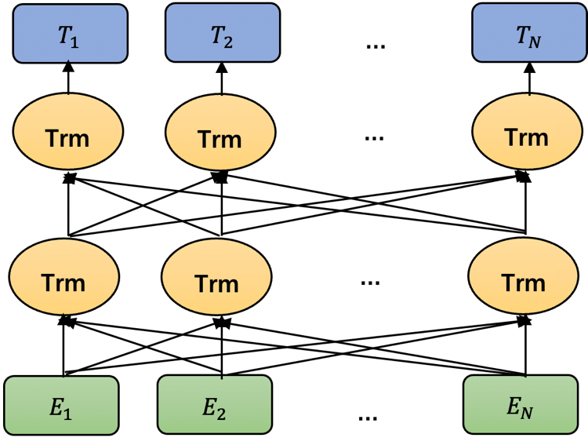{width="3.3725492125984253in"
height="2.549511154855643in"}

图2-21 BERT模型^8\]^

2019年，Yinhan Liu等人提出了RoBERTa（A Robustly Optimized BERT
Pretraining
Approach）^\[98\]^。RoBERTa在BERT模型基础上做了几点改动：1）用更多的训练数据，Batch大小增大，训练时间更长；2）移除了预测下一个语句的任务；3）用更长的语句训练；4）动态的改变MASK的方式；2019年，Wei
Wang等人在BERT的基础上提出了StructBERT（Incorporating language
structures into pre-training for deep language
understanding）^\[99\]^。StructBERT主要有两点贡献，1）训练增加了两个新的目标Word
Structural Objective和Sentence Structural
Objective，使得新的模型能显式对语言的顺序进行正确重构，并对正确顺序的句子作出预测；2）该模型超越了BERT，在现有大部分NLU任务取得了state-of-the-art的效果；

2019年，Yang等人针对BERT中问题提出了XLNet全称为 (Generalized
Autoregressive Pretraining for Language Understanding)
^\[49\]^。作者在对BERT进行了如下三个方面优化：1）采用了排列语言模型PLM
(Permutation Language Model),
将句子随机排列，然后用自回归的方法训练，从而即可以获得双向信息和学习token之间的依赖关系而且解决了BERT在训练过程中输入噪声问题，即BERT采用了Mask的训练方式，一方面忽略了被Mask掉词之间的依赖关系，其次是下游的fine-tuning中不会出现\[MASK\]，这就是出现了不匹配。（2）双流注意力机制，如图2-27，虽然排列语言模型能满足目前的目标，但是并不依赖于其要预测的内容的位置信息，因为无论预测目标的位置在哪里，因式分解后得到的所有情况都是一样的，所以引入了双流注意力机制即查询流和内容流。两个流的网络权重是共享的，训练时用双流，最后在微调阶段，只需要简单的把查询流移除，只采用内容流即可。(3)另外XLNet使用了Transformer-XL，即相对位置编码和片段循环机制。片段循环机制是解决超长序列的依赖问题，

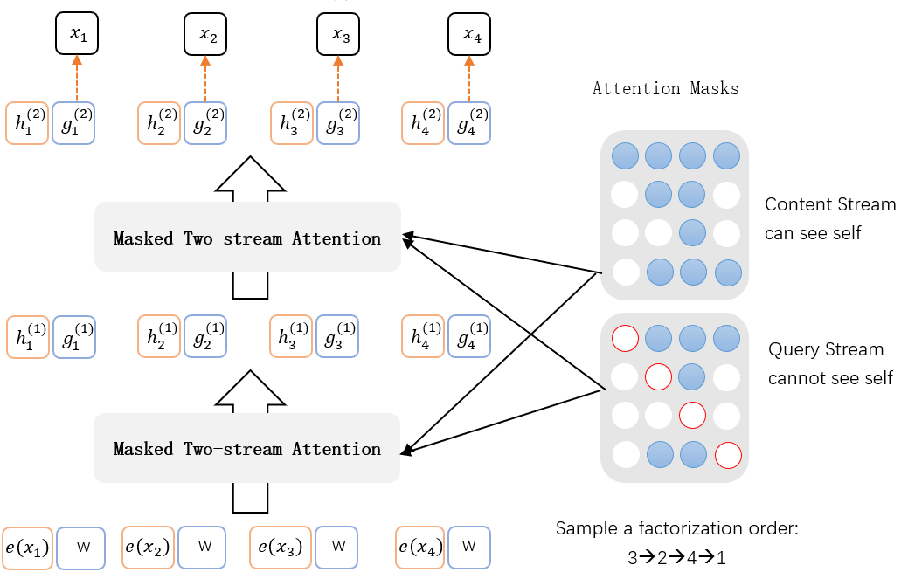{width="4.533996062992126in"
height="2.9509733158355207in"}

图2-27 双流注意力机制^\[49\]^

2020年，Pengcheng等人提出新预训练语言模型DeBERTa（Decoding enhanced BERT
with disentangled
attention）^\[21\]^。它被证明比RoBERTa和BERT作为PLM（Pre-trained Languge
Model）更有效，并且经过微调后，在一系列NLP任务中取得了更好的效果。DeBERTa对BERT模型做了两个修改。1.每个单词都是用两个向量表示的，这两个向量分别对其内容和位置进行编码，并且单词之间的注意力权重是根据单词的位置和内容来计算的内容和相对位置。这是因为观察到一对词的注意力权重不仅取决于它们的内容，而且取决于它们的相对位置。例如，当单词"deep"和"learning"相邻出现时，它们之间的依赖性要比出现在不同句子中时强得多。2.
DeBERTa在预训练时增强了BERT的输出层。在模型预训练过程中，将BERT的输出Softmax层替换为一个增强的掩码解码器（EMD）来预测被屏蔽的令牌。这是为了缓解训练前和微调之间的不匹配。在微调时，我使用一个任务特定的解码器，它将BERT输出作为输入并生成任务标签。然而，在预训练时，我不使用任何特定任务的解码器，而只是通过Softmax归一化BERT输出（logits）。因此，我将掩码语言模型（MLM）视为任何微调任务，并添加一个任务特定解码器，该解码器被实现为两层Transformer解码器和Softmax输出层，用于预训练。

## 2.5 相关文本分类比较与总结

+------------+-----------------------------------------------------------------------------------------------------------+----------------------------------------------+
| **模型**   | **缺点**                                                                                                  | **优点**                                     |
+:===========+:==========================================================================================================+:=============================================+
| Non-DL     | 词与词是没有联系，很独立。                                                                                | 速度快，适合少量数据集。                     |
+------------+-----------------------------------------------------------------------------------------------------------+----------------------------------------------+
| Text       | 没有注意力的学习。很难解决长距离的依赖。                                                                  | 速度快，可以并行运行。更好的获取局部的信息。 |
|            |                                                                                                           |                                              |
| CNN        |                                                                                                           |                                              |
+------------+-----------------------------------------------------------------------------------------------------------+----------------------------------------------+
| LSTM/      | 1.不能根据下文预测。2.不能并行化。3.没有完全解决长距离依赖问题。4. 梯度消失，                             | 一定程度上解决了长距离依赖的问题。           |
|            |                                                                                                           |                                              |
| GRU        |                                                                                                           |                                              |
+------------+-----------------------------------------------------------------------------------------------------------+----------------------------------------------+
| BiLSTM     | 利用LSTM或GRU实现的双向，没有完全解决长句子依赖的问题。                                                   | 双向的模型，可以学到上下文意思。             |
|            |                                                                                                           |                                              |
| BiGRU      |                                                                                                           |                                              |
+------------+-----------------------------------------------------------------------------------------------------------+----------------------------------------------+
| ELMo       | 1.双向语言模型是采用拼接的方式得到的，特征选择和融合与BERT相比较弱；                                      | 1.双向的模型，可以学到上下文意思。           |
|            |                                                                                                           |                                              |
|            | 2.当数据数量较大和质量较高时，该模型的良好效果不显著。                                                    | 2.第一个预训练语言模型。                     |
|            |                                                                                                           |                                              |
|            | 3.双向LSTM对语言模型建模不如注意力模型，训练速度较慢；                                                    |                                              |
|            |                                                                                                           |                                              |
|            | 4.利用LSTM或GRU实现的双向而不是Transformer,没有完全解决长句子依赖的问题。ELMo不能堆叠过深，一般两至三层； |                                              |
+------------+-----------------------------------------------------------------------------------------------------------+----------------------------------------------+
| BERT/      | 1.忽略了被Mask掉词之间的依赖关系，其次是下游的fine-tuning中不会出现\[MASK\]。                             | 1.解决了长距离依赖的问题。                   |
|            |                                                                                                           |                                              |
| 以及其变体 | 2.对局部信息获取和全局信息的获取一样对待。                                                                | 2.双向信息 （上下信息）                      |
|            |                                                                                                           |                                              |
|            | 3\. 需要大量语料和好的GPU训练。                                                                           |                                              |
|            |                                                                                                           |                                              |
|            | 4\. 缺乏生成能力，                                                                                        |                                              |
|            |                                                                                                           |                                              |
|            | 5\. 序列长度方面有限制                                                                                    |                                              |
+------------+-----------------------------------------------------------------------------------------------------------+----------------------------------------------+
| GPT        | 1.单向，不能考虑下文信息。                                                                                | 1.解决了长距离依赖的问题。                   |
|            |                                                                                                           |                                              |
|            | 2.对局部信息获取和全局信息的获取一样对待。                                                                | 2.具有生成能力                               |
|            |                                                                                                           |                                              |
|            | 3.需要大量语料和好的GPU训练。                                                                             |                                              |
+------------+-----------------------------------------------------------------------------------------------------------+----------------------------------------------+
| XLNET      | 1.对局部信息获取和全局信息的获取一样对待。                                                                | 1.具有生成能力                               |
|            |                                                                                                           |                                              |
|            | 2.需要大量语料和好的GPU训练。                                                                             | 2.可以获取更长序列信息                       |
+------------+-----------------------------------------------------------------------------------------------------------+----------------------------------------------+

## 2.6 本章小结

本章介绍了卷积神经网络以及其在序列任务上的计算过程，包括卷积操作和池化操作。又介绍了SENet网络与SKNet，包括基本理论。还介绍了自然语言生成任务常用的序列到序列模型，以及注意力机制和自注意力机制等常用的改进方法。接着介绍了目前流行的
Transformer 模型。

# 短文本分类模型设计

根据上一章的常用的文本分类方法的总结。可以得出基于Transformer的模型对局部信息的提取很弱，或者说局部信息的获取和全局信息的获取是一样对待的。如果完全依赖多头自注意力机制来获取局部信息在是完全不够的。因为相邻两个词之间的依赖性要比出现在不同句子中时强得多。本文提出CS-Transformer（CNN
and SENet-based
Transformer）模型,如图3-1，不仅是一种多输入的解决方案，而且通过把CNN加入Transformer模型中，利用其具有很强的局部信息获取能力而且可有选择性指定不同大小的卷积核提取局部信息，进而提升了局部信息的获取能力。

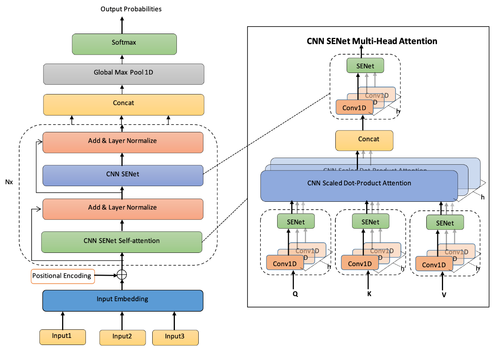{width="5.768055555555556in"
height="4.102083333333334in"}

图 3-1 左图CS-Transformer分类模型，右图是多头注意力机制

## 3.1 分类模型CS-Transformer设计

基于 RNNs
的文本分类模型自从被提出就受到了广泛的认同，并且不断优化，在很多任务上表现出不错的效果。尽管如此，受限于循环神经网络本身的架构特征，基于RNNs
的文本分类模型依然很难处理长依赖问题，其序列的特性也限制了模型的并行化计算。Vaswani
等人于 2017 年在《Attention is all you need》中提出 Transformer
模型，旨在解决 Seq2Seq
任务，同时解决长期依赖问题。作者在文中指出，其提出的
Transformer模型在机器翻译任务上，超过循环神经网络模型和卷积神经网络模型，并且在训练过程中需要更少的计算资源^\[6\]^。随后出现了各种基于Transformer的Encoder或Decoder的优化改进的模型用于自然语言处理，例如，BERT模型，GPT模型，XLNet模型，Transformer-xl模型等等。随着自注意力机制的引入，为全局信息的获取提供很大的保证。但是英语中两个词挨着相邻出现时，它们之间的依赖性和影响性要比它们出现在不同的句子中时或不相邻是强得多。本文引入CNN和SENet对Transformer模型的多头自注意力机制部分和特征提取进行改进，使得改进后的Transformer
Encoder模型更好的提取具有不同粒度的多输入中的信息，而且提升了对局部信息的获取进而提高了准确率。

Transformer 模型也是由一个Encoder组和一个 Decoder 组组成。一个 Encoder
或Decoder
组由多个Encoder模块或Decoder模块堆叠而成。每个模块都是由多头注意力（Multi-Head
Attention）和全连接前向网络层（Fully Connected Feed-Forward
layer）组成。由于摒弃了RNNs，这就需要利用另外一种方法来记住模型输入序列的位置信息。Transformer
模型中使用位置编码（positional
embedding）为输入序列的每一位元素添加一个相对位置信息，这些位置信息随后会被加入到词向量中，作为每一个词语的表示向量。Multi-Head
Attention 通过多个不同的线性变换对输入进行映射，计算方法如下：

$$\begin{array}{r}
Attention(Q,K,V) = softmax\left( \frac{QK^{T}}{\sqrt{d_{k}}} \right)V\#(3 - 1)
\end{array}$$

$$\begin{array}{r}
MultiHead(Q,K,V) = Concat\left( {head}_{2},\ldots,{head}_{h} \right)W^{O}\#(3 - 2)
\end{array}$$

$$\begin{array}{r}
{head}_{i} = Attention\left( QW_{i}^{Q},KW_{i}^{K},VW_{i}^{V} \right)\#(3 - 3)
\end{array}$$

𝑄、𝐾和𝑉分别表示 query向量、key向量和value向量。在Encoder-Decoder
Attention 中，𝑄向量是由 Decoder 解码得到，𝐾和𝑉则是来自
Encoder。公式（3-1）中，𝑠𝑜𝑓𝑡𝑚𝑎𝑥函数得到的结果会为𝑉中每一个值分配权重，权重越大，表示注意力越集中。除此之外，Transformer
还包括 Encoder Self-Attention 和 Decoder Self-Attention。Self-Attention
的计算方式与 Encoder-Decoder Attention 一样，不同的是，Self-Attention
中的𝑄、𝐾和𝑉向量为经过相同序列计算所得，来自相同的网络。Self-Attention
的引入是为了学习到句子中不同词语之间的相关性。在 Encoder 组中，每一个
Encoder 模块在不同抽象级别上对输入序列的相关部分分配不同的注意力。底层的
Encoder 模块的信息更加接近于原输入序列，高层 Encoder
会引入更多更高级的抽象信息。

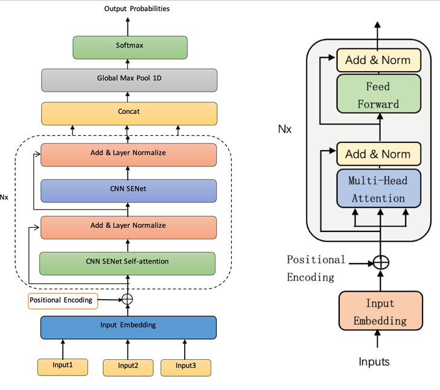{width="5.768055555555556in"
height="5.1194444444444445in"}

图3-2左图是CS-Transformer分类方法模型,右边是普通的Transformer编码部分

图3-2中左图是改进的Transformer encode的分类模型。与原有的Transformer
encoder模块有些多不一样的地方。

（1）多输入而不是单一输入。因为在实际的文本分类中往往是多输入的，每一种输入都代表不一样类型而且每一种输入都携带有不同粒度信息，所以要对待它们不一样，而不是把它们做简单的拼接。实验结果显示固定每一种输入的位置效果最好。例如模型有三种输入（发件人，邮件标题，邮件内容），邮件人占在第一个位置。邮件标题在2-25个位置上。邮件内容在26-150位置上。如果长度不足补零。

（2）基于CNN与SENet层替代全连接。利用CNN提取局部信息和不同卷积核提取不同范围的局部信息的优势，最后利用SENet自动对效果不好的卷积核提取的特征信息进行抑制和提升好的卷积核提取的特征信息，达到更好的词向量的空间映射作用。

（3）基于CNN与SENet的自注意力机制。经过CNN与SENet对K, V,
Q做词向量的空间映射后，在利用子注意力中的点乘。注意力中的点乘保持不变，这样就保持了原有提取长距离信息的能力而且结合了CNN提取局部信息的优势和并行的优势。

经过若干个基于CNN和SENet的网络的Encoder模块之后。做一个拼接，然后全局池化，最后是Softmax层得出每种分类的概率，基于每一种分类的概率选出概率最大的一种概率就是模型最后得出的结果。

## 3.2 卷积在文本中应用

**3.2.1 卷积核为1的1D卷积结果等价与2维全连接**

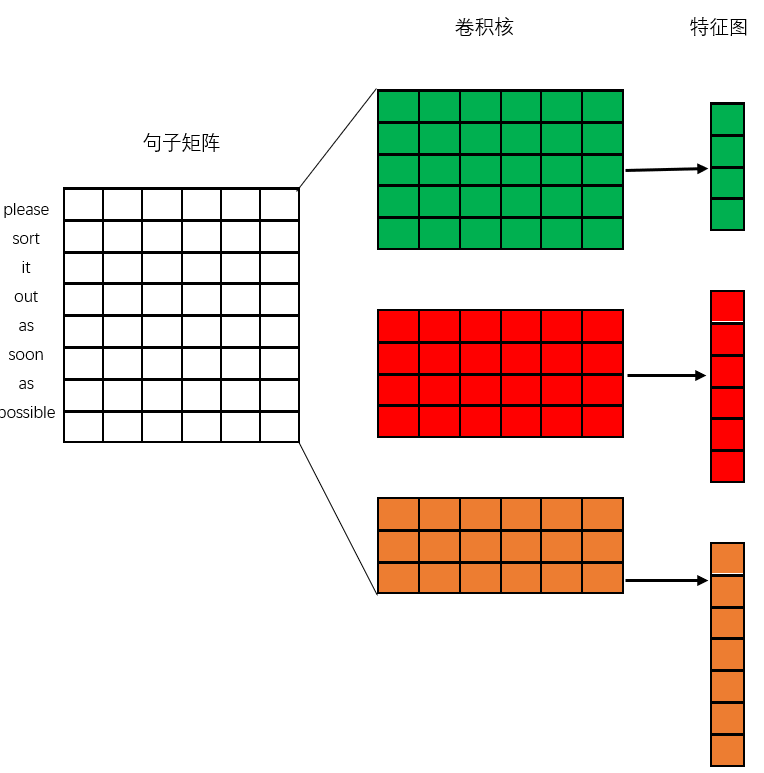{width="4.575623359580052in"
height="4.6296095800524935in"}

图3-3 卷积过程^\[9\]^

在自然语言处理任务中，通常会将句子表示为矩阵。设为$x_{i}\epsilon\mathbb{R}^{k}$是句子中对应的第$i$个单词的𝑘维词向量，则一个长度为𝑛的句子表示为公式（3-4）：

$$\begin{array}{r}
x_{1:n} = x_{1} \oplus x_{2} \oplus \cdots \oplus x_{n\ \ \ }\ \#\#(3\  - 4)\#
\end{array}$$

其中$\oplus$表示拼接操作。$x_{i:i + j}$一般是指$x_{i\ },x_{i\_ 1},...,x_{i + j}$的拼接。

卷积层的作用在于利用窗口滑动即卷积操作来提取文本数据的局部特征。一般采用$h \times k$维大小的卷积核进行卷积操作，其中$h$为卷积核的高度，n为文本的长度（长度是固定的，如果不太短就加0补齐）。为尽可能捕获更多的上下文信息，一般会设置多组高度不同的卷积核进行操作，但随着卷积核的增加，训练效率会随之下降，因此，本文选择使用3组卷积核，分别为$\ h$=1、$h$=
3、$h$=5用来对不同的输入的词向量D进行卷积运算，计算公式如下：

$$\begin{array}{r}
C_{h_{i}\ } = f\left( W_{h}X_{i:i + h - 1} + b \right),h = 3,4,5\#(3 - 5)
\end{array}$$

其中，$C_{h_{i}\ }$代表不同卷积核的输出结果，$W_{h}\epsilon\mathbb{R}^{hk}$
表示不同卷积核的权重矩阵，b代表偏置项，f(·)表示激活函数，为加快训练的收敛速度，本文采用Relu函
数作为激活函数。

当卷积核在长度为n的文本上滑动时，本文设置卷积步长S=1，因此，当卷积核在长度为n的文本中滑动完成后，可得到$n - h + 1$个输出，最终得到的特征向量C为：

$$\begin{array}{r}
C = C_{h,1},C_{h,2},\ldots,C_{h,n - h + 1},h = 3,4,5\#(3 - 6)
\end{array}$$

其中$C\ \epsilon\ \mathbb{R}^{n - h + 1}$。

在Transformer中，做向量的空间映射以及连接模块的都是全连接。下面的公式就全连接公式，其中$x\epsilon\mathbb{R}^{nk}$,
n为文本长度,
k词向量长度，b代表偏置项，f(·)表示激活函数，$w\epsilon\mathbb{R}^{kn}$*\*
$$\begin{array}{r}
\widehat{c} = \ f(\widehat{w}x\  + \ b)\#(3 - 7)
\end{array}$$

如果把利用卷积核为1在文本上抽取特征向量，那么就是h=1,
代入公式$(3 - 5)$与$(3 - 6)$中不难得出$c = \ \widehat{c}\  = f(\widehat{w}x\  + \ b)$，也就是说卷积核为1的1D卷积结果等价与2维全连接。而且卷积也具有并行计算的能力，尽而说明了2维全连接是可以完全被卷积所取代的。全连接相当于卷积核为1的1D卷积结果。

**3.2.2 不同卷积核做卷积的必要性**

英语中两个词挨着相邻出现时，它们之间的依赖性和影响性要比它们出现在不同的句子中时或不相邻是强得多。例如包含这些单词的句子client
impact, service unavailability, money implication，machine
learning，因为这些词挨着相邻出现时，它们之间的依赖性和影响性要比它们出现在不同的句子中时或不相邻是强得多。 所以简单的用全连接然后用自注意力机制来做词向量的抽取是不好的。虽然自注意力机制可以关联到和这个词相关的其它的所有词，但是它是把其它词与相邻的词都一样对待，事实上相邻的词或局部的词的影响性要比其它词大的多。利用不同的卷积核做卷积正好可以抽取不同相邻位置的信息。

因为不同句子用到的词与搭配都不一样，有的句子利用卷积核为3来抽取局部信息就好了，例如client
impact, cooperate action,
有的句子利用卷积核为5来抽取局部信息更好。例如fix it as soon as
possible，所以本文经过大量的实验得出利用$h$=1、$h$=
3、$h$=5三种不同的大小卷积核对词向量做向量空间转换与信息抽取在本文用到的数据集上最合适，效果最好。

## 3.3 文本分类中SENet应用

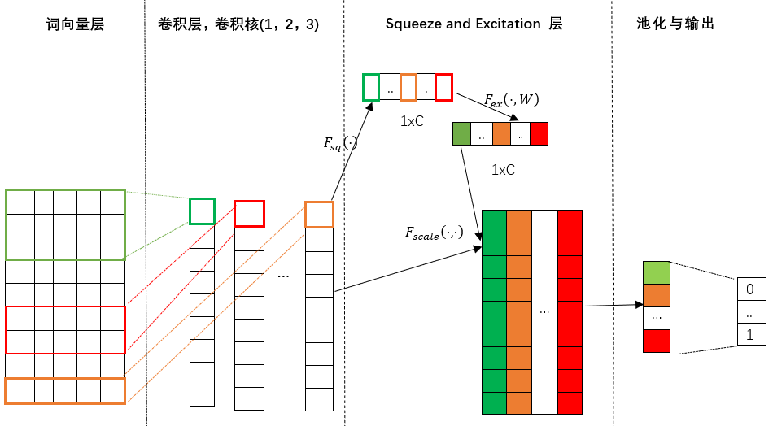{width="5.768055555555556in"
height="3.1819444444444445in"}

图3-4 卷积与SENet提取特征图

利用不同大小的卷积核做卷积来提取不同维度的特征之后，对于每一个词向量来说不是所有的卷积核提取的特征都很重要。有的词向量用卷积核3提取就足够了。有的是卷积核5或1，因为随着文本句子的不同，影响它周围词向量的范围也在变化。例如包含这些单词的句子client
impact, service unavailability, money implication, machine learning, on
priority，因为这些词挨着相邻出现时，它们之间的依赖性和影响性要比它们出现在不同的句子中时或不相邻是强得多。所以不能用全连接简单做词向量的空间映射也不能用卷积核为1的卷积来抽取局部信息，卷积核为2或3效果最好，还有些词语例如as
soon as
possible，利用卷积核为5的卷积来抽取局部信息，那么怎么样才能自动的抑制效果不好的卷积核提取的特征信息和提升好的卷积核提取的特征信息呢？本文利用一维的SENet来实现它。2维的SENet是因为它在计算机视觉领域被人们所认知。本文是把二维SENet改造成一维SENet，从而可以利用它达到自动的抑制效果不好的卷积核提取的特征信息和提升好的卷积核提取的特征信息效果。

SENet（Squeeze-and-excitation）网络^\[57\]^是从特征通道之间的关系上来提升网络的学习能力。Squeeze和Excitation是两个关键的操作。网络提出的动机是希望建模学习特征通道之间的相互依赖关系，采用了一种特征重标定的策略。通过学习的方式来获得到每个特征通道的重要度，根据这个重要度去提升对当前处理任务有用的特征信息，抑制用处不大的特征信息，基本结构示意图如图
3-3所示。首先是Squeeze操作，顺着空间维度来进行特征压缩，将每个一维的特征通道变
成一个实数，这个实数某种程度上具有全局的感受野，并且输出的维度和输入的特征通道数相匹配。它表征着在特征通道上响应的全局分布，而且使得靠近输入的层也可以获得全局的感受野，这一点在很多任务中都是非常有用的，Squeeze操作是由全局平均池化实现。

Excitation
操作，它是一个类似于循环神经网络中门的机制。通过参数w来为每个特征通道生成权重，其中参数w被学习用来显式地建模特征通道间的相关性。Excitation的操作是通过两个全连接层去建模通道间的相关性，并输出和输入特征同样数目的权重，首先将特征维度降低到输入的
1/16，然后经过ReLU激活后再通过一个全连接层后回到原来的维度。这样做的好处在于：1）具有更多的非线性，可以更好地拟合通道间复杂的相关性；2）减少了参数量和计算量。然后通过一个Sigmoid函数获得0到1之间归一化的权重。

最后是一个Reweight的操作，将Excitation
操作输出的权重看做是经过学习选择后的每个特征通道的重要性，然后通过乘法逐通道加权到先前的特征上，完成在通道维度上的对原始特征的重标定。

## 3.4 基于卷积与SENet的多头自注意力机制

自注意力机制是注意力机制中的一种，也是transformer中的重要组成部分.
在2017年6月google机器翻译团队在arXiv上放出的《Attention is all you
need》论文受到了大家广泛关注，自注意力（self-attention）机制开始成为神经网络attention的研究热点，在各个任务上也取得了不错的效果。

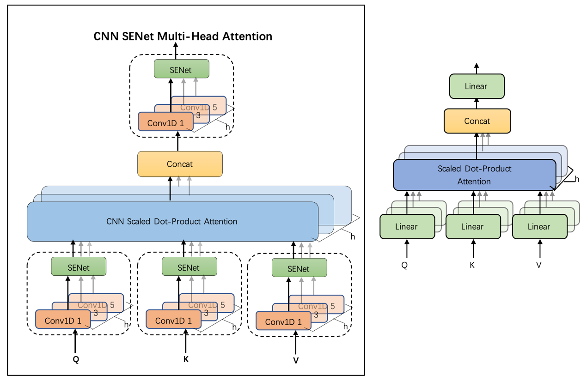{width="5.768055555555556in"
height="3.7576388888888888in"}

图3-5 左图是基于CNN与SENet的多头自注意力，右图是基于全连接的多头自注意力

右图是熟知的Multi-head
attention，它能够让模型从不同的表征子空间去共同学习不同位置的表达信息。先将Q，K，V经过不同的h个线性投影后,
再进行Scaled Dot-Product
Attention的计算，可以学习到不同的语义信息。每个多头模块的计算过程由式(3-11)表示,式(3-12)表示将多个自注意力头的结果进行拼接后转换为特定维度的输出向量。

$$\begin{array}{r}
MultiHead(Q,K,V) = Concat\left( {head}_{2},\ldots,{head}_{h} \right)W^{O}\#(3 - 8)
\end{array}$$

$$\begin{array}{r}
{head}_{i} = Attention\left( QW_{i}^{Q},KW_{i}^{K},VW_{i}^{V} \right)\#(3 - 9)
\end{array}$$

其中Q，K，V 分别代表查询矩阵、键矩阵和值矩阵；
$W_{i}^{Q}，W_{i}^{K}，W_{i}^{V}$ 分别表Q，K，V进行变换的矩阵,
$W_{i}^{Q} \in \mathbb{\ R}^{d_{model} \times d_{k}},\ \ W_{i}^{K} \in \mathbb{\ R}^{d_{model} \times d_{k}},W_{i}^{V} \in \mathbb{\ R}^{d_{model} \times d_{v}},W^{O} \in \mathbb{\ R}^{hd_{v} \times d_{model}},\ $h代表自注意力数。MultiHead(Q,K,V)代表由多头信息拼接变换后的多头注意模块的输出，其长距离特征捕获的能力受Multi-Head数量的影响，数量越多，特征捕获效果越好。

左图是基于CNN与SENet的多头自注意力。Q，K，V分别经过拥有不同卷积核的一维卷积本文论文用的是卷积核为1，3，5的卷积。利用不同卷积核得到的特征值再经过SENet网络，SENet对这些特征值做进一步轨道上的筛选，自动的抑制效果不好的卷积核提取的特征信息和提升好的卷积核提取的特征信息。然后经过点乘注意力。图中这里的注意力是有三个头组成，经过大量试验发现，每个头对应一个不同的卷积核的卷积输入效果最好。相对与不同角度抽取信息。紧接着是将多个自注意力头的结果进行拼接。然后再经过CNN与SENet网络。最终转换为特定维度的输出向量。

基于CNN与SENet的多头自注意力机制不仅利用CNN的并行与提取局部特征的优势而且还可以进一步利用SENet自动对效果不好的卷积核提取的特征信息进行抑制和提升好的卷积核提取的特征信息。SENet在这个过程起到了自动筛选卷积核的作用。注意力中的点乘保持不变，这样就保持了提取长距离信息的能力。

## 3.5 本章小结

本章首先构造基于 Transformer Encoder 的分类模型，指出基于Transformer
Encoder
的分类模型对局部信息捕捉能力不足的缺点。针对该问题，提出基于CNN与SENet的Transformer
Encoder的分类模型，其卷积模块与SENet模块能够很好地捕捉到序列的局部信息。然后论证了线性全连接等价于卷积核为1的一维的卷积以及为什么引入CNN以及为什么要用不同的卷积核做卷积。又介绍了SENet网络，对不同卷积核做卷积的结果自动的抑制效果不好的卷积核提取的特征信息和提升好的卷积核提取的特征信息。又介绍了基于卷积与SENet网络的多头自注意力机制。其中卷积与SENet替代了线性的全连接做Query,
Key,Value的映射。最后介绍了基于改进的Transformer encoder的分类模型。

# 实验与结果分析

## 4.1 实验数据集

随着近年来互联网的蓬勃发胀，为自然语言处理的各类任务提供了很多大规模公开的数据集用于学习和研究，促使了许多经典的文本分类模型出现。在各类文本分类模型中，基于Transformer的Encoder层或Decoder层很多网络模型在短文本分类任务中获得了显著的性能提升。本文实验将在三个英文语言的数据集上测试本文方法的有效性，即IMDB,
SST2和用户邮件优先级数据集（MP），其中IMDB数据集是由Maas等人标注发布于2011年发布的大规模标注数据集^\[3\]^。SST2数据集自于Stanford情感树库^\[56\]^。有户邮件优先级数据集来源于某公司的真实的用户邮件并且被技术支持人员标记过的数据集。简要概述如下：

IMDB数据集：IMDB数据集是一个二分类的情感分析数据集，共包含50000条来自美国电影评价网站的数据，提供了25000电影评论用于训练，而25000条电影评论用于测试，是由Maas等人标注发布^\[3\]^。这是一个二分类的数据集，其中包含比以前的基准数据集更多的数据。另外还有额外的未标记的数据也可以使用。文本平均长度为292,按照情感极性可以划分为积极(Pos)和消极(Neg)两种情感类别。

表 4-1 IMDB数据集原文-类别对示例

  ----------------------------------------------------------------------------
  **原文**                                                          **类别**
  ----------------------------------------------------------------- ----------
  This film has a special place in my heart, as when I caught it    Pos
  the first time, I was teaching adult literacy. It rang very true  
  to me and even an outstanding student I had at the time. There    
  are scenes which make you gulp with sudden emotion, and those     
  which even put a smile on your face through sheer identification  
  with the characters and their situation. \ \ Excellent performances by Jane Fonda and Robert DeNiro that    
  rank with their best work, a great turn by a young Martha         
  Plimpton, an inspiring story line, and a haunting musical score   
  makes for a most enjoyable and rewarding experience.              

  From the beginning of the movie, it gives the feeling the         Neg
  director is trying to portray something, what I mean to say that  
  instead of the story dictating the style in which the movie       
  should be made, he has gone in the opposite way, he had a type of 
  move that he wanted to make, and wrote a story to suite it. And   
  he has failed in it very badly. I guess he was trying to make a   
  stylish movie. Any way I think this movie is a total waste of     
  time and effort. In the credit of the director, he knows the      
  media that he is working with, what I am trying to say is I have  
  seen worst movies than this. Here at least the director knows to  
  maintain the continuity in the movie. And the actors also have    
  given a decent performance.                                       
  ----------------------------------------------------------------------------

表 4-2 IMDB数据集具体信息

  ----------------------------------------------------------------------------
   **数据集**   **文本数**   **训练集**   **测试集**   **验证集**   **类别**
  ------------ ------------ ------------ ------------ ------------ -----------
      IMDB        50000        30000        15000         5000          2

  ----------------------------------------------------------------------------

SST：SST (Stanford Sentiment
Treebank)是2013年由Socher等人标注并发布一个情感分析数据集，主要针对电影评论来做情感分类^\[56\]^。该数据集被标注为五类(非常正面、正面、中立、负面和非常负面)，即这是一个5分类数据集。该数据集一共包括11855条电影评论，已经被分割为训练集(8544)、验证集(1101)和测试集(2210)。

在SST2数据集中，去除了SST中的中立评论，并且把非常正面和正面合并为正面，把非常负面和负面合并为负面。最终SST2总共包含9163个样例，其中训练集包括7792个样例，测试集1821个样例。同样，这也是一个有两个目标类的二分类任务。表4-3
是SST2数据集样例，表4-4时SST2数据集的具体信息

表 4-3 SST2数据集原文-类别对示例

  ---------------------------------------------------------------------------
  **原文**                                                         **类别**
  ---------------------------------------------------------------- ----------
  With a cast that includes some of the top actors working in      0
  independent film, Lovely & Amazing involves us because it is so  
  incisive, so bleakly amusing about how we go about our lives.    

  Not for everyone, but for those with whom it will connect, it's  1
  a nice departure from standard moviegoing fare.                  

  The film provides some great insight into the neurotic mindset   0
  of all comics \-- even those who have reached the absolute top   
  of the game.                                                     
  ---------------------------------------------------------------------------

表 4-4 SST2数据集具体信息

  --------------------------------------------------------------------------
  **数据集**     **文本数**     **训练集**     **测试集**     **类别**
  -------------- -------------- -------------- -------------- --------------
  SST2           9163           7792           1821           2

  --------------------------------------------------------------------------

用户邮件优先级数据集（MP）：是某公司的真实的用户邮件，并且被技术支持人员按优先级（Critical，high，medium，low）人工标记过，表4-5是用户邮件优先级数据集的样例，表4-6是此数据集的训练集，测试集与验证集的具体分配，其中30000用户邮件文本数据用于训练，5000用户邮件文本数据用于验证，15000用户邮件文本数据用于测试。这是一个四分类任务。

表 4-5 有户邮件优先级数据集(MP)原文-类别对示例

  ---------------------------------------------------------------------------------
  **邮件内容**                              **邮件主题**    **发件人**   **类别**
  ----------------------------------------- --------------- ------------ ----------
  Can you advise why event xxx was received Duplicate       User         High
  into aspen, should this not have been     events in aspen              
  picked up as a potential duplicate                                     
  against xxx, we are seeing high volumes                                
  of duplicate coming into aspen and need                                
  to know if they are not being held up.                                 

  We are currently unable to access the     ASPEN Dashboard User         Critical
  ASPEN dashboard.Can you please urgently   outage                       
  check and resolve as we cannot perform                                 
  BAU without access to it.                                              

  On the above payment ref, yesterday I     xxx-000191388   BA           Medium
  accidentally sent through a settlement on                              
  two differing PU items. Firstly, can we                                
  have this payment returned immediately as                              
  aspen will not let me do so. And secondly                              
  im not sure I should have been able to                                 
  make this posting in the first place as                                
  it was over two PU entities.                                           

  Can you please provide a list of events   Lottery tool-   BA           Low
  where the lottery tool has been used with events for                   
  a pay date from 1st August 2021 until     August 2021                  
  31st August 2021 using the following                                   
  criteria: Event Type -- xxx Pay Date --                                
  August 2021 Processing Status -- Not                                   
  including Cancelled                                                    
  ---------------------------------------------------------------------------------

表 4-6 有户邮件优先级数据集(MP)具体信息

  --------------------------------------------------------------------------------------
  **数据集**               **文本数**   **训练集**   **测试集**   **验证集**   **类别**
  ----------------------- ------------ ------------ ------------ ------------ ----------
  有户邮件优先级数据集       50000        30000        15000         5000         4

  --------------------------------------------------------------------------------------

## 4.2 评价指标

评测一个文本分类模型经常使用这些指标：准确率 Accuracy、精确率
Precision、召回率 Recall 以及 F1
值。本文相关研究工作是自然语言处理中文本分类问题，表4-7是一个正反例二分类的混淆矩阵，利用它可以方便的阐述分类问题中的四个评价指标的计算公式。

表 4-7 正反例分类结果的混淆矩阵

  -----------------------------------------------------------------------
                          预测为正例              预测为反例
  ----------------------- ----------------------- -----------------------
  真实为正例              TP(真正例)              FN(假反例)

  真实为反例              FP(假正例)              TN(真反例)
  -----------------------------------------------------------------------

文本分类模型在IMDB，SST2和MP数据集的训练效果，四种评价指标的计算公式如下：

（1）准确率：所有的预测结果正确的数量占全部需要预测样本的比例。计算公式如下：

$$\begin{array}{r}
Accuracy = \frac{TP + TN}{TP + TN + FP + FN}\#(4 - 1)
\end{array}$$

（2）精确率：真实为正例且预测为正例的数量占全部预测为正例的数量的比例。计算公式如下：

$$\begin{array}{r}
Precision = \frac{TP}{TP + FP}\#(4 - 2)
\end{array}$$

（3）召回率：真实为正例且预测为正例的数量占全部真实为正例的数量比例。计算公式如下：

$$\begin{array}{r}
Recall = \frac{TP}{TP + FN}\#(4 - 3)
\end{array}$$

（4）F1
值：也可称为平衡F分数，它的值的范围在\[0，1\]之间。它的值越高，即越接近于1说明算法效果越好，它融合了模型的精确率和召回率，是精确率和召回率加权平均后的结果。计算公式如下：

$$\begin{array}{r}
F1 = \frac{2\  \times Precision\  \times Recall}{Precision\  + \ Recall}\#(4 - 4)
\end{array}$$

其中，TP为原本正例被预测为正例数量，TN为原本反例被预测为反例数量，FP为原本反例但被预测为正例数量，FN为原本正例但被预测为反例数量。

## 4.3 实验参数设置

通过上一章对本文提到的CS-Transformer模型各个部分的详细阐述，我们已经了解了模型整个结构。本小节将对CS-Transformer模型在实验中用的相关键参数进行介绍，介绍的内容包括三个方面：CS-Transformer模型的超参数设置，CS-Transformer模型在训练中的参数设置和实验环境中的相关参数。

（1）CS-Transformer模型的超参数设置

本文所用的分类模型是基于CNN与SENet的多输入Transformer模型，是由多个Encoder叠加而成。根据参数调试结果，Encoder层数为2时效果最优。模型输入的词嵌入维度是48，卷积窗口大小设置为
1，3，5，SENet中超参数r即缩放参数设为16。对于CNN与SENet多头注意力子层，head的数量3，key向量，query向量和
value向量的维度设置为16维，因为利用三个卷积核得到的结果要做拼接，拼接的结果等于词嵌入维度。在前馈神经网络子层中，输出和输入的维度都是48维，模型中每个两层都用残差网络做连接，用于缓解梯度消失。每个子层的输出维度都和词嵌入维度相同即为48。为了提高模型的泛化能力和防止过拟合，在最后一层前馈神经网络子层之后使用Dropout，Dropout的值为0.3。每个Encoder层中之后最后一层前馈神经网络自层中的卷积网络使用激活函数Relu，其它的卷积都不使用。

表 4-8 基于CNN与SENet的Transformer分类模型参数设置

  -----------------------------------------------------------------------
                   参数                                属性
  -------------------------------------- --------------------------------
        Transformer Encoder的层数                       2

                 输入长度                              200

                词嵌入维度                             48维

             卷积中卷积核大小                         1,3,5

             SENet的缩放参数                            16

             自注意力机制头数                           3

                Key 的维度                              16

               Value 的维度                             16

               Query的维度                              16

                 激活函数                              Relu
  -----------------------------------------------------------------------

> （2）CS-Transformer模型在训练中的参数设置

在模型训练的时候，使用Adam作为优化器进行反向梯度传播更新参数。迭代的次数是10。EarlyStopping函数中patience参数设置为4，这样模型的损失函数如果超过4个epoch没有降低是自动训练。batch
size设置为35，初始学习率（Learning
Rate）为0.0003。dropout的参数设置为0.3。表4-9是CS-Transformer模型在训练中具体的参数。

表 4-9 基于CNN与SENet的Transformer分类模型训练过程中的参数设置

  -----------------------------------------------------------------------
                     参数                                属性
  ------------------------------------------ ----------------------------
                  Batch Size                              35

          EarlyStopping中的patience                       4

                    优化器                               Adam

                   迭代次数                               10

                    学习率                              0.0003

                 Dropout Rate                            0.3
  -----------------------------------------------------------------------

（3）实验环境中的相关参数

实验中使用的开发工具为PyCharm，使用的python版本为3.7.11，使用的深度机器学习框架是google公司的
TensorFlow
2.6.0。另外，实验过程中由于三个数据集都很大，需要高内容，为了让模型训练的快一点，实验是在配有GPU
资源的服务器上进行。对其它的硬件环境也有要求，具体服务器的配置见表4-10。

表 4-10 服务器的配置

  -----------------------------------------------------------------------
            硬件名称                              配置
  ----------------------------- -----------------------------------------
            操作系统                            Window 10

               CPU                 AMD Ryzen 7 3700X 8-Core Processor

              硬盘                                2.7 T

              内存                                32 G

               GPU                    NVIDIA GeForce RTX 2070 SUPER
  -----------------------------------------------------------------------

## 4.4 改进的Transformer学习策略

本文选用交叉熵函数（Cross-Entropy）作为模型的损失函数，在输出结果之前，利用随机失活dropout清除部分训练节点，达到减少模型拟合的现象的概率，交叉熵函数的公式如下:

$$\begin{array}{r}
Loss = \ \sum_{j = 1}^{m}{\sum_{i = 1}^{n}{{\widehat{y}}_{ji}\log y_{ji}}}\ \#(4 - 5)
\end{array}$$

其中m为当前训练的batch的样本数，n是类别数，$y_{ji}$表示Softmax层输出概率结果，${\widehat{y}}_{ji}$是用独热向量表示的真实标签。

表4-10是模型CS-Transformer在训练过程中具体的学习过程，包括参数，输入，输出和模型学习过程。

表4-10 CS-Transformer模型学习过程

+----------+-----------------------------------------------------------------------------------------------------------------------------------------------------------------------------------------------------------------------------------+
| 算法1    | CS-Transformer模型学习策略                                                                                                                                                                                                        |
+==========+:==================================================================================================================================================================================================================================+
| **参数** | bd，max_len，c_kernel，h，fold,，batch，epoch。其中𝑥为句子，𝑦为文本分类的标签，bd为词嵌入维度，max_len为最大句子长度，c_kernel为一组卷积核数，h为注意力机制中的头数量，fold代表训练次数，epoch代表每轮训练次数，batch是批次大小。 |
+----------+-----------------------------------------------------------------------------------------------------------------------------------------------------------------------------------------------------------------------------------+
| **输入** | 训练集$T_{train}$=$(x$, $y)$，测试集$T_{test}$ =$\ (x',y')$。其中𝑥和$x'$为输入的句子，𝑦和$y'$为文本分类的标签。                                                                                                                   |
+----------+-----------------------------------------------------------------------------------------------------------------------------------------------------------------------------------------------------------------------------------+
| **输出** | 文本分类模型𝛺                                                                                                                                                                                                                     |
+----------+-----------------------------------------------------------------------------------------------------------------------------------------------------------------------------------------------------------------------------------+
| **Step   | 将数据预处理为相关输入形式。                                                                                                                                                                                                      |
| 1**      |                                                                                                                                                                                                                                   |
+----------+-----------------------------------------------------------------------------------------------------------------------------------------------------------------------------------------------------------------------------------+
| **Step   | 随机初始化模型𝛺中所有网络层的参数。                                                                                                                                                                                               |
| 2**      |                                                                                                                                                                                                                                   |
|          | 1:  FOR(i=0; i\<fold; i++)                                                                                                                                                                                                        |
|          |                                                                                                                                                                                                                                   |
|          | 2:   FOR(j=0; j\<epoch; j++)                                                                                                                                                                                                      |
|          |                                                                                                                                                                                                                                   |
|          | 3: 按batch输入数据到模型。经过位置编码与词嵌入层得t                                                                                                                                                                               |
|          |                                                                                                                                                                                                                                   |
|          | 4: FOR(z=0; z\<encoders; z++)                                                                                                                                                                                                     |
|          |                                                                                                                                                                                                                                   |
|          | 5: 将t输入到CNN(kernel=(1,3,5))与SENet网络中得到$t_{q},\ t_{k\ },t_{v}$.                                                                                                                                                          |
|          |                                                                                                                                                                                                                                   |
|          | 6: 将$t_{q},\ t_{k\ },t_{v}$输入到多头注意力层，得到a（这里因为我用的卷积核是3个，所以如果用多头注意力机制，根据实验结果头的数量和卷积核一样才效果最好。）。                                                                      |
|          |                                                                                                                                                                                                                                   |
|          | 7: 将a与t输入残差网络然后做layer Normalize 得c                                                                                                                                                                                    |
|          |                                                                                                                                                                                                                                   |
|          | 8: 将c输入CNN(kernel=(1,3,5))与SENet网络得到d。                                                                                                                                                                                   |
|          |                                                                                                                                                                                                                                   |
|          | 9: 将c与d输入残差网络然后做layer Nomalize 得$o_{z}$                                                                                                                                                                               |
|          |                                                                                                                                                                                                                                   |
|          | 10: 把$o_{z}$ 赋值给t。                                                                                                                                                                                                           |
|          |                                                                                                                                                                                                                                   |
|          | 11: END FOR                                                                                                                                                                                                                       |
|          |                                                                                                                                                                                                                                   |
|          | 12: 将encoders层出来的结果即为e。                                                                                                                                                                                                 |
|          |                                                                                                                                                                                                                                   |
|          | 13: 将e输入到最大池化层，然后将结果输入到Softmax输出层。                                                                                                                                                                          |
|          |                                                                                                                                                                                                                                   |
|          | 14: 利用公式（4-5）交叉熵函数计算模型𝛺的损失L。                                                                                                                                                                                   |
|          |                                                                                                                                                                                                                                   |
|          | 15: 对损失函数L运用梯度下降反向传播，以调整模型𝛺中的参数。                                                                                                                                                                        |
|          |                                                                                                                                                                                                                                   |
|          | 16: END FOR                                                                                                                                                                                                                       |
|          |                                                                                                                                                                                                                                   |
|          | 17: END FOR                                                                                                                                                                                                                       |
|          |                                                                                                                                                                                                                                   |
|          | 18: 得到分类模型，算法停止。                                                                                                                                                                                                      |
+----------+-----------------------------------------------------------------------------------------------------------------------------------------------------------------------------------------------------------------------------------+

## 4.5 实验结果分析与对比

本节我将利用多个评价指标分别为精确率(Precision)、召回率(Recall)
、准确率（Accuracy）以及F1值(F1-score)等来评测本文改进过的Transformer分类方法。首先把本文提出的方法与目前主流模型的在三个不同的文本数据集上进行多组不同角度对比实验，并对部分典型的数据样例以及结论进行分析。然后，对CS-Transformer模型中用到的关键的超参进行调试并分析结果，最后对模型中我们引入的组件进行消融实验，经一步验证每个模块在整个模型的有效性和必要性。

### 4.5.1 基准模型

将基于CNN与SENet的多输入Transformer网络模型和多种现有的主流模型方法进行对比,接下来简单介绍一些现有的对比方法:

**（1）基于传统机器学习的方法：**

**SVM:** 支持向量机（Support Vector
Machines，SVM），是一种有监督的传统机器分类方法。

**RFC:** 随机森林(Random Forest Classifier,
RFC)方法是一种集成学习算法，其通过将没有剪枝的决策树进行集成的方式提高预测精度。随机森林方法采用分类回归树
(Classification And Regression Tree，CART)
作为基分类器进行集成，各个决策树之间相互独立且可以并行^\[34\]^。

**Count Vectorizer:** 只考虑词汇在文本中出现的频率，属于词袋模型特征。

**Tfidf Vectorizer:** TF的全称Term Frequency，IDF的全称是Inverse
Document
Frequency，即逆文档频率，除了考量某词汇在文本出现的频率，还关注包含这个词汇的所有文本的数量。能够削减高频没有意义的词汇出现带来的影响,
挖掘更有意义的特征。属于Tfidf特征。

**（2）基于深度网络的方法：**

**CNN:**
Kim采用CNN卷积网络对文本分类^\[9\]^。其中，CNN-static即在训练过程中输入Glove词向量且不做修改，CNN-non-static是在训练过程中对词向量进行修改，而CNN-multichannel是采用多通道进行卷积且不同通道利用不同的卷积核3，4，5。

**SENet:** (Squeeze-and-excitation,
SENet)网络是从特征通道之间的关系上来提升网络的学习能力^\[57\]^。

**CNN-SENet:** 基于多通道的卷积神经网络，卷积层后加上SENet的模块。

**LSTM:** 长短期记忆（Long short-term memory, LSTM）。

**BiLSTM:** 双向长短期记忆模型。

**GRU:** (Gated Recurrent unit)
是chung等人在2014年提出的门控机制循环神经网络^\[68\]^。

**BiGRU:** 双向门控机制循环神经网络模型。

**(3) 基于深度网络和注意力机制的方法：**

**LSTM-Att:** 基于LSTM模型与上下文自注意力模块。

**GRU-Att:** 基于GRU模型与上下文自注意力模块。

**(4) 基于Transformer的预训练模型**

**Elmo:** 是一种使用了预训练技术的新型单词向量化的设计采用了双向LSTM
语言模型^\[5\]^。

**BERT:** 全称为Bidirectional Encoder Representation from
Transformers，是一个预训练的语言表征模型^\[8\]^。

**XLNet:** 全称为Generalized Autoregressive Pretraining for Language
Understanding, 是针对BERT的一些缺点对其改进和优化的一个预训练的模型。

**DeBERTa:** 全称为Decoding enhanced BERT with disentangled
attention，DeBERTa，是2020年微软提出新预训练语言模型，一种新的基于Transformer的神经语言模型^\[50\]^。

**(5) 基于CNN与SENet的Transformer消解模型：**

**Transformer Encoder（Random）:** 标准的Transformer Encoder
叠加，然后最大池化加Softmax层输出分类结果，词嵌入层是随机赋值并且可训练。

**Transformer Encoder（Glove）:** 标准的Transformer Encoder
叠加，然后最大池化加Softmax层输出分类结果，运用 Glove
词嵌入工具并且可训练。

**CNN-Transformer(Random):**词嵌入层是随机赋值并且可训练，并在Transformer
Encoder中使用CNN。

**CNN-Transformer(Glove):** 运用 Glove
词嵌入工具并且可训练，对文本进行编码.并在Transformer Encoder中使用CNN。

**CNN-SENet-Transformer(Glove):** 运用 Glove
词嵌入工具并且可训练，对文本进行编码.并在Transformer
Encoder中使用CNN与SENet。

**CNN-SENet-Transformer(Random):**
词嵌入层是随机赋值并且可训练.并在Transformer Encoder中使用CNN与SENet。

### 4.5.2 实验结果与分析

为了验证改进的Transformer模型的有效性和广泛性，本文将其与以下经典模型在IMDB,
SST2和MP这三个数据集上进行对比,对比结果如表4-11所示。

表 4-11 SST2,IMDB和MP数据集上的准确率的对比

+------------+------------------------------+-----------+-----------+-----------+
|            |                              |           | Dataset   |           |
+:==========:+==============================+:=========:+:=========:+:=========:+
|            | Model                        | SST2      | IMDB      | MP        |
|            |                              | ($\%$)    | ($\%$)    |           |
|            |                              |           |           | (%)       |
+------------+------------------------------+-----------+-----------+-----------+
| Non-DL     | SVM(CountVectorizer)         | 86.47     | 84.32     | 83.92     |
| baselines  |                              |           |           |           |
|            +------------------------------+-----------+-----------+-----------+
|            | SVM(TfidfVectorizer)         | 86.71     | 85.89     | 85.35     |
|            +------------------------------+-----------+-----------+-----------+
|            | RFC(CountVectorizer)         | 86.60     | 84.32     | 84.43     |
|            +------------------------------+-----------+-----------+-----------+
|            | RFC(TfidfVectorizer)         | 86.82     | 85.89     | 85.7      |
+------------+------------------------------+-----------+-----------+-----------+
|            | CNN-static                   | 85.87     | 85.89     | 88.9      |
+------------+------------------------------+-----------+-----------+-----------+
| CNN        | CNN-multichannel             | 87.23     | 88.23     | 88.11     |
+------------+------------------------------+-----------+-----------+-----------+
| Baselines  | CNN-non-static               | 86.83     | 86.85     | 87.01     |
+------------+------------------------------+-----------+-----------+-----------+
|            | CNN-SENet                    | 88.16     | 89.23     | 90.12     |
+------------+------------------------------+-----------+-----------+-----------+
|            | LSTM(Glove)                  | 88.79     | 89.03     | 89.01     |
+------------+------------------------------+-----------+-----------+-----------+
|            | LSTM(Random)                 | 88.06     | 88.36     | 88.45     |
+------------+------------------------------+-----------+-----------+-----------+
|            | BiLSTM(Glove)                | 88.34     | 90.8      | 90.63     |
+------------+------------------------------+-----------+-----------+-----------+
| RNN        | BiLSTM(Random)               | 88.23     | 89.45     | 89.47     |
+------------+------------------------------+-----------+-----------+-----------+
| BaseLines  | GRU (Glove)                  | 89.84     | 90.17     | 90.74     |
+------------+------------------------------+-----------+-----------+-----------+
|            | GRU(Random)                  | 89.13     | 89.21     | 89.85     |
+------------+------------------------------+-----------+-----------+-----------+
|            | BiGRU(Glove)                 | 89.96     | 90.18     | 90.69     |
+------------+------------------------------+-----------+-----------+-----------+
|            | BiGRU(Random)                | 89.35     | 89.48     | 89.64     |
+------------+------------------------------+-----------+-----------+-----------+
|            | LSTM-Attention               | 88.92     | 89.21     | 89.49     |
+------------+------------------------------+-----------+-----------+-----------+
| DL+ATT     | BiLSTM-Attention             | 88.94     | 89.86     | 89.28     |
| baselines  |                              |           |           |           |
|            +------------------------------+-----------+-----------+-----------+
|            | GRU-Attention                | 90.01     | 90.36     | 90.54     |
+------------+------------------------------+-----------+-----------+-----------+
|            | BiGRU-Attention              | 90.02     | 90.45     | 90.81     |
+------------+------------------------------+-----------+-----------+-----------+
|            | CNN-SENet-Attention          | 90.06     | 90.78     | 90.91     |
+------------+------------------------------+-----------+-----------+-----------+
|            | Elmo                         | 89.32     | 89.5      | 89.74     |
+------------+------------------------------+-----------+-----------+-----------+
| Pretrain   | BERT-base                    | 92.78     | 92.1      | 91.24     |
| baselines  |                              |           |           |           |
|            +------------------------------+-----------+-----------+-----------+
|            | XLNET-base                   | 93.35     | 92.26     | 91.37     |
+------------+------------------------------+-----------+-----------+-----------+
|            | DeBERTa-base                 | **93.38** | \--       | 91.35     |
+------------+------------------------------+-----------+-----------+-----------+
|            | Transformer(Random)          | 86.45     | 86.32     | 87.18     |
+------------+------------------------------+-----------+-----------+-----------+
| Ours       | Transformer(Glove)           | 85.62     | 85.51     | 86.64     |
| approaches |                              |           |           |           |
|            +------------------------------+-----------+-----------+-----------+
|            | CNN-Transformer(Random)      | **90.47** | **92.05** | **91.84** |
+------------+------------------------------+-----------+-----------+-----------+
|            | CNN-Transformer(Glove)       | 86.74     | 86.32     | 86.32     |
+------------+------------------------------+-----------+-----------+-----------+
|            | CNN-SENet-Transform(Random)  | **90.51** | **92.38** | **92.27** |
+------------+------------------------------+-----------+-----------+-----------+
|            | CNN-SENet-Transformer(Glove) | 90.13     | 90.06     | 89.92     |
+------------+------------------------------+-----------+-----------+-----------+

表 4-12 实验步骤

+----------------------------------------------------------------------------------------------------+
| 实验步骤如下                                                                                       |
+=====================================+==============================================================+
| **输入**                            | 参数 fold，epoch。fold代表训练轮数，epoch代表每轮训练次数。  |
+-------------------------------------+--------------------------------------------------------------+
| **输出**                            | 模型针对每个的数据集的准确率。                               |
+-------------------------------------+--------------------------------------------------------------+
| **Step 1**                          | 初始化超参数，Model，fold= 10，取epoch=                      |
|                                     | 50。fold代表训练轮数，epoch代表每轮训练次数,                 |
|                                     | Model所有模型的数组。                                        |
+-------------------------------------+--------------------------------------------------------------+
| **Step 2**                          | 分别对数据集 SST2与 IMDB，执行以下步骤：                     |
|                                     |                                                              |
|                                     | **1:** FOR (i=0; i\< len(Model); i++)                        |
|                                     |                                                              |
|                                     | **2:** FOR (j=0; j\< 𝑓𝑜𝑙𝑑; j++)                              |
|                                     |                                                              |
|                                     | **3:** Model\[i\].train() 包括训练与验证                     |
|                                     |                                                              |
|                                     | **4:** Accuray\[j\] = Model\[i\].test() 测试结果             |
|                                     |                                                              |
|                                     | **5:** END FOR                                               |
|                                     |                                                              |
|                                     | **6:** final_accuray\[i\] = Accuray总和/fold                 |
|                                     |                                                              |
|                                     | **7:** END FOR                                               |
|                                     |                                                              |
|                                     | **8:** 输出分类模型的准确率，算法停止。                      |
+-------------------------------------+--------------------------------------------------------------+

实验结果如表 4-12 所示。表 4-12
中"\--"表示在数据集上没有相关的实验结果。从实验结果中可以看出：

（1）与传统的机器学习模型（即 SVM 和
RFC）相比，传统机器学习的特征提取方法有两种词频与TFidf，通过比较我发现无论是支持向量集还是随机森林利用TFidf提取特征比简单的把词频最为词的特征效果要好。所以直接利用TFidf提取特征的模型与CNN-SENet-Transformer做比较我发现，CNN-SENet-Transformer在SST2上高出SVM
(TfidfVectorizer) 超过3.76%和RFC (TfidfVectorizer)
上高出3.69%。而且在IMDB数据集上高出SVM
(TfidfVectorizer)超过6.59%和RFC(TfidfVectorizer)上高出6.49%。支持向量集与随机森林的特征的提取依赖于词频与逆文档频率，语义分析比较浅显而且没有针对性的关注重点词组，无法获取其上下文的关联信息，导致分类效果降低，所以其达不到很好的分类效果。

（2）基于CNN的深度学习4个模型中，在SST2和IMDB数据集上准确率最高的是CNN-SENet，CNN的卷积核都是3，4，5。实验发现在三个不同卷积核的卷积后加上SENet做自动的抑制效果不好的卷积核提取的特征信息和提升好的卷积核提取的特征信息效果准确率平均高于其它的三个模型1%，但与CNN-SENet-Transformer相比，在SST2
数据集上的准确率优于CNN-SENet 2.35%，在IMDB数据集上准确率高于CNN-SENet
3.15%。表明没有Transformer中自注意力机制模块获取长句子依赖特征能力是不佳的。

（3）对与循环神经网络的相关变形模型LSTM或GRU的8个模型中。不管是双向的LSTM还是GRU效果都比单向的高。说明双向循环神经网络比单向的获取了更好的上下文特征。从词嵌入这一层来看，Glove词向量模型要比随机的词向量效果好。两种词嵌入词向量在训练中都是可以改变。这8个模型中在SST2和IMDB数据集上效果最好是模型分别是BiGRU(Glove)和BiLSTM(Random)，在SST2和IMDB数据集上准确率分别为89.96%和90.8%。与CNN-SENet-Transformer相比
。在SST2数据集上比双向GRU准确率高0.55%，在IMDB数据集上比双向LSTM准确率高1.58%。效果好的原因有二，第一循环神经网络在一定程度上可以解决长句子依赖问题。但是由于其存在梯度消失的问题而且只能串行执行。所以不是彻底解决长句子依赖的方案。第二是缺乏的自注意力机制，从而不能有选择性的提取句子信息。

（4）与长短期记忆网络或GRU或卷积加上注意力机制5个模型比，在SST2数据集上，LSTM-Attention模型准确率是88.92%，高过LSTM（Glove）模型0.03%，高过LSTM（Radom）模型0.86%。在IMDB数据集上，LSTM-Attention模型准确率是89.21%，高过LSTM（Glove）模型0.18%，高过LSTM（Radom）模型0.85%。无论是长短期记忆网络LSTM还是GRU在编码后加上自注意力机制后，整个模型有了对上下文选择性提取句子信息能力，故而准确率有了很明显提高。在循环神经网络的相关变形模型LSTM或GRU加上注意机制4个模型中，无论是IMDB还是SST2数据集上，准确率最好的模型是双向GRU加上注意力机制即BiGRU-Attention，准确率分别是90.02%和90.45%。但是CNN-SENet-Attention模型在IMDB与SST2数据上准确率分别是90.06%和90.78%。在IMDB和SST2数据集上分别高于模型BiGRU-Attention
0.04%和0.33%。说明了利用卷积与SENet网络做向量的空间映射与特征提取后再利用自注意力机制对句子进行选择性信息提取强于长短期记忆网络或GRU加上注意力机制。其实循环神经网络的一部分功能与注意力机制的功能重复了，都是为了解决长句子依赖问题，但是循环神经网络是自回归语言模型，自回归语言模型就LSTM与GRU没有彻底的解决长句子依赖问题而且难以并行计算。但是CNN虽然缺乏长句子依赖的问题但是这一点被自注意力机制很好的弥补了。这也说明了为什么CNN-SENet-Attention模型准确率高于BiGRU-Attention模型了。与CNN-SENet-Transformer(Random)模型相比，在SST2数据集上准确率少0.45%，在IMDB数据集上准确率少1.6%。说明了Transformer
encoder模块有更高的特征捕获能力而且每一个模块都引入残差网络进一步解决了梯度消失问题。

（5）
与最近流行的预训练模型相比，预训练模型为了解决一词多义的问题。而且一般都是用大量的语料训练这个预训练模型。预训练好的模型不再只是像Word2Vector或Glove向量一对一应关系，而是一个训练好的模型。不同句子同一个词输入模型得到词向量有可能不一样。因为每个词的词向量不只是词本身可以决定的，更多是上下文决定的。预训练模型训练好之后，再根据下游不同数据集和不同任务进一步对模型微调。最终就根据下游的数据集和任务训练出一个符合下游任务的最终模型。但是不足的是这个预训练模型不是针对特定的下游的数据集训练出来的。虽然也根据下游的数据集在训练过程中对模型进行了微调，但是最终的效果相对与专门正对某一数据集训练的模型的效果差了一点。而且这些预训练模型都忽略了局部信息影响大于全局信息这一事实。在这些预训练模型中，在SST2数据集上准确率最高的模型是DeBERTa，准确率是93.38%。在IMDB数据集上确率最高的模型是XLNet，准确率是92.26%。因为DeBERTa与XLNet训练时运的语料有一定差别还有模型的差别，故对下游不同数据集产生了不稳定的效果。有的数据上DeBERTa效果好，有的XLNet效果好。与CNN-SENet-Transformer(Random)模型相比，在SST2数据集上准确率高于2.87%，说明了在SST2这类数据集比较少的情况下（总的样本数是11855），预训练模型的效果比较好，应该预训练模型已经在大料的语料上训练了从而得到了部分知识，如果下游的任务重数据集量比较少时，预训练模型是不错的选择。但是在IMDB数据集上，XLNet与CNN-SENet-Transformer(Random)模型相比，XLNet准确率少于0.12%。说明下游任务中如果数据集足够大，CNN-SENet-Transformer(Random)模型效果更好，这也进一步说明了在Transformer中加入CNN与SENet提高了模型提取局部信息的能力，从而提高了最终的准确率。

（6）从消解模型的对比实验中可以看出，在数据集SST2与IMDB上Transformer
(Random)
比Transformer(Glove)高出0.83%和0.81%。这说明了Glove在Transformer
Encoder叠加这一模型中效果不如用随机向量。其实这也说明了对模型利用数据集训练词嵌入和整个模型也在一定程度上提高模型准确率。而且Glove用的是不同的语料，语言的风格和习惯可能都不一样，故而造成在新的数据上略低于随机向量。CNN-Transformer
(Random) 模型在数据集SST2与IMDB上高于Transformer (Random)
分别是4.02%与5.73%。说明了引入CNN的Transformer
encoder具有了更强的提取句子信息能力。原因是CNN具有好的提取局部信息能力。利用卷积提取局部信息的结果进一步进行自注意力机制。从而有选择性的提取整个上下文信息。整个Transformer
encoder结构保持不变，只是把全连接替换为卷积，从而在进入自注意力能之前每个词向量具备了它局部的信息。这样即不影响提取全局信息的能力而且提高了加强了捕获局部信息能力。CNN-SENet-Transform(Random)模型比CNN-Transformer(Random)
在数据集SST2与IMDB上分别高于0.4%和0.33%。其原因在于卷积利用不同核提取局部特征，但是这些特征不是所有的都有用。不同上下文中，不同卷积核它的权值应该是不一样的。所以SENet的加入正好起到了自动的抑制效果不好的卷积核和提升好的卷积核的效果。特别在IMDB数据集上效果最明显，提高了0.33%。

以上是所有现有的主流模型和改进的Transformer模型在SST2,IMDB和MP数据集上实验结果，改进的Transformer模型准确率在IMDB和MP数据集上更高与其它模型，在SST2数据集上准确率少于预训练模型，说明了我们改进的Transformer模型适合于数据集偏大文本分类，总的来说改进的Transformer模型具有一定的有效性和广泛性。

### 4.5.3 模型CS-Transformer的性能分析

为了探究基于CNN与SENet的Transformer的泛化能力，设计了交叉验证实验对改进的Transformer的性能进行分析。交叉验证实验同样选用SST2与IMDB两种数据集，分别将不同数据集的训练集和测试集进行合并，然后随机打乱后进行训练、测试集的划分。与经典数据集的划分相似，SST2
和 IMDB
数据集的训练集和测试集被划分为80%和20%，每个模型都训练5次，取最大值，将实验结果与经典方法中性能较好的
BiGRU(Glove)进行对比分析。为保证实验的严谨性，本实验的所有预先设定均与对比模型的设置相同。

实验步骤如下：

> **Step 1** 分别将
> SST2，IMDB中原始训练集和测试集合并随机打乱，按照比例重新划分。

**Step 2** 初始化 fold = 5，10。

**Step 3** 分别对fold=5，10, 执行以下步骤：

1: 分别对数据集 SST2与 IMDB，执行以下步骤：

2: FOR epoch = 1 To 50

> 3:
> 按照算法1的步骤执行算法，输出并记录模型的准确率。直到模型自动终止（即连续5次损失函数不减少）
>
> 4: 记录并输出最高准确率

5: END FOR

6: 记录并输出最高准确率

表 4-13 CNN-SENet-Transformer模型和 BiGRU模型的泛化性能对比实验

+---------+--------------------------------+--------------+-------------+
| CV      | Model                          | SST2         | IMDB        |
+=========+================================+==============+=============+
| 5-fold  | BiGRU(Random)                  | 86.34 ± 3.1  | 87.88 ± 2.6 |
|         +--------------------------------+--------------+-------------+
|         | CNN-SENet-Transformer(Random)  | **88.53 ±    | **89.78 ±   |
|         |                                | 2.6**        | 1.8**       |
+---------+--------------------------------+--------------+-------------+
| 10-fold | BiGRU(Random)                  | **87.50 ±    | 78.29 ± 2.6 |
|         |                                | 2.5**        |             |
|         +--------------------------------+--------------+-------------+
|         | CNN-SENet-Transformer(Random)  | 89.41 ± 3.8  | **89.32 ±   |
|         |                                |              | 1.7**       |
+---------+--------------------------------+--------------+-------------+

实验结果如表 4-13
所示。从实验结果可以看出，在5折实验中，CNN-SENet-Transformer在两个数据集上的表现都比
BiGRU更好，且准确率的方差控制在了3%以内。同时，在 IMDB数据集上，5
折实验方差小于 1.8%，10
折实验方差小于1.7%，说明CNN-SENet-Transformer在数据集较大的情况下具有更好的稳定性。在
10 折实验中，CNN-SENet-Transformer在 SST2数据集上的表现低于
BiGRU，且方差较大，稳定性较弱，这是由于数据集比较小，模型训练过程中可能出现欠拟合的现象。但从总体来看，CNN-SENet-Transformer在交叉验证实验中表现了其优势。实验结果证明，CNN-SENet-Transformer的泛化性能与BiGRU相比较优，验证了
CNN-SENet-Transformer在经典文献模型中具有较好的泛化能力。

### 4.5.4 模型执行时间和大小对比评估

表 4-14模型的执行时间和大小表（IMDB数据集训练后的模型）

+-------------+---------------------------------+---------------+----------+
|             | Model                           | Time(s)       | Size(m)  |
+=============+=================================+=======+=======+==========+
| Non-DL      | SVM(CountVectorizer)            | 0.21  | 0.939            |
+-------------+---------------------------------+-------+------------------+
| baselines   | SVM(TfidfVectorizer)            | 0.20  | 0.939            |
+-------------+---------------------------------+-------+------------------+
|             | RFC(CountVectorizer)            | 0.19  | 0.957            |
+-------------+---------------------------------+-------+------------------+
|             | RFC(TfidfVectorizer)            | 0.19  | 0.957            |
+-------------+---------------------------------+-------+------------------+
|             | CNN-static                      | 0.31  | 5.83             |
+-------------+---------------------------------+-------+------------------+
| CNN         | CNN-multichannel                | 0.34  | 5.83             |
+-------------+---------------------------------+-------+------------------+
| Baselines   | CNN-non-static                  | 0.32  | 5.83             |
+-------------+---------------------------------+-------+------------------+
|             | CNN-SENet                       | 0.35  | 5.83             |
+-------------+---------------------------------+-------+------------------+
|             | LSTM(Glove)                     | 0.48  | 6.08             |
+-------------+---------------------------------+-------+------------------+
|             | LSTM(Random)                    | 0.49  | 6.08             |
+-------------+---------------------------------+-------+------------------+
|             | BiLSTM(Glove)                   | 0.54  | 6.44             |
+-------------+---------------------------------+-------+------------------+
| RNN         | BiLSTM(Random)                  | 0.53  | 6.44             |
+-------------+---------------------------------+-------+------------------+
| BaseLines   | GRU (Glove)                     | 0.46  | 6.01             |
+-------------+---------------------------------+-------+------------------+
|             | GRU(Random)                     | 0.47  | 6.01             |
+-------------+---------------------------------+-------+------------------+
|             | BiGRU(Glove)                    | 0.53  | 6.34             |
+-------------+---------------------------------+-------+------------------+
|             | BiGRU(Random)                   | 0.52  | 6.34             |
+-------------+---------------------------------+-------+------------------+
|             | LSTM-Attention                  | 0.50  | 6.45             |
+-------------+---------------------------------+-------+------------------+
| DL+ATT      | BiLSTM-Attention                | 0.57  | 6.56             |
| Baselines   |                                 |       |                  |
|             +---------------------------------+-------+------------------+
|             | GRU-Attention                   | 0.49  | 6.43             |
+-------------+---------------------------------+-------+------------------+
|             | BiGRU-Attention                 | 0.51  | 6.64             |
+-------------+---------------------------------+-------+------------------+
|             | CNN-SENet-Attention             | 0.51  | 6.03             |
+-------------+---------------------------------+-------+------------------+
|             | Elmo                            | 0.69  | 429              |
+-------------+---------------------------------+-------+------------------+
| Pretrain    | BERT                            | 0.64  | 417              |
| baselines   |                                 |       |                  |
|             +---------------------------------+-------+------------------+
|             | XLNET                           | 0.63  | 425              |
+-------------+---------------------------------+-------+------------------+
|             | DeBERTa                         | 0.64  | 404              |
+-------------+---------------------------------+-------+------------------+
|             | Transformer(Random)             | 0.38  | 6.21             |
+-------------+---------------------------------+-------+------------------+
| Ours        | Transformer(Glove)              | 0.37  | 6.31             |
| approaches  |                                 |       |                  |
|             +---------------------------------+-------+------------------+
|             | CNN-Transformer(Random)         | 0.41  | 6.41             |
+-------------+---------------------------------+-------+------------------+
|             | CNN-Transformer(Glove)          | 0.40  | 6.41             |
+-------------+---------------------------------+-------+------------------+
|             | CNN-SENet-Transformer(Random)   | 0.42  | 7.02             |
+-------------+---------------------------------+-------+------------------+
|             | CNN-SENet-Transformer(Glove)    | 0.42  | 7.01             |
+-------------+---------------------------------+-------+------------------+

表4-14中可以看出，传统的机器学习执行速度最快,
执行时间在0.2秒以下，比如支持向量机和随机森林，而且模型也是最小的，都在1M以下。卷积神经网络执行速度在深度网络里是最快的。执行时间在0.35秒以下，因为它可以并行执行。卷积相关的模型大小也是不大，在6M以下。循环神经网络的相关模型速度相对慢些，执行时间在0.55秒以下。原因是循环神经网络本质是自回归网络，是串行执行的网络，与卷积相比慢了点。循环神经网络的相关模型的大小和卷积的差不多，在6.44M以下。加了注意力机制的循环神经相关的网络时间是大小都比之前大一点，时间上多了0.3秒以内，大小上大了0.2M。预训练的相关模型无论是执行时间还是模型大小都是最大的。执行时间在0.63秒到0.69秒。模型大小从404M到429M。原因是它利用大量预料训练出一个通用的模型，所以在训练参数上比较大。参数多了之后速度和模型的大小就大了。由于本文中的基于CNN与SENet的Transformer模型用了两层Transformer
Encoder的叠加就达到了好的效果。故而训练参数不是很多，所以执行时间在0.37-0.42秒之间。模型大小在0.61M-0.71M之间。说明并没有因为引入了CNN与SETNet模块而影响了整个的模型的执行速度。

### 4.5.5 分类模型CS-Transformer训练评估

在训练的时候，利用Tensorboard工具进行可视化分析，并记录了改进的Transformer在训练IMDB数据集是的准确率变化和损失函数变化。图4-1基于CNN和SENet的Transformer模型损失函数曲线图。其中橙色显示模型在训练集上每个epoch的损失函数变化，batch大小是45，蓝色显示模型在验证集上每个epoch的变化。从1到3之间损失函数在验证集上不断较低，3到7之间损失函数没有增长，说明在这期间模型已经过拟合了，没有必要再继续训练下去了。我在Tensorflow的EarlyStopping函数里设置了patience为4。所以模型再训练的时候如果发现损失函数相比上一个epoch训练没有下降。经过patience个epoch后停止训练。模型在3个epoch就达到了最小的损失值，说明模型的收敛速度快。

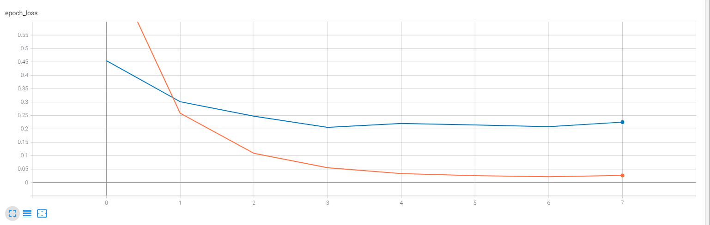{width="5.768055555555556in"
height="1.8314807524059493in"}

图4-1 CS-Transformer模型epoch 损失函数曲线图

图4-2是基于CNN和SENet的Transformer模型准确率曲线图，可以看到，模型在epoch等于3时在验证上取得了最低的准确率0.93左右。这和上图的损失函数取得最小值的epoch是一致的。虽然在epoch
6或7上，准确率高达100%，但是模型已经过拟合了。过拟合的模型泛化能力差，所以取epoch等于3时的模型参数。

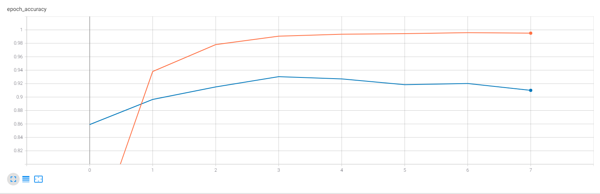{width="5.768055555555556in"
height="1.8694444444444445in"}

图4-2 CS-Transformer模型准确率曲线图

为了分析CNN和SENet对Transformer模型收敛速度的影响。为此，我也利用Tensorboard工具记录了实验中模型的损失函数的值的变化并且可视化。
图4-3
Transformer模型与本文提出的CS-Transformer模型损失函数比较曲线图，可以看到，基于CNN和SENet的Transformer模型收敛速度更快，而且能达到更小的损失值。

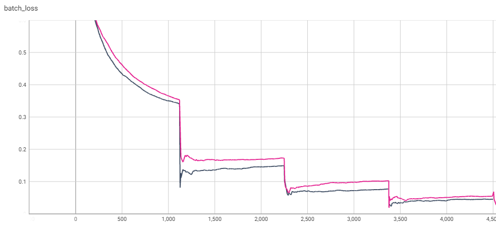{width="5.768055555555556in"
height="2.6756944444444444in"}

图4-3 Transformer模型与CS-Transformer模型的batch损失函数曲线图

其中蓝色曲线表示CS-Transformer模型，红色曲线表示Transformer模型

相应的我也利用Tensorboard工具记录了实验中模型的准确率的值的变化并且可视化。图4-4
为Transformer模型与本文提出的CS-Transformer模型在训练过程中准确率对比曲线图，可以看到，基于CNN和SENet的Transformer模型准确率也更高点在每一个batch上，虽然最后两个模型都有点过拟合了。总的来说CS-Transformer模型比Transformer模型效果要好。

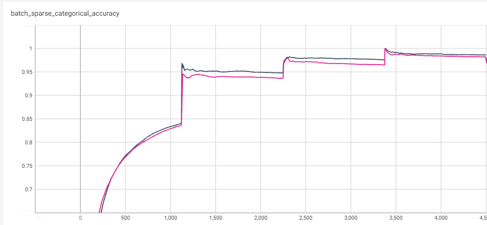{width="5.768055555555556in"
height="2.671527777777778in"}

图4-4 Transformer模型与CS-Transformer模型的准确率曲线图

其中蓝色曲线表示CS-Transformer模型，红色曲线表示Transformer模型

### 4.5.6 超参数Encoder的数量对实验结果的影响

超参Encoder层的数量对模型基于CNN与SENet的Transformer有很大影响。通过不同的层数可能影响梯度传播和收敛的速度以及最终的准确率。为了探究本文设计超参Encoder层的数量对最终分类效果的影响，设计了7组实验进行验证和分析。依次对Encoder层的数量进行1-7的整数取值，记录在每个数据集上的分类准确率，并绘制相应的折线图，分析实验结果。

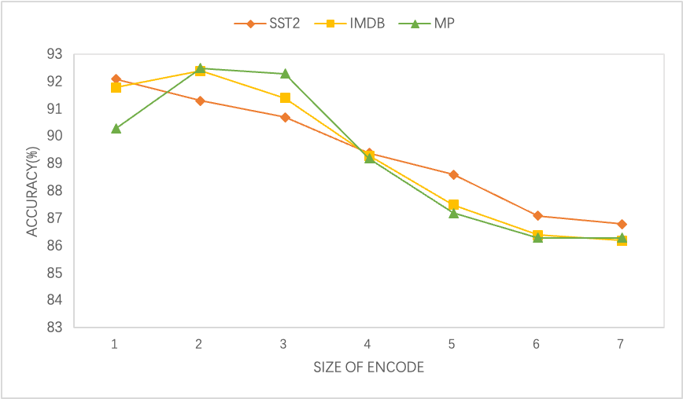{width="5.768055555555556in"
height="3.3694444444444445in"}

图4-5 准确率随Encoder层数在不同数据集上的变化曲线图

实验步骤如下：

> **Step 1** 初始化超参数，取 Encoders =1, fold = 5, 数据集类型设定为
> SST2,

**Step 2** 分别对对数据集SST2，IMDB与MP，执行以下步骤：

1: FOR fold = 1 To 5

2: FOR Encoders = 1 To 7

> 3:
> 按照算法1的步骤执行算法，输出并记录模型的准确率。直到模型自动终止（即连续5次损失函数不减少）

4: END FOR

5: 记录准确率

6: END FOR

7: 记录并输出最高准确率

如图 4-5
所示，准确率随着encoder层的数量增加而出现变化。在SST2数据集上，准确率随Encoder增加一直在减少，在encoder层等于1时准确率就取得了峰值最大。说明了1层encoder
已经是最理想的模型了，与IMDB与MP数据集相比，SST2数据集大小相对小些，这也说明了训练小的数据集少的encoder层数反而获得高的效果。在IMDB与MP数据集上，准确率达到峰值的encoder层数分别为2和3，随后都是越来越低，encoder等于7时所有数据集上准确率都达到了峰值最小，与IMDB数据相比，训练MP数据集稍微复杂些。因为它是多分类而IMDB是二分类的。由此可见，在训练大的数据和复杂的数据集时，encoder层的数量要大些。这也说明为什么近几年的预训练模型比如BERT,
GPT,
XLNET等等，他们都用7-12层，因为如果要训练一个通用的模型必须要用大量语料。他们的模型必须是越复杂越好，这样才能容纳下这庞大的逻辑，所以势必要增加encoder层数来提高最终的准确率。实验结果表明，encoder的数量的取值会影响不同数据集的分类的效果，而且不是越大越好，太大意味着模型表征词汇语法关系的成分增大，对分类结果意义不大，反而造成干扰和准确率的下降。

### 4.5.7 超参数Batch的大小对实验结果的影响

超参批次Batch是指模型训练时根据每批次大小进行训练而不是把所有数据集中的数据一次都输入模型进行训练，批处理训练有三个好处，第一，每次输入到模型中的数量较少，可以在有限的内存下进行训练。第二，可以进行分布式训练。当数据量很大时，可以进行分布式训练，把数据分散到不同的服务器中训练。第三，每一次epoch运行完所有的batch以后可以随机打乱顺序进行一个epoch，防止模型训练时把顺序也训练进去。

Batch大小可能会对模型最终的分类效果产生影响。本实验通过对batch取不同的值，在三种数据集上进行实验，探究batch对模型分类的作用。batch的取值为(20，60)，以5为间距进行实验，记录在每个数据集上的分类准确率，并绘制相应的折线图，分析实验结果如图4-6所示。

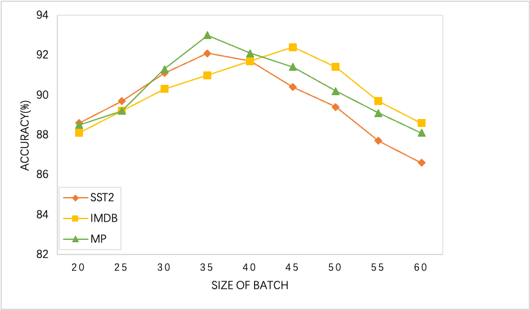{width="5.768055555555556in"
height="3.3694444444444445in"}

图4-6 准确率随batch大小在不同数据集上的变化曲线图

实验步骤如下：

**Step 1** 初始化超参数，取 batch=20, fold = 5, 数据集类型设定为SST2,

**Step 2** 分别对数据集SST2，IMDB与MP，执行以下步骤：

1: FOR fold = 1 To 5

2: FOR i = 1 To 9

> 3:
> 按照算法1的步骤执行算法，输出并记录模型的准确率。直到模型自动终止（即连续5次损失函数不减少）

4: Batch+ =5

5: END FOR

6: 记录准确率

7: END FOR

8: 记录并输出最高准确率

如图 4-6
所示，准确率随着Batch大小的变化而波动。波动的幅度很大，且总体呈上升-下降的趋势。在
IMDB
数据集上，左右两端呈现两个极值点，即准确率的最小值，且中间段Batch等于45取到了极大值点，说明在数据集较大的情况下，batch的大小也要相对大些，这样才能使得模型的最终分类效果更好。波动趋势在SST2与MP数据集也很相似。左右两端呈现两个极值点，中间取到了最大值准确率。但是和IMDB数据集相比。准确率最好的Batch大小小了点，它们都在batch等于35是取的了最大的准确率。说明数据集小的时候，分类效果最好的batch要小点。可能在小的数据集上模型需要很细致的学习。实验结果表明，batch的大小的取值也是会影响不同数据集上分类效果。

### 4.5.8 卷积核的大小对实验结果的影响

超参卷积核的大小对模型基于CNN与SENet的Transformer最终分类效果也有影响。根据实践我知道一个字的意思更多还是被它局部的信息所影响虽然全局信息也很重要，比如machine
learning, client impact, service
unavailability等等，我希望原有的Transformer
encoder层具备更有效的获取局部信息的能力，所以在原有的Transformer中加入了CNN，但是卷积的效果好坏是有卷积核的大小和多少决定的。本实验通过对一维卷积核取不一样的组合，在三种数据集上进行实验，探究卷积核大小对模型分类的作用。一维卷积核的组合的取值分别为(1，1，1)，(3，3，3)，(5，5，5)，(1，2，3)，(1，3，5)，(3，4，5)，(3，3，5)，(3，5，5)来进行实验，记录在每个数据集上的分类准确率，并绘制相应的折线图，分析实验结果如图4-7所示。

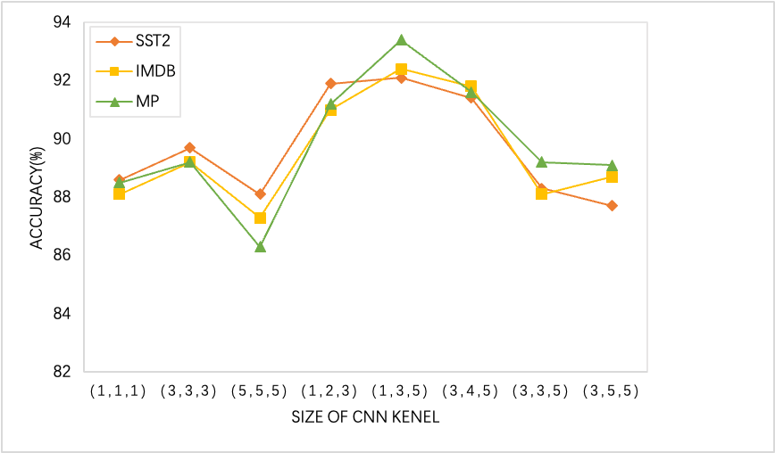{width="5.768055555555556in"
height="3.3694444444444445in"}

图4-7准确率随卷积核大小在不同数据集上的变化曲线图

实验步骤如下：

> **Step 1**
> 初始化超参数，取CNN_KERNEL_ARRYS=\[(1，1，1)，(3，3，3)，(5，5，5)，(1，2，3)，(1，3，5)，(3，4，5)，(3，3，5)，(3，5，5)\],
> fold = 5, 数据集类型设定为SST2,

**Step 2** 分别对对数据集SST2，IMDB与MP，执行以下步骤：

1: FOR fold = 1 To 5

2: FOR i = 1 To len(CNN_KERNEL_ARRYS)

> 3:
> 按照算法1的步骤执行算法，输出并记录模型的准确率。直到模型自动终止（即连续5次损失函数不减少）

4: END FOR

5: 记录准确率

6: END FOR

7: 记录并输出最高准确率

如图 4-7
所示，准确率随着卷积核的不同组合而出现变化。在三个数据集上，都在卷积核为（1，3，5）这组组合上取得了最大峰值。（1，2，3）和（3，4，5）这两组组合次之。说明在卷积核这一维度不同数据集上可以选择一样的。都会在（1，3，5）这组上出现最大的准确率。和数据集的大小规模没有太大的联系。在读取局部信息的时候大致范围就在1，3，5之间。这可能是人类语言的一个规律。该实验结果表明，卷积核的大小取值会影响不同数据集的分类的效果而且都在（1，3，5）这组卷积核上取得最大峰值。

### 4.5.9 不同多输入的方法对模型的影响

在邮件优先级数据集（MP）上，因为此数据集是多输入的，分别是邮件的主题，发件人和邮件内容。本文分别尝试了以下四种不同的多输入方法；

（1）多输入简单拼接：把发件人，邮件主题和邮件内容直接拼接成一个句子。格式为"发件人+邮件主题+邮件内容"，然后如果不足固定长度就加零，然后输入到CS-Transformer模型中。此方法是最简单的，但是效果是最差的。这三个输入携带有不同粒度大小的信息。模型很难把它们区分开。最终准确率是最低。

（2）多输入用\[SEP\]拼接：把发件人，邮件主题和邮件内容用\[SEP\]字符接拼接成一个句子。格式为"发件人+\[SEP\]+邮件主题+\[SEP\]+邮件内容"，然后如果不足固定长度就加零，准确率提高了0.74%。模型可以通过SEP字符区分了不同的输入。

（3）独立的多输入：预先对不同输入规定固定大小。比如发件人1字符，邮件主题30个字符，邮件内容119个字符。不足时步零，一起把它们输入到模型中。通过这种固定长度的每个输入。模型更容易区分不同输入。这样模型就可以用更多的参数学习任务中的逻辑。准确率是92.19%。于多输入用\[SEP\]拼接相比。高于0.32%。

（4）独立的多输入（不同Embedding）:
不仅仅是固定不同输入的大小，而且不同输入对应不同的Embedding。这样它们就可以拥有不同初始词向量了。但是效果不是很理想，准确率是91.25%。于不同输入利用同一个Embedding相比，低了1.02%。说明不同输入里面的词的初始意思是一样的。最后更加上下文经一步得到具体的不一样的意思。这是符合人的逻辑的。一词多义。这个词本质的意思只有一个，虽然它们根据上下文有不同意思。

表 4-15 CS-Transformer模型在不同的多输入方法中准确率变化

  -----------------------------------------------------------------------
  **多输入方法**                                 **MP(%)准确率**
  ---------------------------------------------- ------------------------
  多输入简单拼接                                 91.13

  多输入用\[SEP\]拼接                            91.87

  独立的多输入                                   92.27

  独立的多输入（不同Embedding）                  91.25
  -----------------------------------------------------------------------

## 4.6 消融实验

在本节中，设计了一系列模型来验证改进的Transformer模型的有效性。对于嵌入层，为了探索Glove词向量和随机赋值词向量对模型的影响，每种网络都设计了两种类型，一种是利用提前已经训练好的Glove词向量作为嵌入层并且训练的时候也可以微调例如CNN(Random)，第二种嵌入层是随机赋值且可以训练的例如CNN(Glove)。为了研究CNN在改进的Transformer模型影响，设计了三个模型分别为CNN,
Transformer和CNN-
Transformer。为了研究SENet在改进的Transformer模型影响，设计了三个模型分别为CNN-SENet,
CNN-Transformer和CNN-SENet-Transformer。另外，还设计了Transformer和CNN模型作为基准模型。

表 4-16 在三个数据集上的消融实验结果

  -------------------------------------------------------------------------
  Models                           SST2 ($\%$)   IMDB ($\%$)    MP ($\%$)
  -------------------------------- ------------ ------------- -------------
  CNN(Random)                         86.81         86.89         87.01

  CNN(Glove)                          87.83         87.84         88.9

  CNN-SENet(Random)                   88.16         89.23         90.12

  CNN-SENet(Glove)                    88.44         89.62         90.01

  Transformer(Random)                 86.45         86.32         87.18

  Transformer(Glove)                  85.62         85.51         86.64

  CNN-Transformer(Random)           **90.47**     **92.34**     **91.84**

  CNN-Transformer(Glove)              86.74         86.32         86.32

  CNN-SENet-Transformer(Random)     **90.51**     **92.78**     **92.27**

  CNN-SENet-Transformer(Glove)        90.13         90.01         89.92
  -------------------------------------------------------------------------

实验结果如表4-14所示。从实验结果可以看出，有Transformer组件的模型嵌入层用随机赋值效果比Glove词嵌入要好。相反,
CNN用Glove词嵌入效果比随机赋值的词嵌入要好。这说明了Transformer网络自己本身可以训练自己嵌入层，不需要已经训练好的词向量效果更好。从CNN这一维度看，单纯的使用卷积和单纯的使用Transformer效果都不很理想，但是在卷积加入Transformer后，比CNN准确率在三个数据集上平均高出4%。经一步说明了CNN在Transformer中发挥了很大作用，提高了模型的分类效果。也说明了引入了卷积后使得Transformer具备了更强的局部提取能力。再从SENet这一维度看。CNN-SENet比CNN最终的准确率平均要好1%左右。CNN-SENet-Transformer(Random)模型比CNN-Transformer(Random)模型在SST2,IMDB和MP数据上分别要高0.1%,0.44%和0.43%。说明了,SENet在改进的Transformer也是对最后的分类效果有很大的作用了。因为它在卷积后弱化了不要的卷积核提取的信息和强化了好的卷积核提取的信息。实验结果表明，Transformer通过结合CNN核SENet，可以有效提高模型对局部信息的获取而且还不影响原有模型对全局信息的获取，从而有效的提高了句子分类的效果。

## 4.7 本章小结

作为NLP领域的研究热点，短文本分类是自然语言处理最具挑战性的任务之一。不同于传统的短文本分类方法，Transformer模型因为加入了自注意力机制和残差网络和好的结构。能够很好的解决了长句子依赖的问题和梯度消失问题而且还符合人类思维。许多的研究者开始对Transformer和Transformer的encoder或decoder组件展开了研究，陆续提出了在Transformer的基础上提出了很多好的模型比如BERT,GPT,XLNET等等，但这些模型都缺乏更好的局部信息能力，而且忽略一个事实局部信息对词向量影响大于其它全局信息。所以本文在原有Transformer的encoder基础上加入了CNN和SENet网络，从而使得模型在不影响全局信息获取的情况下具备了更好的获取局部信息的能力，从而提升的最终的准确率。

本章对提出的基于CNN和SENet的Transformer模型在不同数据上和现在主流的神经网络进行了对比实验和消减实验。而且还对有可能影响模型最终效果的不同超参进行实验，最终得出了一组理想的参数使得基于CNN和SENet的Transformer模型具有高准确率和更高的执行效率而且收敛更快。

# 基于CS-Transformer模型自动回复邮件系统

经过上一章的多次实验，分析和对比后，最终选出一个效果较好文本分类的模型即CS-Transformer模型，最高文本分类准确率在用户邮件数据集上达到
92.26%。本章基于上一章的CS-Transformer模型，设计了一个利用CS-Transformer模型做文本分类的自动回复邮件系统。我将从五个层面对自动回复邮件系统进行阐述，即自动回复邮件系统架构，系统功能设计，系统实现与分析，系统性能和系统安全。

## 5.1 自动回复邮件系统架构

### 5.1.1 技术介绍

**5.1.1.1 Django**

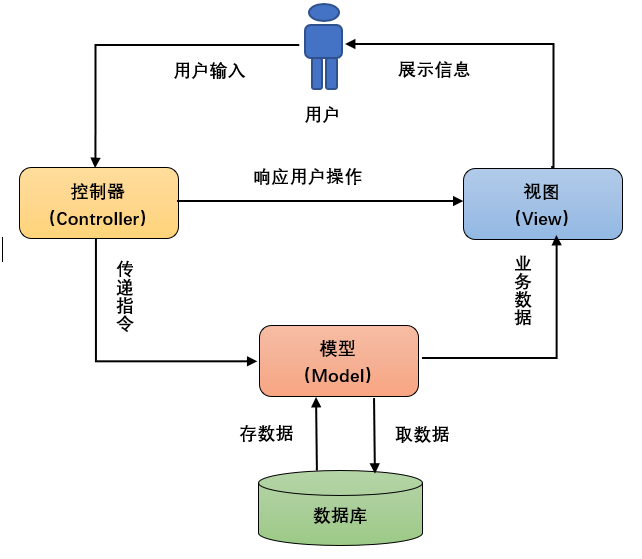{width="4.783813429571303in"
height="4.165246062992126in"}

图5-1 MVC 用户操作流程图

在目前基于Python语言的几十个Web开发框架中，几乎所有的全栈框架都强制或引导开发者使用MVC设计模式。MVC设计模式最早由Trygve
Teenskaug在1978年提出，上世纪80年代是程序语言Smalltalk的一种内部架构。后来MVC被其他领域借鉴，成为了软件工程中的一种通用架构模式。MVC把Web框架分为三个基础部分：模型（Model）、视图（view）和控制器（Controller）。MVC的优点有很多，比如低耦合，维护的成本较低，快速的开发方式，很高的重用性和部署方便等等。用户操作的流程如图5-1所示。首先用户输入信息传入到控制器，控制器再将指令传入模型中，模型可以通过连接数据库进行数据增删改查，然后将所需要数据返给视图，最后视图通过控制器的响应，将信息展示给用户。

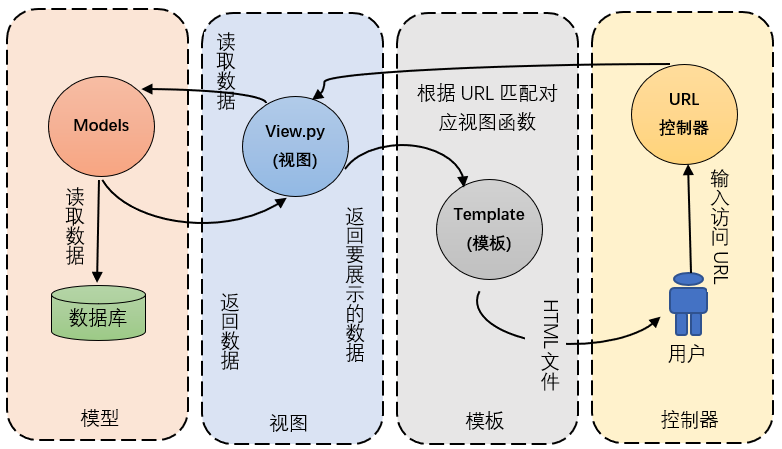{width="4.593435039370079in"
height="2.6373818897637795in"}

图5-2 MTV 用户操作流程图

Django是一个高级Python语言且开放源代码的Web应用框架，鼓励快速开发和简洁实用的设计。Django使程序员可以更轻松地以更少的代码更快地构建更好的Web应用程序。Django对传统的MVC设计模式进行了修改，将视图分成View模块和Template模块两部分，将动态的逻辑处理与静态的页面展示分离开。而Model采用了ORM技术，将关系型数据库表抽象成面向对象的Python类，将数据库的表操作转换成Python的类操作，避免了编写复杂的SQL语句。如图
5-2
所示。首先用户通过浏览器输入访问的URL，URL控制器根据URL匹配对应视图函数，如果不包括数据调用，则视图层将模板直接返回给用户。否则，调用模型层，模型层通过数据库对数据进行增删改查，之后把数据返回到视图层，视图层较数据传递给相应的模版，模版层较数据和相应模版进行融合，最终返回给用户的浏览器，由浏览器对数据进行渲染和显示。

5.1.1.2 pywin32

pywin32模块是用来向用户提供一系列操作Windows控件的SDK，让用户通过简单的参数和方法调用来实现一些复杂的操作。本系统利用python代码调用pywin32模块对用户outlook里邮件进行操作比如读取邮件，修改邮件，回复邮件。

5.1.1.3 PyQt5

PyQt5是python第三方GUI开发工具，是目前公认的python上最好的客户端界面开发工具。存在界面设计器QtDesigner工具，可便捷的采用拖拽方式进行页面构造，比如调整颜色，字体，大小等样式，然后通过工具将UI文件生成对应的python代码，不需要去代码层面来写大量界面代码，真正的所见即所得。

### 5.1.2 系统架构

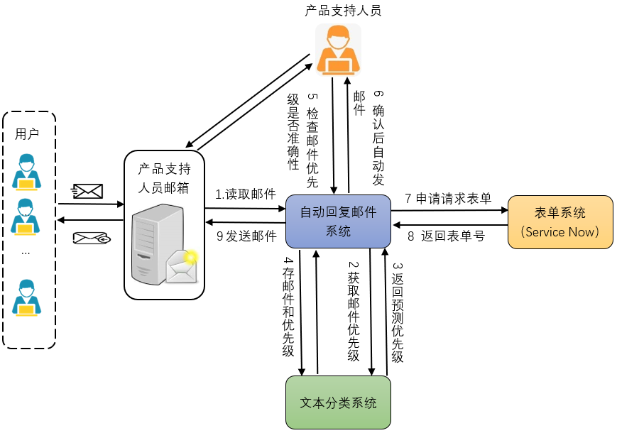{width="5.768055555555556in"
height="4.049305555555556in"}

图 5-3 系统架构图

本系统架构图如图 5-3 所示，系统采用
python3.8，Django，tensorflow,pywin32和PyQt5作为基础框架。产品支持人员每天都会有大量的用户的邮件，这些邮件有的是关于系统漏洞，有的关于系统新功能，还有的是关于系统可用性和稳定性的问题。当产品支持人员在他的邮箱里收到任意一份客户的邮件的时候，自动回复邮件系统就会读到这份邮件。然后调用Django服务器中获取邮件优先级方法（此方法是利用改进的Transformer模型预测邮件的优先级）。获得到邮件的优先级后，把邮件的信息以及得到的邮件的优先级级别通过调用Diango暴露的保存接口保存到oracle数据库中。产品支持人员在自动回复邮件系统看到新来的用户邮件，然后会检查预测的邮件级别，如果邮件预测的级别有问题就会进一步修改，如果没有问题就会直接点击回复确认邮件。点击回复确认邮件之后自动回复邮件系统利用预测的邮件优先级与邮件里信息调用表单系统（Service
Now）申请表单号。在表单系统里申请到表单后就可以回复邮件，回复邮件内容为checking或Acknowledge，这个是可以配置的。邮件标题要追加表单号。这个表单号会作为用户以及产品支持人员跟踪这个问题来用。

## 5.2 系统功能设计

### 5.2.1 自动回复邮件系统

登录功能：根据用户账号与密码登录系统。如果是第一次登录必须要先注册账号。注册的时候要提供邮件回复内容（Checking或Acknowledge或其它邮件内容）。如果没有输入邮件确认内容，默认值为Checking。登录之后可以改这个值。

自动读取邮件功能：登录系统后，后台任务会每隔一段时间读取邮箱里未读的邮件，读取未读的邮件后调用文本分类系统获取邮件优先级级别。并且保存邮件内容以及预测的邮件级别，供后续回复邮件使用。当然如果产品支持人员

修改邮件优先级功能：未回复的邮件和邮件的预测优先级都会显示在自动回复邮件系统的表格中。产品支持人员如果看到这些为回复的邮件，检查是否预测的邮件优先级准确。如果有问题，可以进一步修改邮件优先级。

回复邮件功能：产品支持人员检查完邮件优先级后，可以点击回复邮件按钮。点击之后首先在表单系统里根据邮件内容与邮件优先级申请表单号，然后根据表单号回复邮件。回复的邮件标题要追加表单号。以作为用户和产品支持人员跟踪这个问题来用。

### 5.2.2 文本分类模型系统

邮件优先级分类功能：邮件优先级预测流程如图5-4所示，当输入邮件内容，邮件标题与发件人类型时，因为改进的Transformer模型现在只能用英文语言进行分类预测，因此首先要对输入语句进行语种判断。若输入的语句为中文，则返回错误代码，不能执行下一步。若输入语句为英文，则调用CS-Transformer模型中的预测函数，预测函数要加载已训练完成的邮件数据集上的参数文件进行预测。预测函数执行完毕后，返回分类结果数字，即"0"，"1"，"2"，"3"。其中"0"在返回中表示"critical"，"1"表示"high"，"2"表示"medium"，"3"表示"low"。利用事先定义好的字典将数值转化为邮件优先级，最后返回。

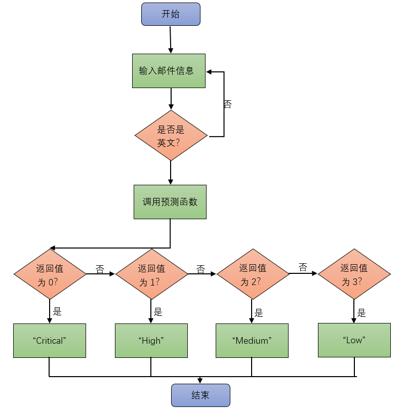{width="4.060804899387577in"
height="4.091116579177603in"}

图 5-4 邮件优先级预测流程图

邮件保存功能：保存邮件的内容与预测的邮件的优先级到oracle数据库中，以待后续之用。所用到的表要事先创建。最后返回值。

邮件读取功能：根据邮件标题或ID从数据库中读取邮件内容和预测的邮件级别。获取所有未发送的邮件列表。最后返回值。

## 5.3 系统实现与分析

### 5.3.1 自动回复邮件系统

系统主页面如图5-5所示，界面是选用python第三方GUI开发工具PyQt5实现的。每隔1.5秒会调用后端在数据库获取所有待回复确认的邮件。如果有新的待回复的邮件，需要刷新界面上待回复的邮件列表，否则不刷新。通过显示的待回复的邮件内容与预测邮件级别，产品支持人员可以修改预测的邮件优先级，如果确认无误就可以点击回复确认邮件按钮。之后程序调用表单系统获取表单号。追加表单号到邮件标题上回复确认邮件，邮件内容默认为Acknowledged。

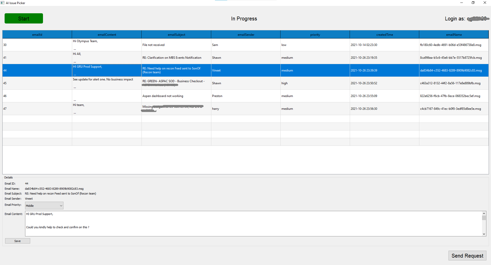{width="5.768055555555556in"
height="3.1206561679790026in"}

图 5-5 用户主页面

产品支持人员看到有新的用户邮件后，点击查看邮件的内容，并进一步判断预测的邮件优先级是否正确。如果不正确就可以直接修改邮件优先级，最后点击Send
Request按钮申请表单号和发送确认邮件。

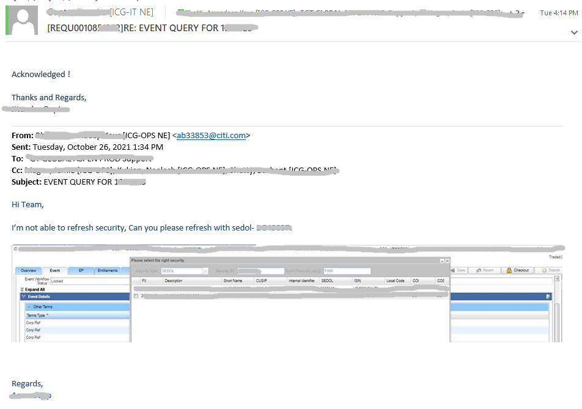{width="5.768055555555556in"
height="4.052777777777778in"}

图 5-6 自动的回复确认邮件页面

> 图5-7 是申请表单系统Service Now，Title一般需要填写邮件标题，Requested
> by是发件人或用户，Description是用户邮件的内容，Priority是邮件的优先级。Priority也是需要我的模型预测出来的值。

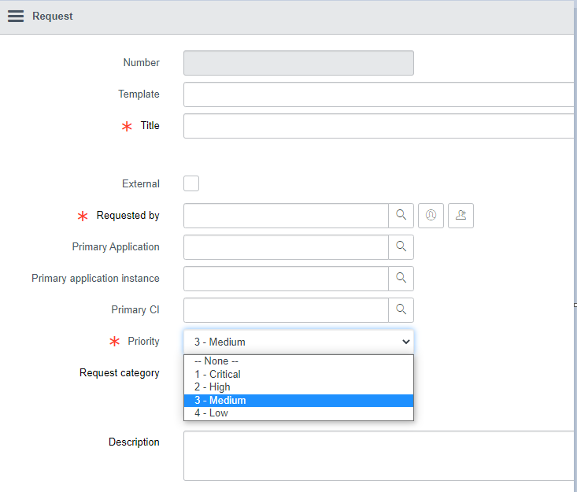{width="4.316318897637795in"
height="3.680252624671916in"}

图 5-7 申请表单系统Service Now

系统的后端有一个任务组件，在每隔1.5秒会扫描一次产品支持人员的邮箱。为了提高效率每次只读取前20封邮件。根据产品支持小组人员的经验，在1.5秒内最多收到20封邮件。而且1.5秒即是他们可以容忍的时间范围也可以节省电脑资源利用率。默认是每隔1.5秒读取20封邮件，这些参数可以根据自己电脑和实践进一步调节。每次读20封邮件后再过滤出未读的邮件。在这些未读邮件里根据一定条件(如图5-8)选出需要回复的邮件，根据邮件内容，邮件标题和发件人的信息调用文本分类模型系统获取预测的邮件优先级级别，然后把邮件与预测的邮件优先级保持到oracle数据库中。用于后续的显示。

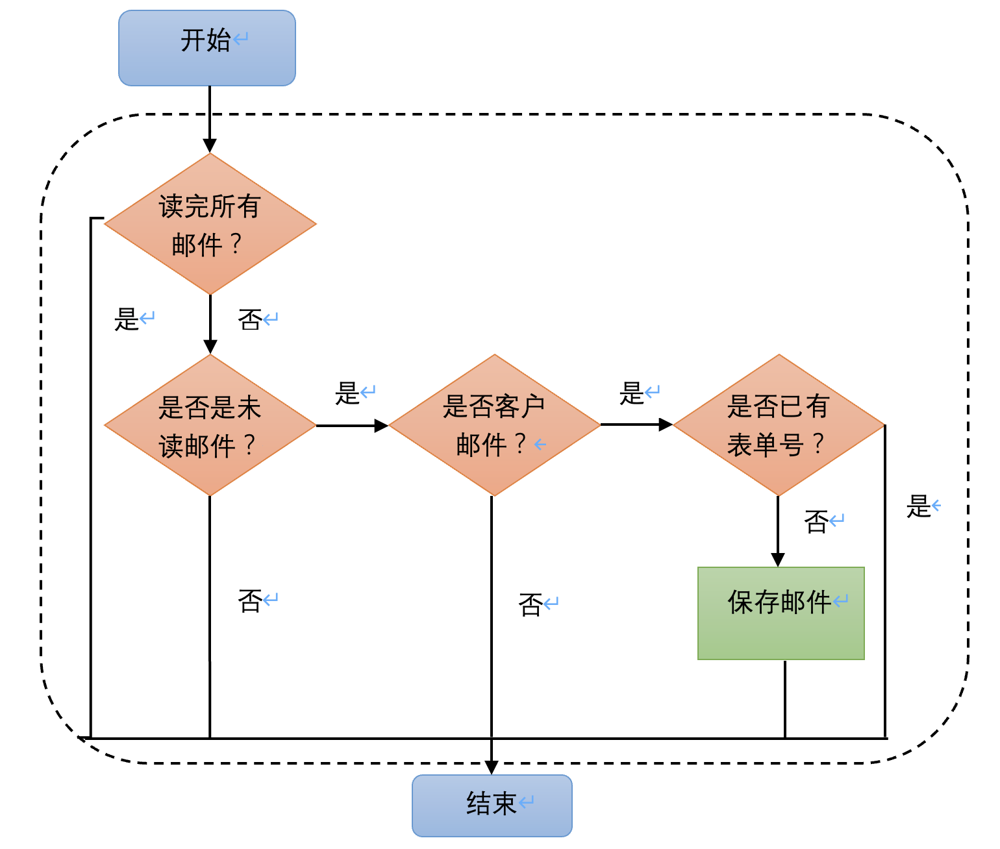{width="4.565330271216098in"
height="3.8777274715660544in"}

图 5-7 邮件读取与保存流程图

### 5.3.2 文本分类模型系统

本系统利用Django提供若干接口给外部系统调用。主要的接口有以下几个：

预测邮件的优先级：输入参数是邮件内容，邮件标题和发件人，输出是根据改进的Transformer模型预测出的邮件的优先级。预测的整个流程如图5-4。例如输入邮件内容为"Can
you advise why event xxx was received into aspen, should this not have
been picked up as a potential duplicate against xxx, We are seeing high
volumes of duplicate coming into aspen and need to know if they are not
being held up ."，邮件标题为"Duplicate events in
aspen"，发件人类别为"User"。首先检测是否为英文，如果为英文就调用模型的预测方法。预测结果为四类：0是Critical，1是High，2是Medium，3是low。

为验证基于CNN与SENet的Transformer模型的有效性和准确性，本节设置了一组实验进行分析。选取为参与训练的邮件数据集中1000个样本用于测试。每种类型选出250个样本。测试结果如图5-9混淆矩阵。可以看出这Critical这种类型预测的回归率高而low的却很小，其它的次之。原因在于我在训练的时候为了提高Critical的回归率，多加入了2000条Critical样本用于训练。这样模型就对Critical这类型数据学习偏好，权重相对多些。这正是我门要的。因为特别紧急的邮件回归率要求产品支持人员快速解决。如果分到其它类别会导致问题没有及时解决而丢失大量钱和损失公司名誉。所以为让Critical类别的回归率高点牺牲点总体的准确率也是可以的。

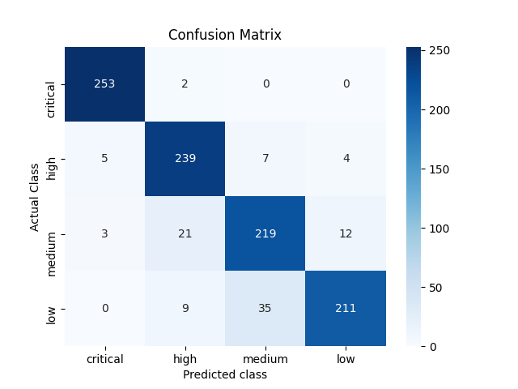{width="4.736111111111111in"
height="3.5520833333333335in"}

图 5-9 混淆矩阵

进一步选择8条样本在这1000条中，选取不同类型的用户测试邮件，查看分类结果，对比标签。选取的测试邮件如表所示，其中每种数据根据四分类各取2条样本。可以看到在这8条中只有2条low的邮件中一条被封错为Medium。

表 5-1 预测系统测试样本

+---------------------------------+------------------+--------+----------+------------+
| 邮件内容                        | 邮件标题         | 发件人 | 标签     | 预测       |
|                                 |                  |        |          |            |
|                                 |                  |        |          | 结果       |
+=================================+==================+========+==========+============+
| Only one entitlement have fed   | ASPEN ISSUE      | User   | high     | high       |
| onto Sonof on the above event   | 1192038          |        |          |            |
| is over-paid, this I believe is |                  |        |          |            |
| causing in control call line    |                  |        |          |            |
| because of technical Issue.     |                  |        |          |            |
| Please see below screen shot    |                  |        |          |            |
| for your reference.Could you    |                  |        |          |            |
| please urgently look into it ?  |                  |        |          |            |
+---------------------------------+------------------+--------+----------+------------+
| I can see that one part of the  | RE:PLEASE        | User   | Critical | Critical   |
| issue was resolved, however the |                  |        |          |            |
| cancellation of the below is    | URGENTLY         |        |          |            |
| still not feeding into Aspen    | INVESTIGATE WHY  |        |          |            |
| and GPW.                        | MANUAL POSTINGS  |        |          |            |
|                                 | DON\'T FEED -    |        |          |            |
| Please urgently check as Client | xxx              |        |          |            |
| is chasing.                     |                  |        |          |            |
+---------------------------------+------------------+--------+----------+------------+
| Looks to be a system error      | Overpaid ISIN :  | Ops    | Medium   | Medium     |
| aspen incorrectly mark to       | xxx, Amt :       |        |          |            |
| overpaid, it appears there are  |                  |        |          |            |
| no values on the trade lines.   | xxx AUD          |        |          |            |
|                                 |                  |        |          |            |
| Please check and return the     |                  |        |          |            |
| payment as per attached email.  |                  |        |          |            |
+---------------------------------+------------------+--------+----------+------------+
| Please can you provide an       | Notification     | BA     | low      | **Medium** |
| extract from Prod of events     | Standardization: |        |          |            |
| that meet the following         | Different IDD    |        |          |            |
| criteria:                       |                  |        |          |            |
|                                 | across Options   |        |          |            |
| 1\. Event Cat = VOLU or CHOS    |                  |        |          |            |
|                                 |                  |        |          |            |
| Example Prod Event ID xxx       |                  |        |          |            |
+---------------------------------+------------------+--------+----------+------------+
| The below payment ID has been   | Payment ref xxx  | User   | high     | high       |
| rejected in jasper and got      |                  |        |          |            |
| approved by the approvers, but  |                  |        |          |            |
| still the positions are not     |                  |        |          |            |
| open they are still showing as  |                  |        |          |            |
| paid. Need your quick           |                  |        |          |            |
| assistance.                     |                  |        |          |            |
+---------------------------------+------------------+--------+----------+------------+
| We are currently unable to      | ASPEN Dashboard  | User   | Critical | Critical   |
| access the ASPEN dashboard. Can | outage           |        |          |            |
| you please urgently check and   |                  |        |          |            |
| resolve as we cannot perform    |                  |        |          |            |
| BAU without access to it.       |                  |        |          |            |
+---------------------------------+------------------+--------+----------+------------+
| I'm not able to refresh         | EVENT QUERY FOR  | BA     | Medium   | Medium     |
| security, Can you please        | xxx              |        |          |            |
| refresh with sedol- BG49037.    |                  |        |          |            |
+---------------------------------+------------------+--------+----------+------------+
| Could you review the Ref Data   | Ref Data         | BA     | low      | low        |
| approval flow, we have 9        | Approval Q       |        |          |            |
| outstanding I can see for       |                  |        |          |            |
| approval in Legacy, however     |                  |        |          |            |
| that now just bring up a        |                  |        |          |            |
| redirect, issue being these are |                  |        |          |            |
| not showing for approval UI     |                  |        |          |            |
| side                            |                  |        |          |            |
|                                 |                  |        |          |            |
| Submitter is in my Team and     |                  |        |          |            |
| should be ...                   |                  |        |          |            |
+---------------------------------+------------------+--------+----------+------------+

## 5.4 系统性能

后端邮件搜集Job的性能：系统的后端有一个任务组件，在每隔1.5秒会扫描一次产品支持人员的邮箱。为了提高效率每次只读取前20封邮件。根据产品支持人员的反馈以及我对所有邮件在1.5秒时间的归纳得出，1.5秒最多不会超过15封邮件。为了防止后期邮件的量有所增加，我又多加了5封邮件，总共要读最新的20封。循环一次平均执行时间是0.8秒左右。

模型预测：根据CS-Transformer模型执行的时间和分类系统执行逻辑的时间。平均时间是0.5秒左右。

更新邮件：比如在主页面上，更新邮件的优先级大概要用0.8秒，这里包含系统的调用时间和页面的展示时间。

申请表单：调用表单系统（Service
Now）申请请求表单,以及传送时间总共平均时间是0.9秒左右。

回复邮件：调用Pywin32包回复邮件。总共用时平均0.5秒。

自动回复邮件：从点击send
request按钮到成功回复邮件，总共用时2.5秒。这过程包含申请表单，回复邮件和更新数据到数据库。

  -----------------------------------------------------------------------
  **功能**        **平均执行时间（秒）**
  --------------- -------------------------------------------------------
  邮件搜集job     0.8=0.2（读邮件）+0.5（模型预测）+0.1（数据操作）

  模型预测        0.5

  更新邮件        0.8

  申请表单        0.9

  回复邮件        0.5

  自动回复邮件    2.5=0.9（申请表单）+0.5（回复邮件）+0.1（数据操作）
  -----------------------------------------------------------------------

## 5.5 本章小结

在本章中，阐述了一个自动回复邮件系统以及它依赖的文本分类系统的架构和功能。在自动回复邮件系统中详细讲述了客户端界面的主要功能包括更改邮件优先级，回复确认邮件等等。后端的功能包括自动读取邮件，保存邮件，如果开启了自动回复邮件功能，邮件直接自动回复。在文本分类系统中是基于上一章中得到最高准确率的CS-Transformer模型作为预测邮件优先级的模型。并且对模型利用未训练过的数据做出了进一步的验证。训练时候为了得到一个Critical回归率高的模型，多进入了2000条的Critical样本。虽然准确率下降了点，但是已达到了目标，准确率高并且Critical回归率也高高的模型。

I

# 第六章 总结

## 6.1 工作总结 

早期的文本分类方法主要是采用传统的机器学习方法，经典传统机器学习方法包括随机森林，支持向量机，贝叶斯和逻辑回归等，但是由于此方法需要大量的人力成本（比如人工标注，特征工程，利用专家手动提取特征等等），还有建模和模型训练需要凭借专家的经验，准确率不高，只能在少量数据集上训练，所以促使专家们不得不对模型进行革新和升级。在这个大的背景下，基于深度学习的文本分法脱颖而出。它克服了经典的传统机器学习的缺点，并且在自然语言处理的各个任务上取得了很过的效果，尤其是文本分类方法。常见的基于深度学习的文本方法有基于
RNN、LSTM，GRU和 CNN
等神经网络，在这些方法中卷积在语句较长的情况下，无法更好的捕获长句子依赖关系。而循环神经网络具有不能并行运行，虽然LSTM一定程度上解决了长句子依赖问题，但是没有彻底解决而且还有梯度消失等缺点，这些缺点导致特征提取能力不理想，训练时间和执行时间都很长，以及最后的文本分类准确率和其它指标不高等不好的特点。

鉴于传统机器学习和深度机器学习具有诸多缺点，2017年以后，相继出现了让大家耳目一新一系列的预训练模型，比如BERT，GPT，XLNet，DeBERTa和其它基于Transformer的模型。这些模型相继在一系列NLP任务中取得了更好的效果。并且具有并行执行，解决了长语句依赖的问题和可以使模型更加关注文中最相关的部分的好的特点。这些特点主要是由于Transformer采用了注意力机制来建立原输入序列和注意力层输出词之间的联系，使得每个词都在提取它的特征的时候只关注到上下文中它最想关注的那一部分，同时过滤掉冗余部分带来的负面影响。本文正对Transformer以及Transformer相关的变体在文本分类中存在的局部信息获取能力不足，但往往相邻的两个词具有强相关性的特点，提出了一种改进的Transformer
模型即CS-Transformer模型。具体思想是引入卷积，利用不同大小的卷积核提取局部信息。进而提升了局部信息的获取能力，使得局部信息对词向量影响大于其它全局信息。然后进一步引入SENet,
通过学习的方式来自动获取到每个特征通道的重要程度，然后依照这个重要程度去提升有用的特征并抑制对当前任务用处不大的特征。本文的具体工作有如下几个方面：

（1）通过阅读国内外大量有关于文本分类的文献，了解现有文本分类的发展进程和现状，并在开头详细介绍了多种文本分类模型，分析了现有算法的一些优缺点。

（2）基于现有的预训练模型不足，提出了基于CNN和SENet的Transformer模型。使得模型更好的提取局部信息。因为一个词的意思除了全局信息对它影响外更多的还是取决与它的局部信息。然后又引入了SENet，对通过不同的大小核提取的局部信息进行加权过滤。从而弱化不好的局部信息和提高好的局部信息。

（3）利用SST和IMDB数据集来训练改进的Transformer模型。与经典文本分类方法做了对比。实验结果表明，传统的文本分类语义分析比较浅显而且没有针对性的关注重点词组，无法获取其上下文的关联信息，导致分类效果降低，所以其达不到很好的分类效果。与CNN的深度学习4个模型对比，实验表明，没有自注意力机制模块的CNN获取长句子依赖特征能力是不佳的。与循环神经网络的相关变形模型LSTM或GRU相比，实验表明，循环神经网络没有彻底解决长句子依赖而且速度比较慢，所以效果不好。与最近流行的诸多预训练模型相比，尽管实验结果在SST数据集上，预训练模型比较好，因为SST数据集比较小，CS-Transformer模型表现欠拟合。但是在IMDB和MP数据集上，CS-Transformer模型效果更好。因为CS-Transformer模型基于CNN和SENet，使得模型提高了局部信息的获取能力并且不影响原有的全局信息获取的能力。具有更好的鲁棒性，速度快而且还准确率高等特点。

（4）利用基于CNN和SENet的Transformer模型作为本文的邮件优先级分类的模型。开发了一个自动邮件回复系统，大大的节约了产品支持人员的时间进而提高了效率。

综上所述，本文提出的基于CNN和SENet的Transformer模型从不同角度解决了现有文本分类方法的不足之处，也通过多种数据集和多组超参实验证明了方法的有效性和准确性。

## 6.2 未来展望 

对于现有文本分类方法虽然逐步趋向成熟，但是文本分类的准确分析还有待提升空间。我将本文未来研究方向和邮件自动回复系统进一步改进归纳为以下几点:

（1）CS-Transformer文本分类模型不同的数据集都要重新训练一遍才有更好的效果。可尝试把所有的用户的邮件作为语料对模型进行MLM（masked
language
model）无监督的训练。训练之后模型具有了提取词级别的信息，然后再根据邮件优先级数据集进行句子级别的训练。这要模型可能会学的更好。

（2）现如今对于文本分类的任务分析，由于都是利用模型来训练至少一种语言。但是即使是一种语言它也有口语话表达，书面话的表达。两者之间的表达。可以先训练一个模型用于区分是那种类型。然后再利用不同模型去预测。效果会更好。这样做之后，每个模型都是一个不大的微模型。因为每个模型参数少，所以执行时间也会有所降低。

（3）本文仅对英文类的文本数据集进行训练和实验，由于加入了卷积提高了词的局部信息的获取，如果要训练中文的数据集，可以尝试不用中文分词，直接训练，可能分类的效果更好。

（4）自动邮件回复系统现在是用PyQt5工具设计的UI界面。如果未来产品支持人员长时间用完并且评估之后可以不需检查预测结果，直接根据预测的用户邮件优先级自动回复邮件。那么可以编写邮箱插件，只要安装了这个邮箱插件就可以更快速更方便的自动申请表单并且自动回复邮件。

（5）由于邮件是文字和图片组成，用户发的图片中也包含大量的信息。如果使模型加入了图片里携带的信息。那么也可以经一步提高最终的分类效果。

# 参考文献

1.  TANG D, QIN B, FENG X, et al. Effective LSTMs for Target-Dependent
    Sentiment Classification\[C\]//Proceedings of COLING 2016, the 26th
    International Conference on Computational Linguistics: Technical
    Papers. Osaka, Japan: The COLING 2016 Organizing Committee, 2016:
    3298--3307.

2.  MA Y, PENG H, CAMBRIA E. Targeted Aspect-Based Sentiment Analysis
    via Embedding Commonsense Knowledge into an Attentive
    LSTM\[C\]//AAAI 2018: AAAI Press, 2018: 5876--5883.

3.  Maas A, Daly R E, Pham P T, et al. Learning word vectors for
    sentiment analysis\[C\]//Proceedings of the 49th annual meeting of
    the association for computational linguistics: Human language
    technologies. 2011: 142-150.

4.  Mikolov T, Chen K, Corrado G, et al. Efficient estimation of word
    representations in vector space\[J\]. arXiv preprint
    arXiv:1301.3781, 2013.

5.  Matthew E. Peters, Mark Neumann, Mohit Iyyer, et al. Deep
    Contextualized Word Representations\[C\]. In: Proc of Proceedings of
    the 2018 Conference of the North American Chapter of the Association
    for Computational Linguistics. New Orleans, Louisiana, USA:
    Association for Computational Linguistics, 2018. 2227--2237

6.  Vaswani A, Shazeer N, Parmar N, et al. Attention is all you
    need\[C\]//Advances in neural information processing systems. 2017:
    5998-6008.

7.  Radford A, Narasimhan K, Salimans T, et al. Improving language
    understanding by generative pre-training\[J\]. 2018.

8.  Devlin J, Chang M W, Lee K, et al. Bert: Pre-training of deep
    bidirectional transformers for language understanding
    \[C\]∥NAACL-HLT．2019．

9.  Kim Y. Convolutional Neural Networks for Sentence
    Classification\[C\]// Proceedings of the 2014 Conference on
    Empirical Methods in Natural Language Processing. 2014: 1746-1751.

10. LeCun Y, Bottou L, Bengio Y, et al. Gradient-based learning applied
    to document recognition\[J\]. Proceedings of the IEEE, 1998, 86(11):
    2278-2324.

11. Collobert R, Weston J, Bottou L, et al. Natural language processing
    (almost) from scratch\[J\]. Journal of machine learning research,
    2011, 12(ARTICLE): 2493− 2537.

12. PANG B, LEE L, VAITHYANATHAN S. Thumbs up?: sentiment classification
    using machine learning techniques\[C\]//Proceedings of the ACL-02
    conference on Empirical methods in natural language processing -
    EMNLP '02. Not Known: Association for Computational Linguistics,
    2002, 10: 79--86.

13. MNIH V, HEESS N, GRAVES A, et al. Recurrent models of visual
    attention\[C\]//In Proceedings of the 27th International Conference
    on Neural Information Processing Systems - Volume 2 (NIPS'14).
    Cambridge, MA, USA: MIT Press, 2014: 2204--2212.

14. 胡朝举, 梁宁. 基于深层注意力的 LSTM 的特定主题情感分析\[J\].
    计算机应用研究, 2019, 36(04): 1075--1079.

15. 赵冬梅, 李雅, 陶建华, 等.
    基于协同过滤Attention机制的情感分析模型\[J\]. 中文信 息学报, 2018,
    32(08): 128--134.

16. 程艳, 尧磊波, 张光河, 等. 基于注意力机制的多通道 CNN 和 BiGRU
    的文本情感倾 向性分析\[J\]. 计算机研究与发展, 2020, 57(12):
    2583--2595.

17. 曾义夫, 蓝天, 吴祖峰, 等.
    基于双记忆注意力的方面级别情感分类模型\[J\]. 计算机 学报, 2019,
    42(08): 1845--1857.

18. Li X, Wang W, Hu X, et al. Selective kernel
    networks\[C\]//Proceedings of the IEEE/CVF Conference on Computer
    Vision and Pattern Recognition. 2019: 510-519.

19. 武婷, 曹春萍.
    融合位置权重的基于注意力交叉注意力的长短期记忆方面情感分析模
    型\[J\]. 计算机应用, 2019, 39(08): 2198--2203

20. CHEN P, SUN Z, BING L, et al. Recurrent Attention Network on Memory
    for Aspect Sentiment Analysis\[C\]//Proceedings of the 2017
    Conference on Empirical Methods in Natural Language Processing.
    Copenhagen, Denmark: Association for Computational Linguistics,
    2017: 452--461.

21. Liu, Yinhan, et al. Roberta: A robustly optimized bert pretraining
    approach. arXiv preprint arXiv:1907.11692,2019.

22. 杜慧, 俞晓明, 刘悦, 等.
    融合词性和注意力的卷积神经网络对象级情感分类方法\[J\].
    模式识别与人工智能, 2018, 31(12): 1120--1126.

23. 张新生, 高腾. 多头注意力记忆网络的对象级情感分类\[J\].
    模式识别与人工智能, 2019, 32(11): 997--1005.

24. FAN C, GAO Q, DU J, et al. Convolution-based Memory Network for
    Aspect-based Sentiment Analysis\[C\]//The 41st International ACM
    SIGIR Conference on Research & Development in Information Retrieval.
    Ann Arbor MI USA: ACM, 2018: 1161--1164.

25. WU X, HE R, SUN Z, et al. A Light CNN for Deep Face Representation
    With Noisy Labels\[J\]. IEEE Transactions on Information Forensics
    and Security, 2018, 13(11): 2884--2896.

26. BENGIO Y, SCHWENK H, SENÉCAL J-S, et al. Neural Probabilistic
    Language Models\[G\]//HOLMES D E, JAIN L C. Innovations in Machine
    Learning. Berlin/Heidelberg: Springer-Verlag, 2006, 194: 137--186.

27. MIKOLOV T, SUTSKEVER I, CHEN K, et al. Distributed Representations
    of Words and Phrases and their Compositionality\[C\]//In Proceedings
    of the 26th International Conference on Neural Information
    Processing Systems - Volume 2 (NIPS'13). Red Hook, NY, USA: Curran
    Associates Inc.: 3111--3119.

28. VASWANI A, SHAZEER N, PARMAR N, et al. Attention Is All You
    Need\[C\]//Proceedings of the 31st International Conference on
    Neural Information Processing Systems (NIPS'17). Red Hook, NY, USA:
    Curran Associates Inc., 2017: 6000--6010.

29. Kingma D , Ba J . Adam: A Method for Stochastic Optimization\[J\].
    Computer Science, 2014.

30. WANG Y, HUANG M, ZHU X, et al. Attention-based LSTM for Aspect-level
    Sentiment Classification\[C\]//Proceedings of the 2016 Conference on
    Empirical Methods in Natural Language Processing. Austin, Texas:
    Association for Computational Linguistics, 2016: 606--615.

31. Cho K , Merrienboer B V , Bahdanau D , et al. On the Properties of
    Neural Machine Translation: Encoder-Decoder Approaches\[J\].
    Computer Science, 2014.

32. WERBOS P J. Backpropagation through time: what it does and how to do
    it\[J\]. Proceedings of the IEEE, 1990, 78(10): 1550--1560.

33. 李胜旺, 杨艺, 许云峰, 等. 文本方面级情感分类方法综述\[J\].
    河北科技大学学报, 2020, 41(06): 518--527.

34. HU M, LIU B. Mining and summarizing customer
    reviews\[C\]//Proceedings of the 2004 ACM SIGKDD international
    conference on Knowledge discovery and data mining - KDD '04.
    Seattle, WA, USA: ACM Press, 2004: 168--177.

35. 杨亮, 周逢清, 林鸿飞, 等. 基于情感常识的情感分析\[J\]. 中文信息学报,
    2019, 33(06): 94--99.

36. 易顺明, 易昊, 周国栋. 采用情感特征向量的 Twitter
    情感分类方法研究\[J\]. 小型微 型计算机系统, 2016, 37(11):
    2454--2458.

37. Breiman L, Friedman J, Stone C J, et al. Classification and
    regression trees\[M\]. CRC press, 1984.

38. WAGNER J, ARORA P, CORTES S, et al. DCU: Aspect-based Polarity
    Classification for SemEval Task 4\[C\]//Proceedings of the 8th
    International Workshop on Semantic Evaluation (SemEval 2014).
    Dublin, Ireland: Association for Computational Linguistics, 2014:
    223--229.

39. LIU Q, ZHANG H, ZENG Y, et al. Content Attention Model for Aspect
    Based Sentiment Analysis\[C\]//Proceedings of the 2018 World Wide
    Web Conference on World Wide Web - WWW '18. Lyon, France: ACM Press,
    2018: 1023--1032.

40. TONG J, CHEN W, WEI Z. Attentional Transformer Networks for
    Target-Oriented Sentiment Classification\[G\]//JIN H, LIN X, CHENG
    X, et al. Big Data. Singapore: Springer Singapore, 2019, 1120:
    271--284.

41. DONG L, WEI F, TAN C, et al. Adaptive Recursive Neural Network for
    Target-dependent Twitter Sentiment Classification\[C\] //Proceedings
    of the 52nd Annual Meeting of the Association for Computational
    Linguistics (Volume 2: Short Papers). Baltimore, Maryland:
    Association for Computational Linguistics, 2014: 49--54.

42. RUDER S, GHAFFARI P, BRESLIN J G. A Hierarchical Model of Reviews
    for Aspect-based Sentiment Analysis\[C\]//Proceedings of the 2016
    Conference on Empirical Methods in Natural Language Processing.
    Austin, Texas: Association for Computational Linguistics, 2016:
    999--1005.

43. 徐琳宏, 林鸿飞, 赵晶. 情感语料库的构建和分析\[J\]. 中文信息学报,
    2008(01): 116--122.

44. NASUKAWA T, YI J. Sentiment analysis: capturing favorability using
    natural language processing\[C\]//Proceedings of the international
    conference on Knowledge capture -K-CAP '03. Sanibel Island, FL, USA:
    ACM Press, 2003: 70--77.

45. 孙建旺, 吕学强, 张雷瀚.
    基于词典与机器学习的中文微博情感分析研究\[J\]. 计算机 应用与软件,
    2014, 31(07): 177--181.

46. 王勇, 吕学强, 姬连春, 等. 基于极性词典的中文微博客情感分类\[J\].
    计算机应用与软件, 2014, 31(01): 34-37+126.

47. 陈国兰. 基于情感词典与语义规则的微博情感分析\[J\]. 情报探索,
    2016(02): 1--6.

48. 洪巍, 李敏. 文本情感分析方法研究综述\[J\]. 计算机工程与科学, 2019,
    41(04): 750--757.

49. Yang Z，Dai Z，Y-ang Y et a1．XLNet: Generalized autoregressive
    pretraining for language understanding\[J\]．Advances in Neural
    Information Processing Systems，2019,32:5753-5763．

50. He，Pengcheng，et al. Deberta: Decoding-enhanced bert with
    disentangled attention. arXiv preprint arXiv:2006.03654, 2020.

51. 王素格, 杨安娜, 李德玉, 等. 基于支持向量机的文本倾向性分类研究\[J\].
    中北大学 学报(自然科学版), 2008(05): 421--425.

52. 梁坤, 古丽拉·阿东别克. 基于 SVM
    的中文新闻评论的情感自动分类研究\[J\]. 电脑知识与技术, 2009, 5(13):
    3496--3498.

53. 周振龙. 支持向量机理论在文本分类中的应用研究\[D\]. 兰州理工大学,
    2007.

54. 吴秀梅. 基于潜在语义分析和最大熵的中文情感分析研究\[D\].
    北京交通大学, 2011.

55. 黄文明, 孙艳秋. 基于最大熵的中文短文本情感分析\[J\].
    计算机工程与设计, 2017, 38(01): 138--143

56. Socher R, Perelygin A, Wu J, et al. Recursive deep models for
    semantic compositionality over a sentiment
    treebank\[C\]//Proceedings of the 2013 conference on empirical
    methods in natural language processing. 2013: 1631-1642.

57. Hu J, Shen L, Sun G. Squeeze-and-excitation
    networks\[C\]//Proceedings of the IEEE conference on computer vision
    and pattern recognition. 2018: 7132-7141.

58. Lin M, Chen Q, Yan S. Network in network\[J\]. arXiv preprint
    arXiv:1312.4400, 2013.

59. 杨鼎. 基于朴素贝叶斯的中文文本情感倾向分类研究\[D\]. 湖南工业大学,
    2010.

60. 林江豪, 阳爱民, 周咏梅, 等. 一种基于朴素贝叶斯的微博情感分类\[J\].
    计算机工程与科学, 2012, 34(09): 160--165.

61. 冯时, 付永陈, 阳锋, 等. 基于依存句法的博文情感倾向分析研究\[J\].
    计算机研究与 发展, 2012, 49(11): 2395--2406.

62. 杨艳, 徐冰, 杨沐昀, 等. 一种基于联合深度学习模型的情感分类方法\[J\].
    山东大学学报(理学版), 2017, 52(09): 19--25.

63. 李杰, 李欢. 基于深度学习的短文本评论产品特征提取及情感分类研究\[J\].
    情报理论与实践, 2018, 41(02): 143--148.

64. PENNINGTON J, SOCHER R, MANNING C. GloVe: Global Vectors for Word
    Representation\[C\]//Proceedings of the 2014 Conference on Empirical
    Methods in Natural Language Processing (EMNLP). Doha, Qatar:
    Association for Computational Linguistics, 2014: 1532--1543.

65. MIKOLOV T, CHEN K, CORRADO G, et al. Efficient Estimation of Word
    Representations in Vector Space\[J\]. Computer Science, , 1--12.

66. Bahdanau D, Cho K, Bengio Y. Neural machine translation by jointly
    learning to align and translate\[C\]//In ICLR 2015 : International
    Conference on Learning Representations 2015. 2015.

67. Luong M T, Pham H, Manning C D. Effective approaches to
    attention-based neural machine translation\[C\]//Proceedings of the
    2015 conference on empirical methods in natural language processing.
    Lisbon, Portugal: Association for Computational Linguistics, 2015:
    1412--1421.

68. Chung J, Gulcehre C, Cho K H, et al. Empirical evaluation of gated
    recurrent neural networks on sequence modeling\[J\]. arXiv preprint
    arXiv:1412.3555, 2014.

69. Silva J, Coheur L, Mendes A C, et al. From symbolic to sub-symbolic
    information in question classification\[J\]. Artificial Intelligence
    Review, 2011, 35(2): 137-154.

70. KINGMA D, BA J. Adam: A Method for Stochastic Optimization\[J\].
    International Conference on Learning Representations, 2014.

71. BAHDANAU D, CHO K H, BENGIO Y. Neural machine translation by jointly
    learning to align and translate\[C\]//In ICLR 2015: International
    Conference on Learning Representations 2015. 2015.

72. Mnih V. Heess V. Graves A. Recurrent models of visual
    attention\[C\]//Proceedings of Advances in neural information
    processing systems 2014: 2204-2212

73. DONG L, WEI F, TAN C, et al. Adaptive Recursive Neural Network for
    Target-dependent Twitter Sentiment Classification\[C\] //Proceedings
    of the 52nd Annual Meeting of the Association for Computational
    Linguistics (Volume 2: Short Papers). Baltimore, Maryland:
    Association for Computational Linguistics, 2014: 49--54.

74. 杨玉亭, 冯林, 代磊超, 等.
    面向上下文注意力联合学习网络的方面级情感分类模型 \[J\].
    模式识别与人工智能, 2020, 33(08): 753--765.

75. GLOROT X, BENGIO Y. Understanding the difficulty of training deep
    feedforward neural networks\[J\]. Journal of Machine Learning
    Research, 2010, 9: 249--256.

76. XU K, LEI J, KIROS R, et al. Show, Attend and Tell: Neural Image
    CaptionGeneration with Visual Attention\[C\]//Proceedings of the
    32nd International Conference on International Conference on Machine
    Learning - Volume 37. Lille, France: JMLR.org, 2015: 2048--2057.

77. ZENG B, YANG H, XU R, et al. LCF: A Local Context Focus Mechanism
    for Aspect-Based Sentiment Classification\[J\]. Applied Sciences,
    2019, 9(16): 3389--3408.

78. Nesterov Y. A method for unconstrained convex minimization problem
    with the rate of convergence o(1/k\^2)\[C\]//Doklady an ussr. 1983,
    269: 543--547.

79. JOHN D, ELAD H, YORAM S. Adaptive Subgradient Methods for Online
    Learning and Stochastic Optimization\[J\]. J. Mach. Learn. Res.,
    2011: 2121--2159.

80. Bahdanau D , Cho K , Bengio Y . Neural Machine Translation by
    Jointly Learning to Align and Translate\[J\]. Computer Science,
    2014.

81. Yin W , H Schütze, Xiang B , et al. ABCNN: Attention-Based
    Convolutional Neural Network for Modeling Sentence Pairs\[J\].
    Computer Science, 2015.

82. Hochreiter S, Schmidhuber J. Long short-term memory\[J\]. Neural
    Computation, 1997, 9(8): 1735-1780.

83. Li Y, Tarlow D, Brockschmidt M, et al. Gated graph sequence neural
    networks\[J\]. arXiv preprint arXiv:1511.05493, 2015.

84. 安波. 基于逻辑回归模型的垃圾邮件过滤系统的研究\[D\].
    黑龙江:哈尔滨工程大学,2009. DOI:10.7666/d.y1655484.

85. 宋晓婉. 多类文本的支持向量机分类算法研究\[D\]. 江苏:江苏科技大
    学,2019.

86. 王杨,许闪闪,李昌,等. 基于支持向量机的中文极短文本分类模型\[J\].
    计算机应用研究,2020,37(2):347-350.
    DOI:10.19734/j.issn.1001-3695.2018.06.0514

87. 刘勇,兴艳云. 基于改进随机森林算法的文本分类研究与应用\[J\].
    计算机系统应用,2019,28(5):220-225. DOI:10.15888/j.cnki.csa.006927.

88. 吴皋,李明,周稻祥,等. 基于深度集成朴素贝叶斯模型的文本分类\[J\].
    济南大学学报（自然科学版）,2020,34(5):436-442.
    DOI:10.13349/j.cnki.jdxbn.20200511.003.

89. Zhang Y , Wallace B . A Sensitivity Analysis of (and Practitioners\'
    Guide to) Convolutional Neural Networks for Sentence
    Classification\[J\]. Computer Science, 2015.

90. 万齐斌,董方敏,孙水发.
    基于BiLSTM-Attention-CNN混合神经网络的文本分类方法\[J\].
    计算机应用与软件,2020,37(9):94-98,201.
    DOI:10.3969/j.issn.1000-386x.2020.09.016

91. 滕金保,孔韦韦,田乔鑫,等.
    基于LSTM-Attention与CNN混合模型的文本分类方法\[J\].
    计算机工程与应用,2021,57(14):126-133.
    DOI:10.3778/j.issn.1002-8331.2011-0037.

92. Schuster, Mike, Paliwal, et al. Bidirectional recurrent neural
    networks.\[J\]. IEEE Transactions on Signal Processing, 1997.

93. Graves A, Jaitly N, Mohamed A. Hybrid speech recognition with deep
    bidirectional LSTM\[C\]//2013 IEEE workshop on automatic speech
    recognition and understanding. IEEE, 2013: 273-278.

94. 关立刚. 基于注意力和残差连接的BiLSTM\--CNN文本分类\[D\].
    广东:广东工业大学,2019. DOI:10.7666/d.D01762164.

95. 王婷伟. 基于Attention与BiLSTM模型的多情感分类方法研究\[D\].
    湖南:南华大学,2020.

96. 赵亚欧,张家重,李贻斌,等.
    基于ELMo和Transformer混合模型的情感分析\[J\].
    中文信息学报,2021,35(3):115-124.

97. 杨书新,张楠. 融合情感词典与上下文语言模型的文本情感分析\[J\].
    计算机应用,2021,41(10):2829-2834.
    DOI:10.11772/j.issn.1001-9081.2020121900.

98. Liu Y, Ott M, Goyal N, et al. Roberta: A robustly optimized bert
    pretraining approach\[J\]. arXiv preprint arXiv:1907.11692, 2019.

99. Wei Wang, Bin Bi, Ming Yan, Chen Wu, Zuyi Bao, Liwei Peng, and Luo
    Si. Structbert: Incorporating language structures into pre-training
    for deep language understanding. arXiv preprintarXiv:1908.04577,
    2019c.

100. Collobert, Ronan, Weston, et al. A unified architecture for natural
     language processing: deep neural networks with multitask
     learning\[C\]// Machine Learning, Proceedings of the Twenty-Fifth
     International Conference (ICML 2008), Helsinki, Finland, June
     5-9, 2008. ACM, 2008.

101. Ungerleider, Sabine K G . Mechanisms of visual attention in the
     human cortex.\[J\]. Annual Review of Neuroscience, 2003,
     23(1):315-341.

# 致谢

当论文写到此时，我感觉我的研究生生涯已经离结束不远了，时间过得好快，转眼间三年时光过去。回想当初，决定要去考梦想的学校复旦，每天把工作赶紧做完，为的是早点下班回家去复习，舍弃了看电视剧看电影，上网，看小说的坏习惯去做高数题和记单词。一做就做到晚上1点但一点没觉的累。因为离自己大学毕业已经8年，大学学到的东西很多都已经淡忘。所以自己要花更多时间去复习。还好自己家附近有一个图书馆，可以去自修室去学习，那还比较安静。有时还能看到一起考研的人，自己也感觉不到那么孤军奋战。再加上朋友和家人的鼓励，一直坚持到了最后。那时感觉自己又回到大学时光，每天宿舍，图书馆和饭堂，三点一线的规律生活，很有充实感。收到通知书后，我就赶紧打电话给自己家人，让他们也知道我当时的选择是对，我是有能力考上复旦的。然后就得意洋洋的发了朋友圈，朋友都给我点赞。但是不久后，我发现真正的挑战在后面。是在学习新知识充实自己，最好利用学到知识完成一篇优质的论文，顺利结业。研究生的这段时间里，不论是导师，同学还是家人和朋友，都对我的学习给予了强大的支持和帮助。

首先，我要感谢我的导师赵进教授，由于自己马虎和不认真，在写论文当中，经常需要导师的点拨和指导。是他给予我细心地教导，才有了我现在的成果。除此之外，他还随和，不管论文需要修改多少次，不管我发微信问多少问题，赵老师总是不厌其烦，认真给出指导意见。也正因为赵老师细心地指导，让我对待我的论文的写作也越来越严谨，进步越来越大。记得好几次由于自己的工作的忙碌，只能晚上写论文而且时间比较急就在晚上11点后发微信给让导师给我检查一下实践报告和培养方案，赵老师居然马上给我去检查，也没有抱怨和拖延时间，真的是感激涕零啊。虽然我和赵老师相处了差不多大半年，但赵老师的教诲我铭记于心，真的很高兴在自己读研阶段选到这么好的一位导师，在此我真心的感恩我的导师赵进。

然后，我要感谢我的同学，是他们让我的研究生生涯更丰富多彩，也是他们对学习的坚持和认真的态度，激励着我一直读下去，无论前面有多少困难，都不要轻易放弃。祝愿你们毕业后，不忘初心，负韶华。

再要感谢复旦，为我提供了学习和进步的环境。廖炳华老师对我们无微不至的照顾。每次课都能可以耐心的做在最后一排。提醒我们不能懈怠，廖老师都来上课，我有什么理由逃课呢。

还有感谢父母，感谢你们一直以来对我的养育和支持，对我一如既往的关爱，让我在沾沾自喜的时候冷静下来，在不知所措的时候指引我前进的方向。我不会辜负你们对我的期望，接下来的每一步我都会走好。

最后，我要感谢我的妻子顾玉婷和女儿刘奕茗。来复旦读研的这几年里，是你们在我需要帮助的时候，一直陪伴我，鼓励我。无论家里有多忙，我的妻子都能给我创造一个安静的学习环境。还有我的女儿，尽管只有4岁，但是感觉她什么都懂，在我看书的时候，她总是找她妈妈去玩，给我留了很多时间去学习，因为有你们，我的生活显得更加光彩夺目，读研的时候才没有后顾之忧。感谢你们。在接下来的日子里，让我们一起为美好的日子奋斗拼搏吧。

**复旦大学**

**学位论文独创性声明**

本人郑重声明：所呈交的学位论文，是本人在导师的指导下，独立进行研究工作所取得的成果。论文中除特别标注的内容外，不包含任何其他个人或机构已经发表或撰写过的研究成果。对本研究做出重要贡献的个人和集体，均已在论文中作了明确的声明并表示了谢意。本声明的法律结果由本人承担。

作者签名： 日期：

**复旦大学**

**学位论文使用授权声明**

本人完全了解复旦大学有关收藏和利用博士、硕士学位论文的规定，即：学校有权收藏、使用并向国家有关部门或机构送交论文的印刷本和电子版本；允许论文被查阅和借阅；学校可以公布论文的全部或部分内容，可以采用影印、缩印或其它复制手段保存论文。涉密学位论文在解密后遵守此规定。

作者签名： [　]{.underline} 导师签名： 日期：
